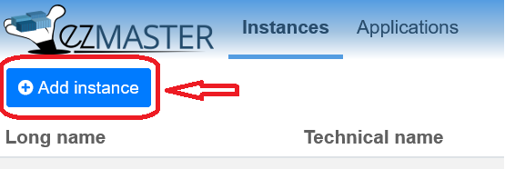
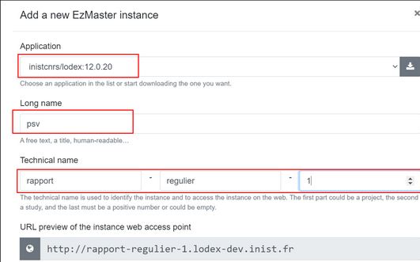
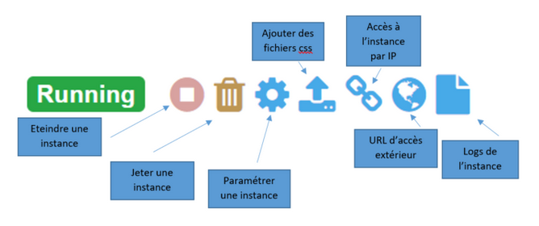
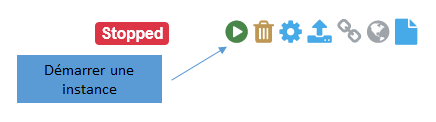
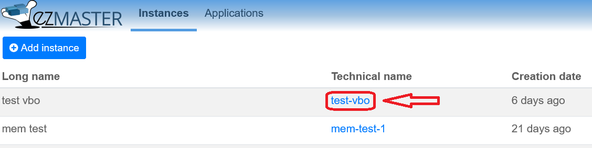
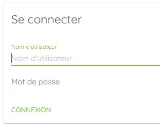

# Créer une instance Lodex

## Prérequis

- Utiliser les navigateurs Firefox ou Chrome
- Utiliser de préférence la suite LibreOffice
- S’authentifier avec des droits “Administrateur” sur la machine ezMaster sur laquelle on souhaite travailler

## Créer une nouvelle instance

- Se connecter à une machine ezMaster sur laquelle Lodex est installé (voir : Installation avec ezMaster)
- Ouvrir l’onglet “Instances”
- Cliquer sur le bouton \[**Add instance**/**Ajouter une instance**\]

- Dans la fenêtre qui s’ouvre sélectionner, à l’aide de la liste déroulante du premier champ,
  la version de Lodex à utiliser pour l’instance à créer

- Saisir un nom technique court, mais significatif dans la première case du *“Technical name”* \<Nom technique\>,
  puis une extension/un complément dans la case du milieu et le chiffre 1 (pour version 1)
  dans la case de droite (cette dernière info est indispensable pour gérer les versions).

:::warning

Saisir un numéro dans le *“Technical name”* est très fortement recommandé, même s’il existe qu’une seule version.
Si vous ne mettez pas de numéro, l’URL d’accès à l’instance pointera sur la dernière version
et certaines modifications peuvent ne pas être prises en compte.

:::

- Saisir le \<Nom long\>, destiné à l’utilisateur humain.
- Clic sur \[**Create**/**Créer**\] → la nouvelle instance est créée et s’ajoute à la liste des instances.

## Paramétrer une instance

Les actions disponibles pour chaque instance sont les suivantes :

:::note[Paramétrer une instance]

Accéder au fichier de paramétrage de l’instance.
A la création d’une instance, un fichier de paramétrage par défaut au format JSON est créé, mais il peut être modifié
selon les besoins
Voir : [Les paramètres d’une instance](./8-instance-setting.md)

:::

:::note[Ajouté des fichiers css]

Ajouter des fichiers à l’instance.
Cela permet entre autre de personnaliser le thème de son instance,
en intégrant des fichiers : police, icônes, fonctions, feuille de style, …
Voir : [Le modèle](#)

(mettre le lien vers l'équivalent de https://www.lodex.fr/docs/partie-2-2/la-creation-dun-modele/)

:::

Si une instance est éteinte, le premier bouton sert à la démarrer :

## Ouvrir l’instance créée

- Cliquer sur le *“Technical name”* (nom technique) de l’instance dans la liste des instances affichée dans ezMaster

- Dans l’écran de connexion entrer les identifiants de l’administrateur définis dans le paramétrage de l’instance
- Cliquer sur \[**CONNEXION**\]

