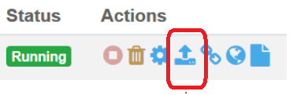
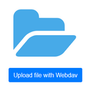
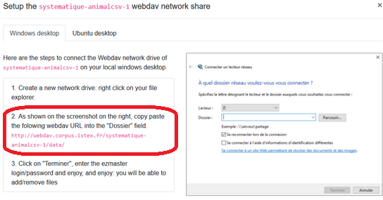
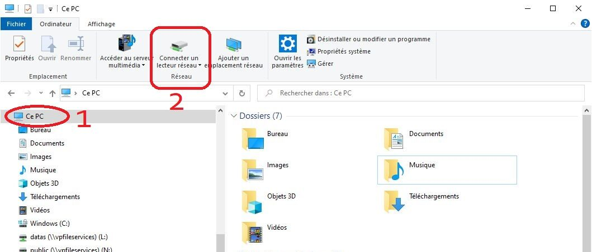
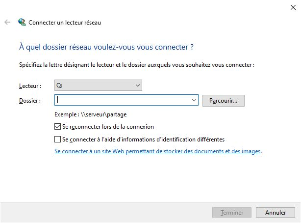

# Se connecter aux répertoires d’une instance

L’accès à l’**arborescence des fichiers** de Lodex se fait au moyen du **WebDAV de l’instance**.
Cet accès doit être paramétré sur un PC en utilisant les paramétres de l’instance
(voir le paragraphe *“Paramétrer une instance”* dans [Créer une instance lodex](./1-creating-an-instance.md)) :

- Cliquer sur l’icône de téléchargement de fichiers

- Cliquer sur « **Upload file with Webdav** »

- Copier l’**URL Webdav** mentionnée dans le point 2 de la procédure indiquée (par exemple
  ci-dessous : `http://webdav.corpus.istex.fr/…`)

- Ouvrir l’explorateur de fichiers du PC, se positionner sur “**Ce PC**” (1) puis cliquer sur “**Connecter un lecteur
  réseau**” (2)

- Coller l’URL webdav dans la zone “**Dossier**” puis cliquer sur “Terminer”

Le lecteur réseau créé apparaît dans l’explorateur du PC. La connexion à ce lecteur implique de saisir le login et le
mot de passe de la machine Lodex utilisée.
