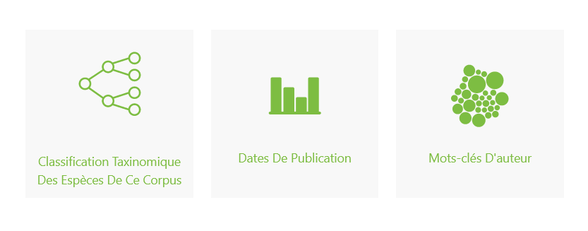
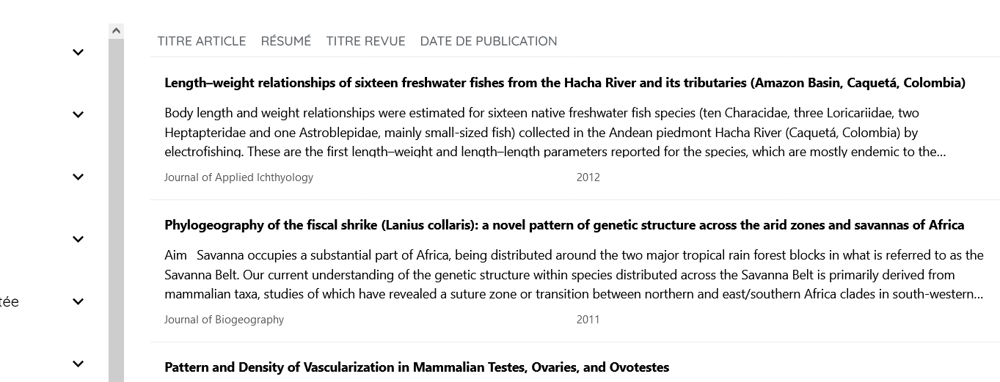
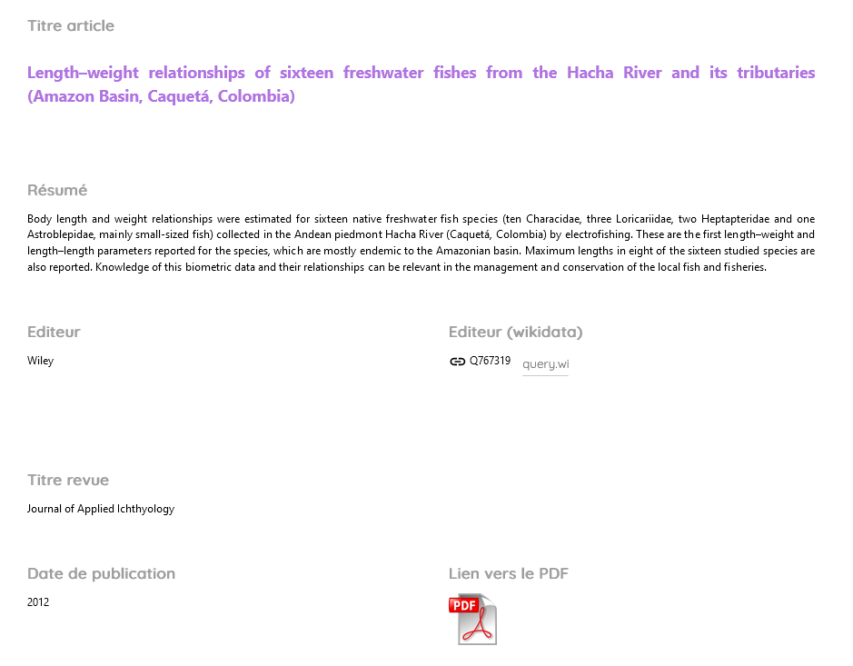
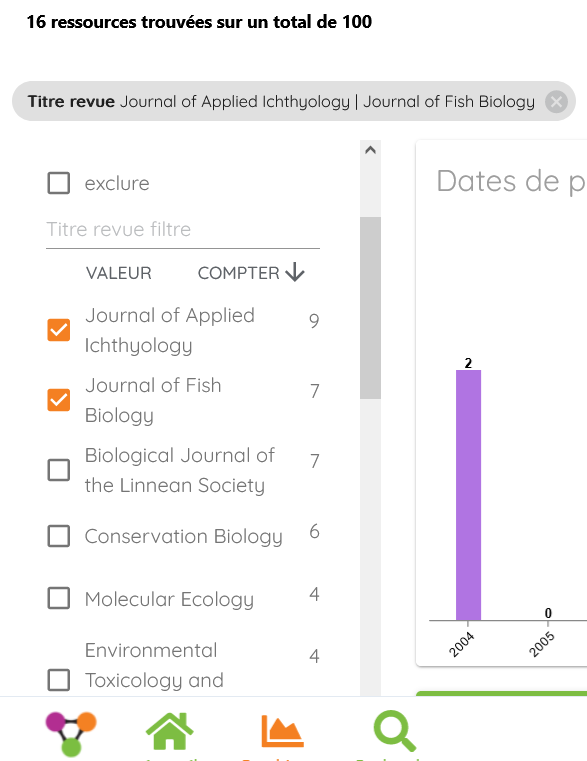
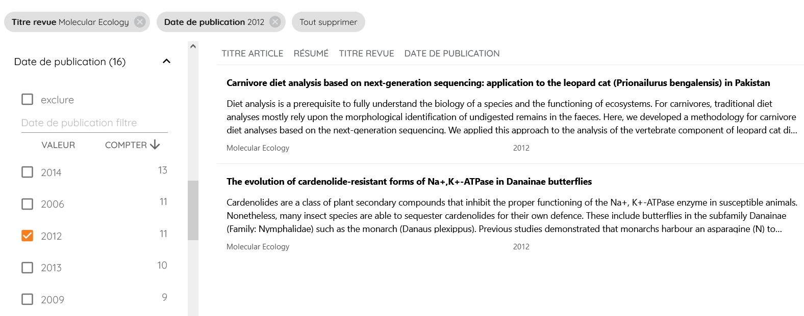
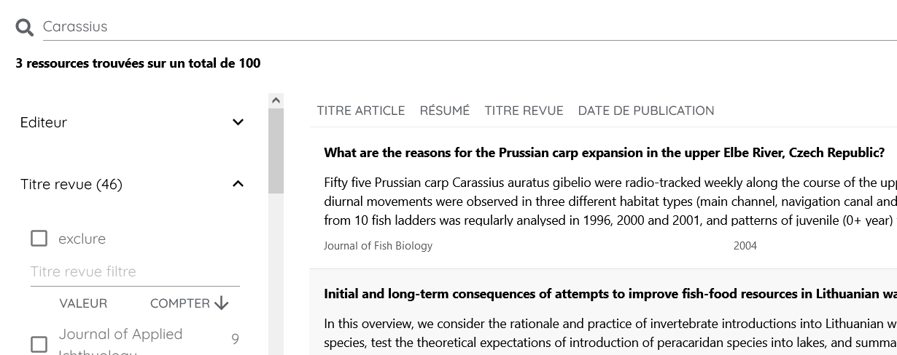

# Naviguer dans une instance

La navigation dans les pages d’une instance se fait via les boutons “**Accueil**“,
“**Graphiques**” et “**Recherche**” situés dans le pied de page

## Parcourir les graphiques

La page “Graphiques” propose un accès aux différentes vues graphiques des données,
telles qu’elles ont été paramétrées par les administrateurs de l’instance.

Au-dessous de chaque graphique, le menu “Parcourir les résultats” permet d’accéder aux données

## Parcourir les données

La page “Recherche” donne accès à la liste des ressources incluses dans le jeu de données chargé dans l’instance,
affichées selon les paramétrages définis par les administrateurs de l’instance.

Un clic sur le titre d’une de ces ressources donne accès au détail des informations relatives à la ressource,
affiché selon les paramétrages définis par les administrateurs de l’instance

## Filtrer les données avec les facettes

La partie gauche des pages de “Graphiques” et de la page “Recherche” donne accès aux facettes qui ont été définies par
les administrateurs,
dans l’étape 6 du [paramétrage d’un modèle](#).
L’utilisation de ces facettes permet de **filtrer les données affichées** dans les graphique ou la page de recherche.

Le chevron affiché à droite des titres de champs permet de déplier la liste des valeurs associées,
avec leur nombre d’occurrences dans le corpus.
On sélectionne ensuite les valeurs que l’on souhaite conserver ou exclure en cochant ou décochant les cases situées à
leur gauche.

Dans l’exemple ci-dessous,
l’affichage du graphique a été restreint aux articles publiés dans les revues “Journal of Applied Ichtyology” (9
documents)
et “Journal of Fish Biology” (7 documents) :

Les filtres accessibles via les facettes peuvent être associés entre eux (l’opérateur implicite est un AND booléen).
La liste des facettes sélectionnées s’affiche dans la ligne supérieure de l’affichage,
elles peuvent être supprimées en cliquant sur la croix située à droite du nom de la facette.

Dans l’exemple ci-dessous,
l’affichage des données a été restreint aux articles publiés dans la revue “Molecular Ecology” durant l’année 2012.

## Rechercher dans les données

La recherche s’effectue sur sur tous les champs indexés des ressources, via le masque de requête présent en haut de
page :

Le moteur de recherche de Lodex est celui de MongoDB* :

- il appauvrit les termes de recherche : il supprime les accents, la ponctuation, la casse,
  les mots vides selon la langue, les marques de pluriel (au moins celles en ‘s’)
- il recherche les mots dérivés de la racine d’un terme en fonction de la langue,
  mais il convient de tester l’efficacité de cette méthode avant un usage réel

  Ainsi :
  - métadonnées, métadonnée, metadonnees et metadonnee (ou termes avec majuscules) rendent les mêmes résultats
  - meta-données et meta donnees rendent les mêmes résultats (booléen OR implicite entre les deux termes)
  - “document” et “documents” rendent les mêmes résultats ;
    “documentation” rend des résultats communs avec le précédent et des résultats spécifiques supplémentaires.
  - “retin” renvoie par exemple “rétinitis”, “retina” et “retinal” mais pas “retinoïc”,
    et « retino » renvoie “retinoïc” et quelques autres termes commençant par “retino”.

- il n’existe pas de possibilité d’indiquer une troncature spécifique
- l’opérateur par défaut qui s’applique entre les termes recherchés est le booléen OR,
  et il n’existe pas d’opérateurs explicites (tels OR, AND, NOT)
- une recherche sur plusieurs mots propose en résultat un classement des documents du plus pertinent au moins pertinent

À partir du résultat d’une recherche, il est possible de :

- sélectionner une ressource en cliquant sur son titre ; pour retourner à la recherche précédente,
  cliquer à nouveau sur la loupe “Recherche”
- voir plus de résultats : à chaque clic sur cette proposition présente en bas de la liste de notices,
  10 résultats supplémentaires s’ajoutent à l’affichage

*Pour plus d’infos sur le moteur de recherche de MongoDB et son paramétrage :
https://docs.mongodb.com/manual/core/index-text/
