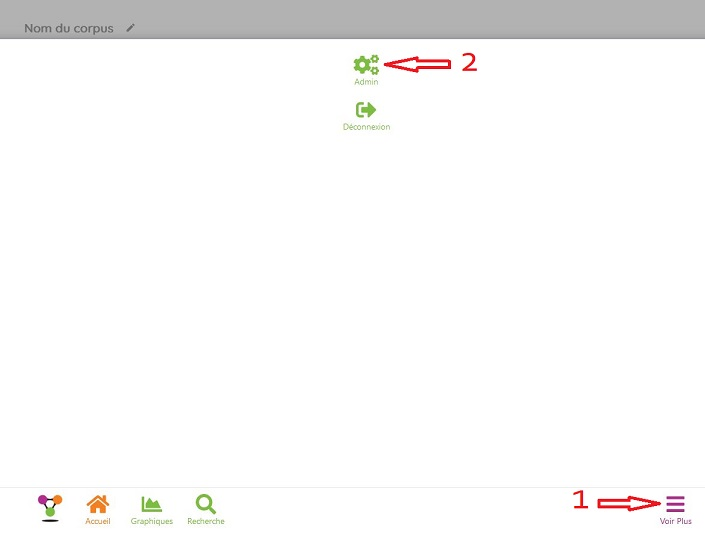
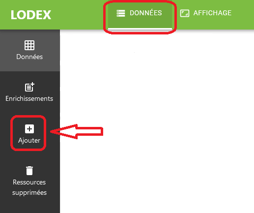
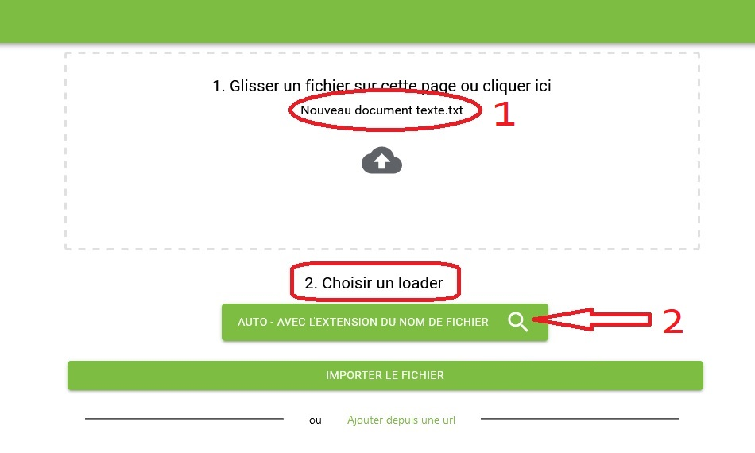
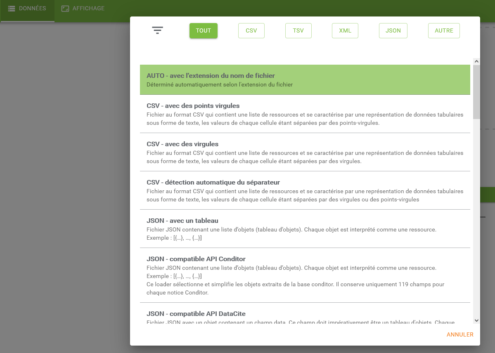
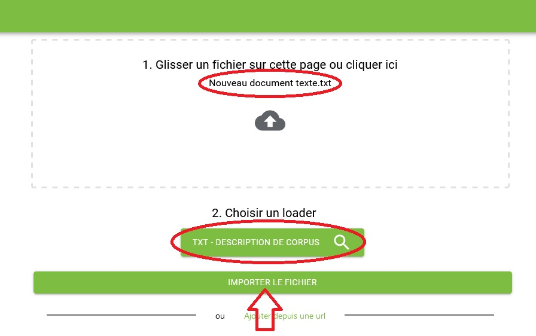
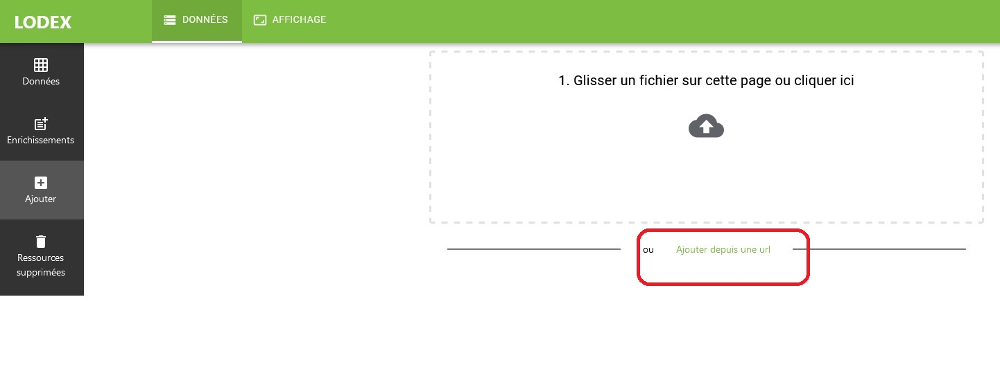
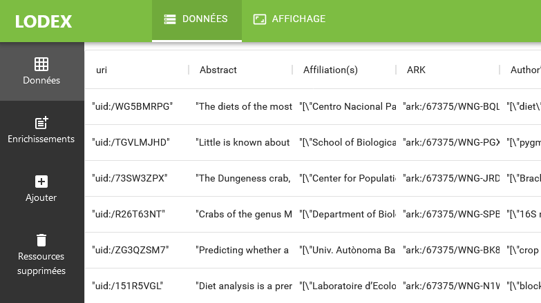
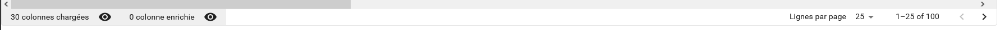

# Importer des données dans l’instance

L’import d’un jeu de données est la première étape vers la publication de ces données avec Lodex.

L’import peut intervenir :

- à la création d’une instance
- pour ajouter de nouvelles données à une instance créée précédemment.
  Dans ce cas,
  il est impératif que la structure du nouveau jeu de données soit identique à celle du fichier chargé initialement.

:::warning

Pour importer des données dans une instance, il faut se connecter à l’instance avec un compte **Administrateur**
Voir : [Les paramètres d’une instance](#)

(mettre le lien vers l'équivalent de https://www.lodex.fr/docs/partie-2-2/parametres-dune-instance/)

:::

## Importer un jeu de données

- Ouvrir le menu d’administration de l’instance, en cliquant sur “Voir plus” (1) puis sur “Admin” (2)

- Dans l’onglet “Données”, cliquer sur le menu “Ajouter”

### Importer des données depuis un fichier

- La fenêtre qui s’ouvre permet de glisser un fichier ou de parcourir l’arborescence d’un disque pour le sélectionner
- Une fois le fichier déposé dans la page (1), cliquer sur la loupe (2) permettant d’ouvrir le menu de sélection du
  loader

- dans la liste qui s’ouvre, sélectionner un “loader” en cliquant sur la ligne correspondante

:::info

Le choix du loader dépend de l’origine et du format des données à importer.
Les loaders disponibles pour Lodex sont décrits ici : https://www.lodex.fr/docs/partie-2-2/les-loaders/

:::

- Une fois le loader choisi, cliquer sur “Importer le fichier”

### Importer des données depuis une URL

La fonction “Ajouter depuis une url” permet d’indiquer à Lodex l’URL d’une page où se trouvent les données à importer.

:::warning

Si l’instance contenait déjà des données avant cet import, un message d’alerte indique :
“Les données que vous vous apprêtez à ajouter seront fusionnées ou se substitueront, si même identifiants,
avec celles déjà chargées”. Il faut “Accepter” ou “Annuler”.
Les nouvelles données seront ajoutées **sans écrasement** de celles qui étaient déjà présentes,
**ce qui peut générer des doublons**

:::

## Affichage des données après import

Le jeu de données s’affiche dans le menu “Données”

La ligne affichée en bas de l’écran données détaille l’état des colonnes chargées et permet la navigation dans le
tableau

