# Les paramètres d’une instance

À la création d’une instance, un fichier de paramétrage par défaut est généré (format JSON), mais il peut être modifié
selon les besoins.

## Authentification

La configuration de l’authentification permet de différencier l’**accès utilisateur** (userAuth),
celui qui visualise les données, de l’**accès administrateur**, celui qui peut les modifier.

Par défaut des mots de passe standard sont renseignés pour les statuts d’administrateur et d’utilisateur :

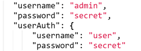

La pratique courante consiste à mettre comme “username” le technicalName de l’instance (sans le suffixe numérique)
et comme “password” un mot de passe aléatoire (créé par exemple avec un générateur tel
que https://www.dashlane.com/fr/password-generator ).

Si un login et un mot de passe ont été définis pour “userAuth”,
tout utilisateur devra saisir ces identifiants pour consulter l’instance

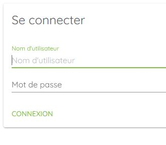

Il est possible d’inactiver l’utilisation d’un mot de passe utilisateur pour permettre un accès
à tous ceux qui disposent de l’URL d’uns instance, sans identification.
Deux possibilités pour y parvenir :

- supprimer les 3 lignes relatives à userAuth dans la configuration de l’instance
- conserver ces lignes en les inactivant (si on souhaite réactiver cette possibilité par la suite)
  en ajoutant une lettre à “userAuth”:

## ARK

LODEX génère des ARK pour chaque ressource au moment de la publication du jeu de données si dans le fichier de
configuration,
après l’authentification, les éléments “naan” et “subpublisher” sont ajoutés et renseignés avec leurs données
associées .

Dans cet exemple :

- naan= 67375 correspond à l’enregistrement de l’Inist
  dans [le registre d’autorité](https://n2t.net/e/pub/naan_table.html)
- subpublisher = 8Q1 correspond à l’identifiant de la ressource tel qu’il a été généré en interne
  par [Registre ARK Inist](http://vpezark.intra.inist.fr:35268/#/)

:::info

L’enregistrement d’un identifiant unique pour chaque ressource est une condition du web sémantique

:::

## Lodex-extended

Lodex peut être configuré pour utiliser des fichiers de configuration différents de ceux installés par défaut,
ces fichiers doivent être accessibles sur un serveur autonome.
Ce dépôt permet d’étendre les fonctionnalités à l’aide de fichiers de configuration au format .ini (“exporters”,
“loaders”,“routines”)

Une fois le serveur lancé, il suffit de préciser dans Lodex l’URL d’accès au serveur de fichier,
au redémarrage de Lodex, les fichiers .ini utilisés seront ceux du serveur distant.

## Routines – Loaders – Exporters

Pour avoir accès aux Routines, aux Loaders et aux Exporters dans une instance Lodex, il faut qu’il aient été au
préalable :

- enregistrés dans un fichier .ini rangé en dossier, par thématique, dans Lodex-extended
- listés dans le fichier de configuration .json

Il est également possible de supprimer un format de Loader ou d’Exporter afin de simplifier l’utilisation d’une
instance,
en les supprimant dans le fichier de configuration .json

Exemple de liste de Routines dans un fichier de configuration .json :

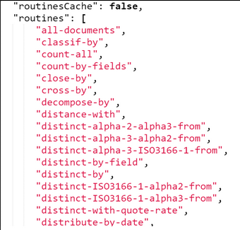

Exemples de liste de Loaders dans un fichier de configuration .json :

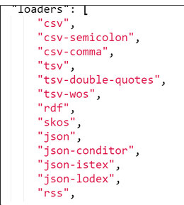

Exemples de liste d’Exporters dans un fichier de configuration .json :

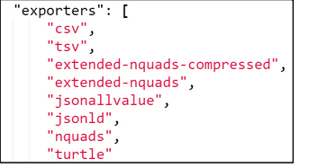

## Paramétrages optionnels

- Pour répondre aux normes du web sémantique

Lodex permet d’exposer des données selon les normes du web sémantique (Linked Open Data), lesquelles stipulent que :

- La donnée doit être interopérable (serveur/client), découplée de la technologie (un seul format propriétaire)
- Le sens (sémantique) de la donnée doit être décrit (ontologie ou structure), en utilisant exclusivement les 5 langages
  de base

Ces langages sont :

> **URI** *(Uniform Resource Identifier)* : adresse web qui permet d’accéder à la donnée
> **RDF** *(Resource Description Framework)* : langage qui permet de décrire les ressources
> **RDFS** *(RDF Schema modélisation)* :  modélisation des définitions de données
> **OWL** *(ontology web language)* :  description de la sémantique de la donnée (vocabulaire)
> **SPARQL** *(Sparql query language)* : langage de requête, aller chercher l’information dans les ontologies
> et traiter les différents triplets RDF (ou nquads)

- **Dataset**

La fonction “istexQuery” permet de configurer les exports NQuads étendus

- **SPARQL endpoints**

Lodex permet d’interroger, grâce à son SPARQL endpoint, des données hébergées sur des serveurs distants
(serveur web de données liées, machine autonome ou navigateur web)
et d’afficher les réponses dans un format accessible à l’humain via le client web (formatage de la réponse)
Pour voir exemple avec data.idref et data.bnf : https://authorized-user.data.istex.fr/uid:/ABES3GY8OEGGD

C’est dans le fichier de configuration,
grâce à la fonction “sparqlEndpoints” qu’il faut ajouter les liens vers les SPARQL endpoints des différents
établissements :

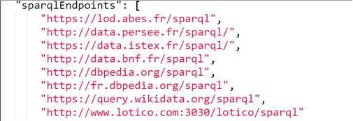

- Fil d’Ariane

Lorsque des instances sont liées,
comme c’est le cas par exemple pour “data.istex => Corpus scientifiques => Corpus actualité => Sciences de la santé =>
Coronavirus : SRAS MERS”,
il est possible d’ajouter un fil d’Ariane dans le haut des pages d’une instance

Les données se renseignent entre les 2 crochets :

Les labels et les url de chaque instance enregistrés dans le fil d’Ariane doivent être organisés
du plus générique jusqu’à l’instance spécifique concernée par le paramétrage

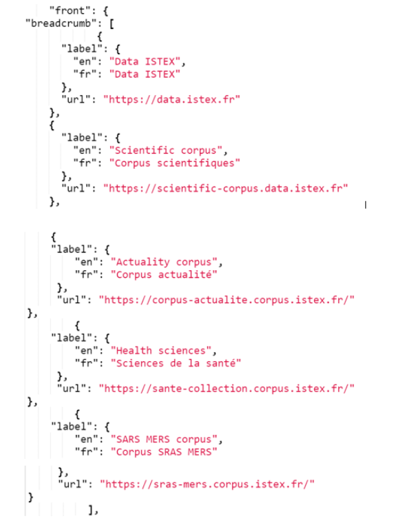

- Menu: barre d’outil

Le fichier de configuration par défaut disponible à la création d’une instance,
prévoit une barre d’outil qui propose des icônes qui renvoient vers les pages “Accueil”, “Graphique” et “Recherche”

L’ordre d’affichage de ces icônes dépend de l’ordre enregistré dans le fichier de configuration .json

Le bouton “Voir Plus” permet l’accès à la connexion et déconnexion sur une autre page dite “advanced“.
L’affichage de ce menu contextuel peut facilement se modifier : position left,right,
emplacement front ou advanced (top ou non ), suppression, …

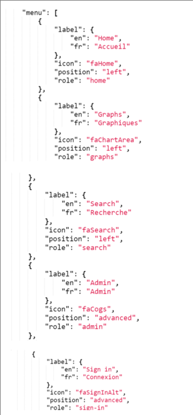

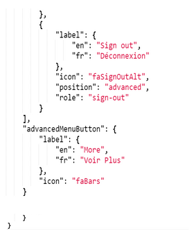

Il est possible d’ajouter dans le fichier de configuration de quoi afficher dans le menu l’icône ISTEX-DL
et de relancer une requête à l’API ISTEX grâce à la sauvegarde de son q_id.

( voir la documentation ISTEX : https://doc.istex.fr/tdm/extraction/istex-dl.html#application-istex-dl-istex-download)

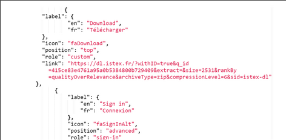

Mais aussi ajouter des liens vers une documentation, un formulaire de contact,… en utilisant des icônes personnalisées,
à partir du moment où ces données sont disponibles dans le paramétrage de l’instance et ajoutées **par le WebDav
(voir** [Se connecter aux répertoires d’une instance](./login-instance-repository))

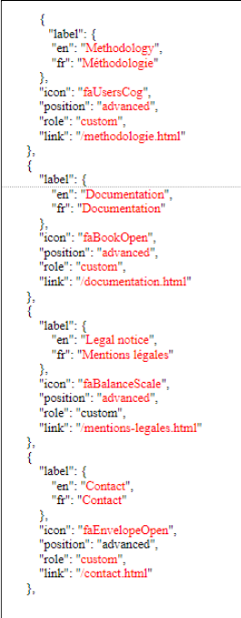
