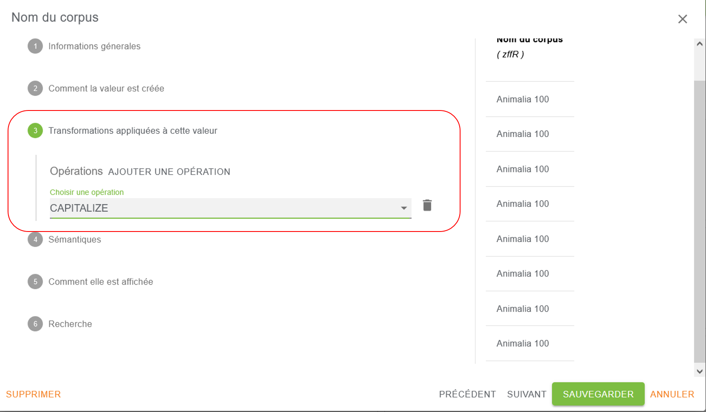

# Création ou modification d’un modèle

Pour créer un modèle ou modifier le modèle d’une instance, il faut s’authentifier en tant qu’administrateur dans
l’instance (voir “[Paramètres d’une instance](../../getting-started/8-instance-setting.md)”) et se rendre dans
l’administration.

- Après avoir importé un fichier de données :

- Sélectionner *“AFFICHAGE”*, car c’est bien le modèle qui conditionne l’affichage :

Le paramétrage de l’affichage se réalise sur les différentes pages accessibles via les menus de la colonne de gauche :

- ***Page d’accueil***
  La page d’accueil permet de présenter les données exposées, leurs créateurs, leur origine, les méthodes et outils
  utilisés pour les collecter ou les transformer, etc.
- ***Pages de ressources (avec ou sans sous-ressources)***
  La page de ressources permet d’accéder au détail des données, de les parcourir par facette, de faire des recherches
  dans ces données. Elle peut être déclinée en sous-ressources (voir le
  chapitre “[Sous-ressources](./4-sub-resources.md)”)
- ***Page de graphiques***
  La page de graphiques permet la présentation des données sous une forme visuelle facile à appréhender.

## Paramétrage des Pages

:::warning

Toute création d’un modèle commence avec le paramétrage des pages de ressources.

:::

Nous décrivons donc ici le paramétrage dans ses grandes lignes des pages de ressources et mettrons en avant ensuite les
possibles spécificités des pages d’accueil et de graphiques.

### Sélection des données

Après avoir sélectionné l’onglet *“PAGES DE RESSOURCES”*, on est automatiquement positionné sur *“RESSOURCE PRINCIPALE”*

Pour choisir les données à paramétrer :

cliquer sur *“DEPUIS UNE COLONNE”* pour afficher la liste des colonnes disponibles

dans le tableau, cliquer sur le bouton *“AJOUTER”* positionné au bas de la colonne à inclure dans le modèle\<

Pour ajouter des données non disponibles dans le fichier d’import (par exemple des données “calculées” à partir des
données d’origine importées), cliquer sur *“+NOUVEAU CHAMP”*

Cette même façon de procéder peut s’appliquer aux “SOUS-RESSOURCES” (détail
dans “[sous-ressources](./4-sub-resources.md)”).

Qu’il s’agisse d’un champ créé à partir d’une colonne existante ou à partir d’un nouveau champ, nous allons détailler
dans le paragraphe suivant les modalités de paramétrage de l’affichage des données.

#### Paramétrage de l’affichage des données

Le paramétrage des données d’une colonne se réalise en 6 étapes.

:::info

La partie de droite de la fenêtre de configuration de l’affichage propose un aperçu (limité !) des données finales

:::

#### ÉTAPE 1 : Informations générales

La zone “Étiquette” affiche par défaut l’en-tête de la colonne.

Il est possible de modifier ce texte. On peut par exemple mettre “Titre article” , ce qui apparaîtra comme suit:

Il est également possible d’ajouter une langue (Aucun, Français ou English) et une ou plusieurs classes sémantiques (
dcterms).

Lorsque des champs ont le même nom mais ne sont pas utilisés au même endroit, ils peuvent être “tagués” grâce aux icônes
adéquates (Page d’accueil, Ressource, Sous-ressource, Facette et Graphique). Une précision plus importante peut encore
être apportée par l’ajout d’un nom interne personnalisé.
Cela permet une reconnaissance plus facile de ces champs dans les opérations d’élaboration du modèle.

#### ÉTAPE 2 : Comment la valeur est créée

Cette partie permet d’indiquer la source d’une valeur.

Cette valeur peut prendre diverses formes :

**UNE VALEUR ARBITRAIRE**: permet d’éditer un texte (titre, texte de présentation…) ou de faire tourner une routine ou
de mettre un pointeur vers un site externe etc…

Ici par exemple on va mettre un pointeur vers une requête Wikidata:

:::info

Lorsque cette valeur est celle d’un texte, il est possible de styler ce texte avec Markdown ou en html ( dans ce cas
utiliser le format “Texte – syntaxe markdown” ou” Texte – balises en html ” en étape 5 )

:::

**UNE VALEUR EN PROVENANCE D’UNE COLONNE EXISTANTE** (qui reprendra les données telles quelles) : on sélectionne la
colonne choisie parmi celles qui sont proposées.

Ainsi le choix d’un résumé apparaîtra sous la forme suivante:

**UNE LISTE DE VALEURS EN PROVENANCE DE PLUSIEURS COLONNES EXISTANTES** (exemple: regroupement d’ISSN papier et ISSN
électroniques grâce à un transformer CONCAT)

**UNE VALEUR EN PROVENANCE D’UNE URI DE SOUS-RESSOURCES**

**UNE VALEUR EN PROVENANCE D’UN CHAMP DE SOUS-RESSOURCES**

#### ÉTAPE 3 : Transformations appliquées à cette valeur

On peut ensuite appliquer un certain nombre d’opérations aux valeurs créées. Pour cela, on clique sur *“AJOUTER UNE
OPERATION”* pour choisir une opération/transformation dans le menu déroulant.

On peut ajouter autant d’opérations que souhaitées.

L’ensemble des opérations possibles est décrit dans
le [chapitre Transformers](https://www.lodex.fr/docs/documentation/principales-fonctionnalites-disponibles/transformer-des-donnees/)

Si finalement on ne souhaite rien ajouter, il faut cliquer sur la poubelle à droite, ce qui aura pour effet de refermer
le menu déroulant et d’annuler toute action.

#### ÉTAPE 4 : Sémantiques

Cette étape permet de :

- configurer le champ pour le web sémantique ou
- d’annoter un autre champ (note/légende d’un graphique)  ou
- de créer un « nœud blanc » pour les triplets (web sémantique).
- de regrouper

En pratique, on s’en sert pour créer des sous-champs en bougeant le curseur correspondant aux champs composites

On peut ainsi regrouper année, volume, numéro, paginations pour un article sous une nouvelle étiquette ou regrouper les
sous-champs d’une adresse postale

#### ÉTAPE 5 : Comment la valeur est affichée

On peut **Appliquer un format** à chaque valeur. Si nous prenons l’exemple d’un résumé nous pouvons sélectionner par
exemple “RESOURCE – Description” puis le format “Texte-Paragraphe” choisi dans un menu déroulant.

Ensuite il est possible de déterminer la largeur d’affichage du texte (100% pour la largeur totale de la page ou des
pourcentages inférieurs si besoin, comme par exemple 50% si on veut afficher 2 champs côte à côte).

Il est possible également de déterminer si on souhaite rendre visible la valeur considérée ou non sur la page sur
laquelle on se trouve en cochant ou non la case adéquate.

Des formats très différents sont proposés suivant l’usage que l’on souhaite en faire.

Suivant le format choisi, de nouveaux champs de paramétrage peuvent aussi apparaître.

On peut avoir accès notamment à des éléments de mise en forme de type: taille, couleur d’un titre, texte etc.

#### ÉTAPE 6 : Recherche

ÉTAPE 6 : Recherche

Cette étape permet de définir les critères de recherche sur le champ en cours de configuration. Deux possibilités de
recherche sont disponibles, elles ne sont pas exclusives :

- Cocher “UNE RECHERCHE TEXTE GLOBALE PEUT ÊTRE EFFECTUÉE SUR CE CHAMP” pour indexer le champ afin de permettre une
  recherche globale ;
- Cocher “EST UNE FACETTE” pour inclure le champ dans le menu latéral des facettes qui permet l’exploration des
  résultats de recherche et des graphiques.

:::warning

Lorsque les 6 étapes ont été configurées, il ne faut pas oublier de “SAUVEGARDER” le paramétrage !

:::

:::warning

Une facette doit être une chaîne de caractères pour être fonctionnelle. Il existe un transformer pour ce
faire: [STRING](https://www.lodex.fr/docs/documentation/principales-fonctionnalites-disponibles/transformer-des-donnees/#string).

:::

### Spécificités de la page d’accueil

La page d’accueil permet de présenter le travail, les créateurs, d’où proviennent les ressources présentées etc…

Sélectionner *“page d’accueil”* et uniquement *“NOUVEAU CHAMP”* autant de fois qu’il est nécessaire.

Une boîte de paramétrage s’ouvre comme précédemment.

#### ÉTAPE 1 : Informations générales

Même procédure que pour la page de ressources.

#### ÉTAPE 2 : Comment la valeur est créée

***Si l’on se trouve sur la page d’accueil***, cette valeur ne peut être qu’arbitraire et permet d’éditer un texte (
titre,
texte de présentation…).

:::info

Si aucun champ n’est marqué par une syndication, rien ne s’affichera dans la page recherche de l’instance.

:::

#### ÉTAPE 3 : Transformations appliquées à cette valeur

ne pas renseigner

#### ÉTAPE 4 : Sémantiques

#### ÉTAPE 5 : Comment la valeur est affichée

Par défaut cette catégorie est visible (peut être décoché)

**La syndication**

Le terme “syndication” est une **forme raccourcie de “syndication de contenu”**.
Par analogie avec une syndication de contenu via un flux (RSS ou autre), qui permet d’afficher des informations issues
d’un site dans un autre site, la syndication dans Lodex permet de marquer un champ utilisé pour l‘affichage ou pour la
recherche . Ce champ est non répétitif.
Un champ peut être syndiqué en tant que : titre de ressource, titre de sous-ressource, description de ressource, détail
1, détail 2, titre de jeu de données, description de jeu de données

Exemple de champs choisis: Titre = *“RESSOURCE Titre”* et revue et date de publication = *“RESSOURCE détail 1”* et
*“RESSOURCE détail 2”*

La syndication permet de cibler **jusqu’à 4 champs à afficher dans la liste des résultats de recherche et dans une
grille de la page d’accueil.**

Ensuite, la mise en forme suit les mêmes règles et possibilités que pour la page de ressources.

#### ÉTAPE 6 : Recherche

Ne présente aucun intérêt sur la page d’accueil.

:::warning

Lorsque les 6 étapes ont été configurées, il ne faut pas oublier de “SAUVEGARDER” le paramétrage !

:::

### Spécificités de la page de graphiques

La page de graphiques permet d’obtenir des représentations visuelles facilement lisibles de l’organisation des données.

Avant de créer des graphiques, reprenez les titres des champs qui vous intéressent ainsi que le code de 4 lettres qui
est l’identifiant Lodex du champ.

Sélectionner *“page d’accueil”* et uniquement *“NOUVEAU CHAMP”* autant de fois qu’il est nécessaire.

Une boîte de paramétrage s’ouvre comme précédemment.

#### ÉTAPE 1 : Informations générales

Même procédure que pour la page de ressources.

#### ÉTAPE 2 : Comment la valeur est créée

***Si l’on se trouve sur la page de graphiques***, cette valeur est arbitraire et permet d’éditer une routine qui
définit
l’opération à mettre en œuvre pour constituer le graphique. La routine est appelée par le préfixe **“/api/run/”** suivi
de
l’identifiant de la routine puis de l’identifiant du champ sur lequel elle est appliquée.

Pour consulter le descriptif des
routines : [Les routines et les graphes](https://www.lodex.fr/docs/documentation/principales-fonctionnalites-disponibles/les-routines-et-graphes/)

Exemple : paramétrage de l’utilisation de la routine “tree-by” (permet de créer des graphiques en forme d’arbres
représentant des données hiérarchisées) sur le contenu du champ d’identifiant “oldH” :

:::warning

Certains graphiques ne sont compatibles qu’avec certaines routines

:::

#### ÉTAPE 3 : Transformations appliquées à cette valeur

ne pas renseigner

#### ÉTAPE 4 : Sémantiques

#### ÉTAPE 5 : Comment la valeur est affichée

Il faut sélectionner à ce stade dans le menu déroulant un **format de type graphique.**

D’autres éléments peuvent ensuite être modifiés: affichage ou non d’infobulles, changement du jeu de couleurs,…

Les graphiques seront présents sur la page des graphes accessibles via l’onglet “Graphiques” dans la barre des tâches,
qui s’affiche dès la création du premier graphique.

**Ajouter une légende dans un graphique**

- Clic sur le bouton *“NOUVEAU CHAMP”* -> une boîte de dialogue s’ouvre
- Infos générales : renseigné : mettre un espace (ou bien un titre pour le commentaire)
- Comment la valeur est créée :
  - Une seule option se présente : *“Une valeur arbitraire”* : saisir le texte explicatif de la légende (ex. : **Nombre
    de publications par type de document**).
- Transformations appliquées à cette valeur : ne pas renseigner
- Sémantiques : sélectionner le champ (graphique) à annoter dans la liste déroulante

:::info

Si aucun champ n’apparaît dans la liste Annoter un autre champ, sauvegarder, puis ouvrir à nouveau le champ de légende,
la liste s’affiche alors.

:::

### Comment exposer des graphiques sur la page d’accueil

Pour afficher les graphiques sur la page d’accueil à la place ou en plus des graphiques sur la page *“Graphiques“*, il
faut les rappeler à partir de cette page *“Graphiques”*

Tout d’abord bien relever le nom des graphiques ainsi que le code Lodex de 4 lettres qui caractérise le champ des
graphiques sur la *“Page de graphiques”*

exemple: Dates de publication (Tu5z)

Retourner sur le paramétrage du modèle de la page d’accueil, puis *“NOUVEAU CHAMP”*

- Mettre un label dans étiquette
- Sélectionner valeur arbitraire ex : Dates de publication
- Comment elle est affichée : visible
- Syndication : aucun
- Format : copie d’un champ existant
- Nom du champ: Tu5z-Dates de publication
