# Les sous-ressources

Lodex permet une navigation dans les ressources importées. Il est également possible, depuis la version 12, de proposer
une navigation liée à des sous-ressources, données qui ont été ajoutées pour enrichir les ressources (par ex. :
systématique animale, laboratoire CNRS).

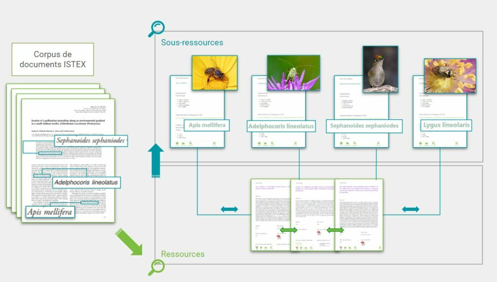

La marche à suivre se déroule en plusieurs étapes.

## Import d’un fichier comportant les données de la sous-ressource

:::warning

Les données importées doivent être impérativement au format JSON.

Si tout le fichier de départ n’est pas en JSON, il faut au minimum que la (les) colonne(s) des données de la
sous-ressource soit en JSON.

:::

Dans l’exemple ci-dessous, 2 données sont à paramétrer en tant que sous-ressources :

Intitulé du fichier importé :

- **noms d’espèces détectés** dans l’article (ex. : *Malacanthus, Balanus, …*)
- **sous-corpus** (famille des espèces détectées)

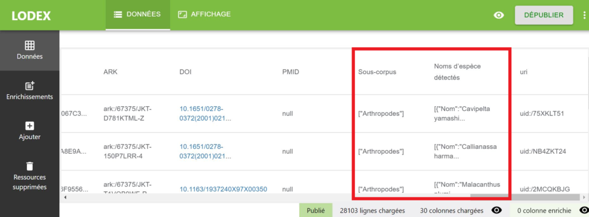

## Modification du modèle pour prendre en compte les enrichissements sous forme de sous-ressources

La configuration des sous-ressources se fait en deux étapes :

- il faut créer une *“Nouvelle sous-ressource”* à partir de la *“Page de ressource“*
- il faut ensuite lier cette sous-ressource à la ressource principale

### Configuration de la page dédiée à la sous-ressource

- Depuis la page *“Ressource”* de l’onglet *“Affichage“*, sélectionner *“+ Nouvelle sous-ressource”*.
  Lui donner un *“Nom”*, nom de la sous-ressource (ici : espèces animales), un *“Identifiant”*, nom du sous-champ sur
  lequel il pointe dans les données en JSON (ici : Name) et un *“Chemin”*, nom du champ sur lequel il pointe dans les
  données en JSON (ici : Detected species names)

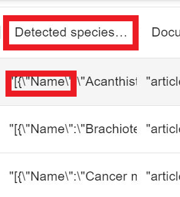

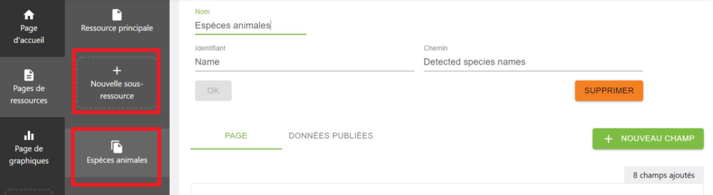

- une fois cette page créée, ajouter des champs qui sont paramétrés comme n’importe quel autre champ de Lodex :
  - Étiquette

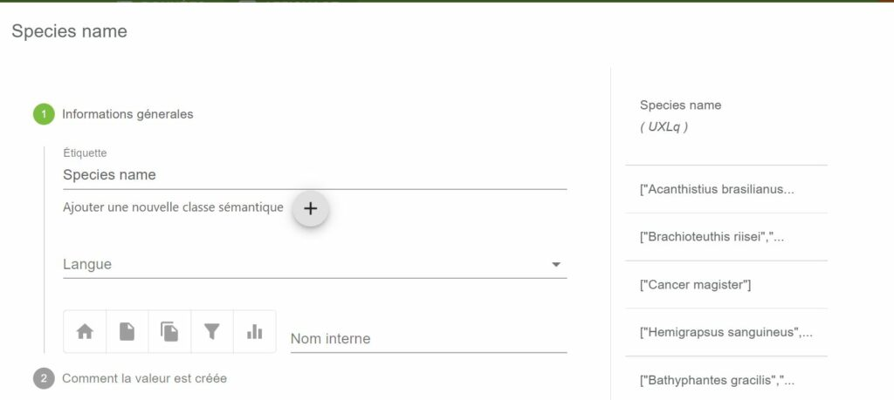

- Valeur

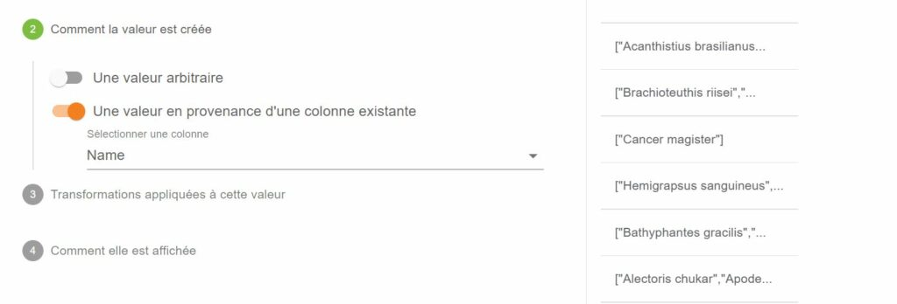

- Opération (si le champ contient plusieurs données par exemple)

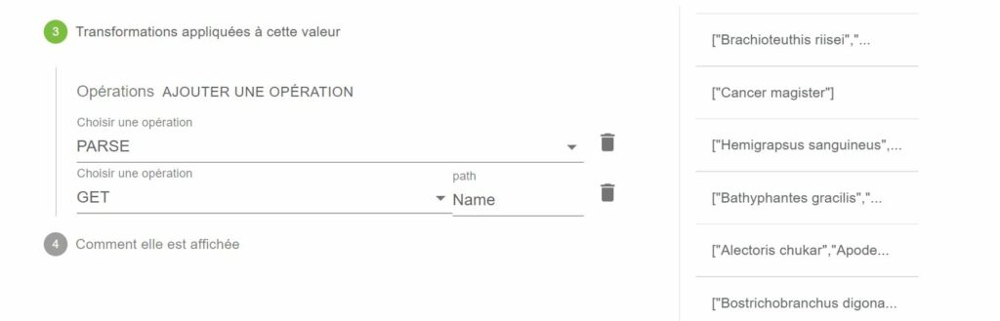

- Pour l’affichage choisir “Syndication > SUBRESOURCE – Titre”

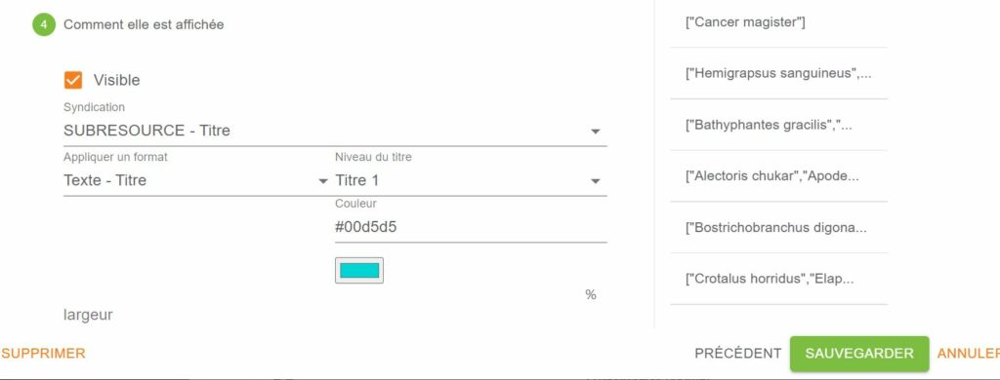

- Il est possible d’ajouter d’autres champs, par exemple dans l’exemple cité pour présenter la systématique animale de
  l’espèce pour laquelle la page est créée avec un affichage différent

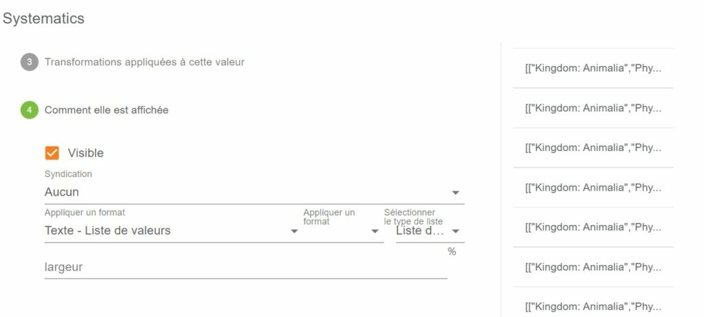

- En sélectionnant *DONNEES PUBLIEES* , on visualise les données relatives à la sous-ressource

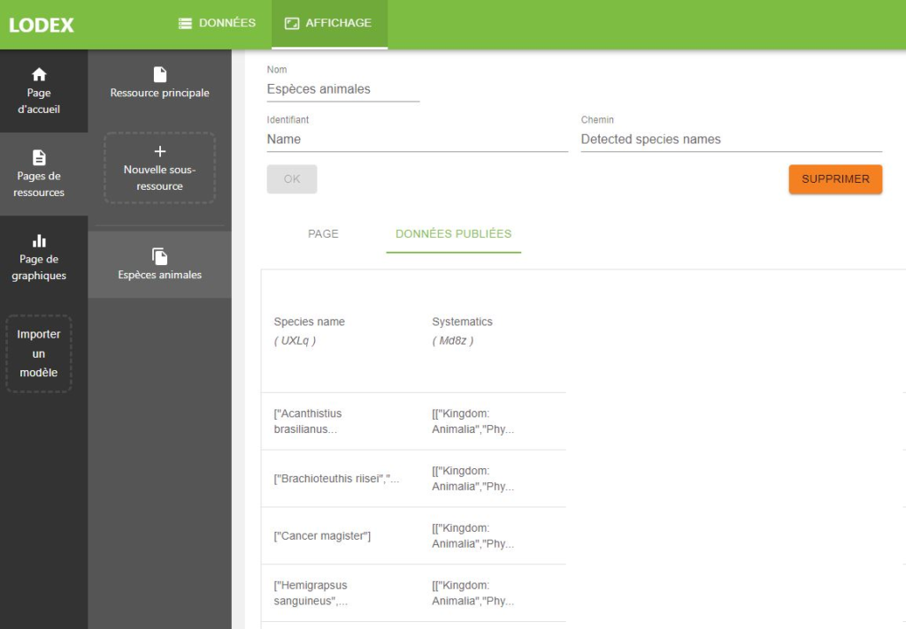

- Ne pas oublier de sauvegarder

### Configuration de la page ressource pour la lier à la page de sous-ressource

Une fois la sous-ressource créée, il faut la lier à la ressource principale. Deux champs sont à déclarer dans celle-ci :
**un champ sous-ressource**, et un **champ lien sous-ressource**.

- **Créer le champ sous-ressource**

Dans *“Ressource Principale”*, cliquer sur *“+ NOUVEAU CHAMP”*, et créer le champ lien (vers la sous-ressource).

- Indiquer dans *“Étiquette”* le même nom que celui choisi pour *“Chemin”* dans la configuration de la sous-ressource (
  nom du champ sur lequel il pointe dans les données en JSON, ici : Detected species names)

Nom interne (ici : Sous-ressource), est un nom que vous choisissez pour que ça soit parlant pour vous.

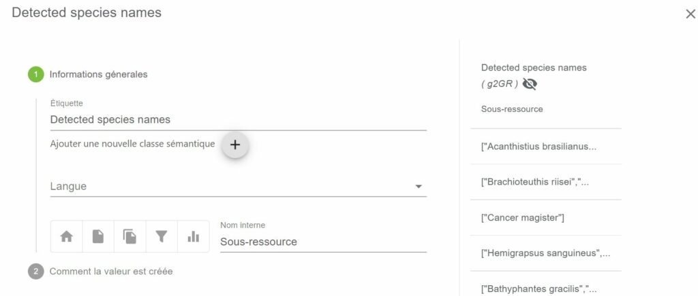

- Dans *“Comment la valeur est créée”* choisir *“Une valeur en provenance d’un champ de sous-ressource”* et indiquer la
  sous-ressource et le champ ciblé (qui peut être différent de l’identifiant, comme un intitulé par ex.)

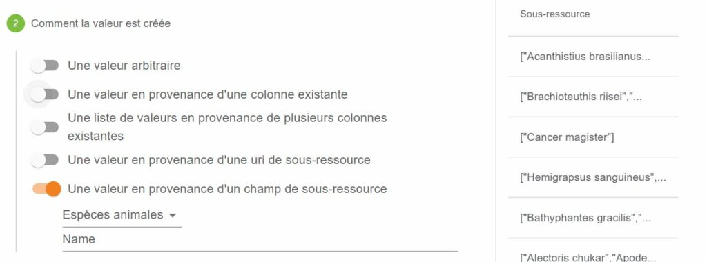

- Dans *“Comment elle est affichée”* rendre le champ non visible

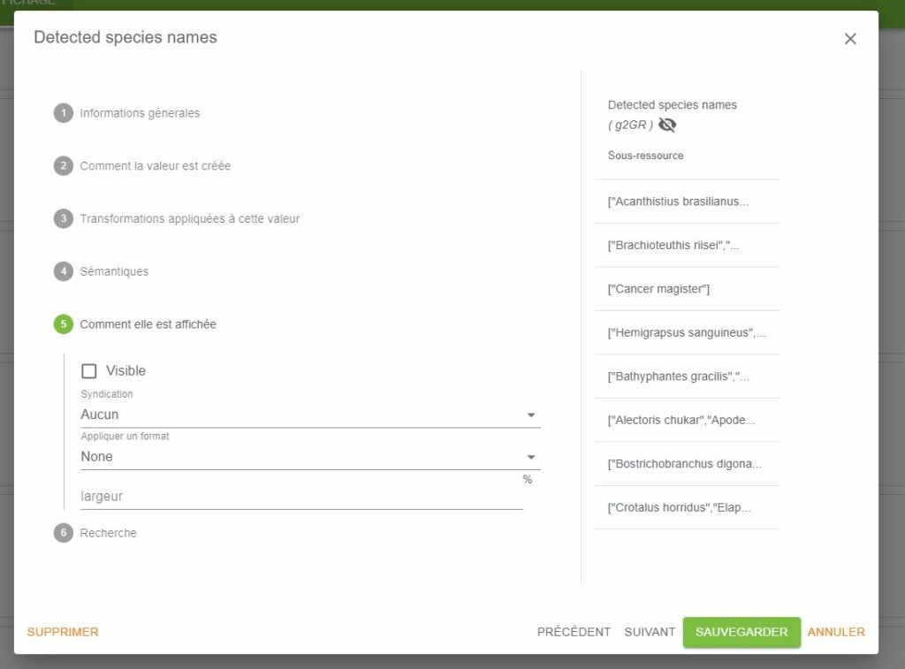

- **Créer le champ lien sous-ressource**

Pour créer le champ lien sous-ressource, cliquer sur *“Nouveau Champ”* dans *“Ressource Principale”*, et créer le champ
d’affichage du lien vers la sous-ressource.

- Nommer le champ dans *“Informations générales”* > *“Étiquette”* en gardant toujours le même nom (ici : Detected
  species names). Pour le nom interne, comme ci-dessus nom pour permettre de vous y retrouver, choisir par ex. “Lien
  sous-ressource” .

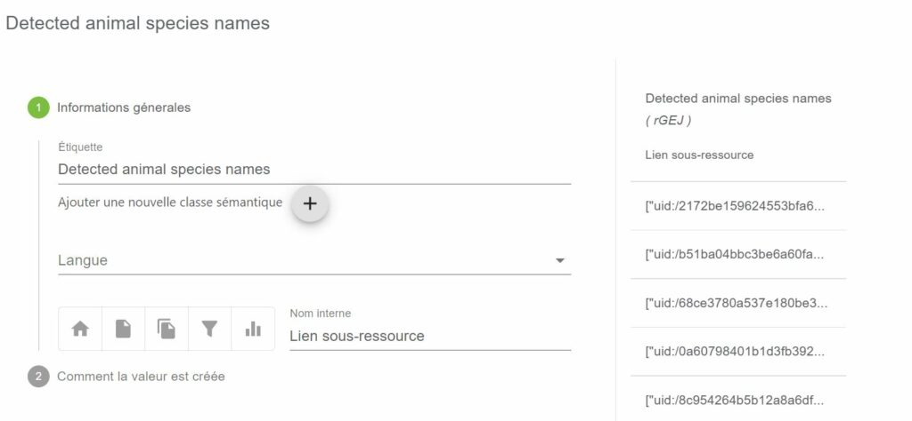

- Dans *“Comment la valeur est créée”* , choisir *“Une valeur en provenance d’une uri de sous-ressource”* et indiquer la
  sous-ressource.

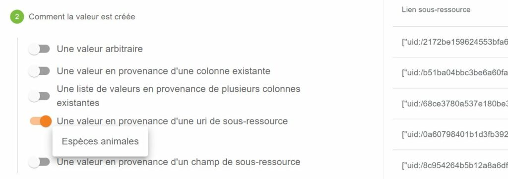

- Dans *“Comment elle est affichée”*, choisir *“URL – Lien interne > L’étiquette est le contenu d’une autre colonne”*,
  coller l’identifiant du champ lien, précédemment créé

Ce champ lui doit être visible

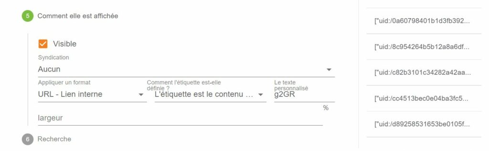

Ce qui donne :

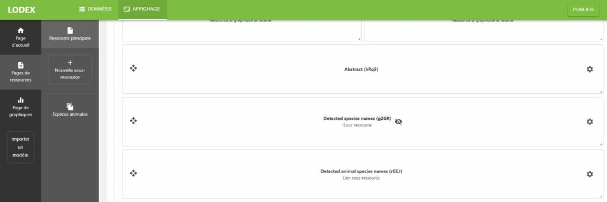

## Publication

Cliquer sur *“Publier”* pour publier les données, si un message apparaît signalant des uri en double cliquer sur
*“Publier quand même”*

Dans chaque page ressource, les noms des sous-ressources qui ont enrichi le document s’affichent et sont cliquables.

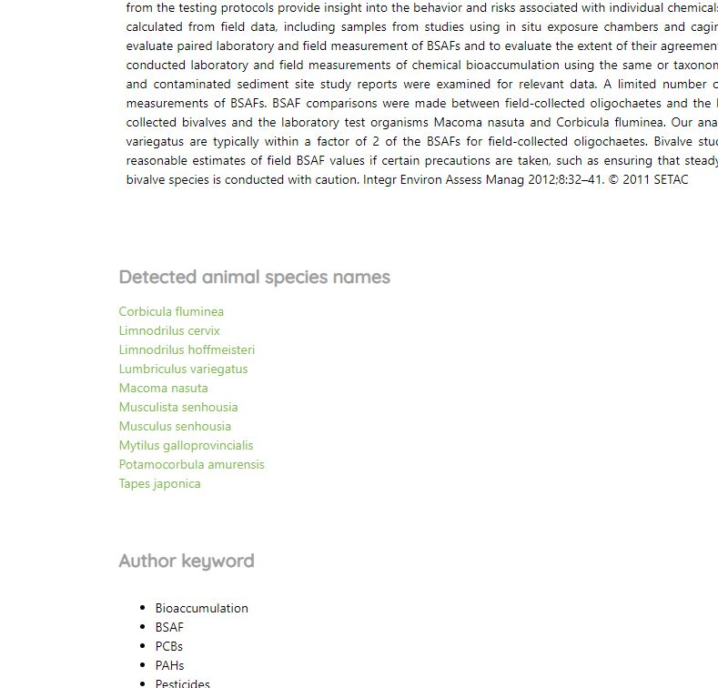

En cliquant sur un lien, on accède à la page dédiée à la sous-ressource et à tous ses champs.

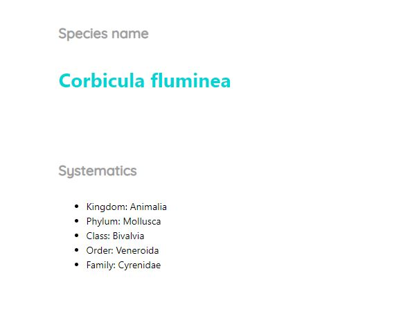
