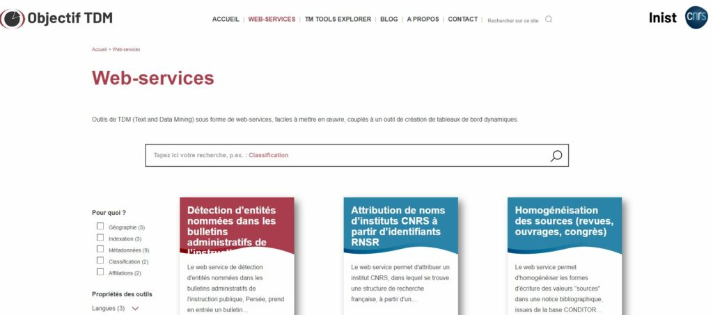
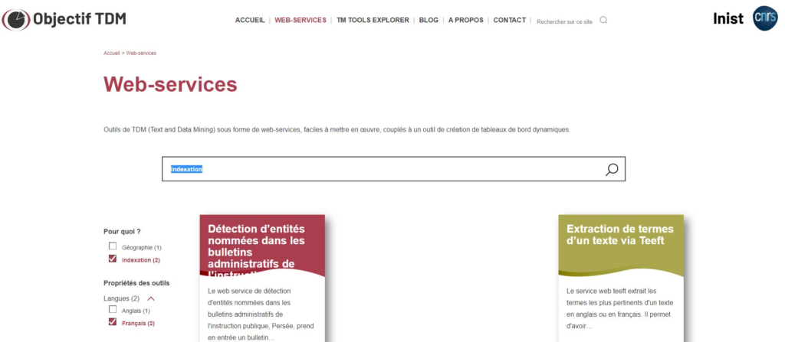
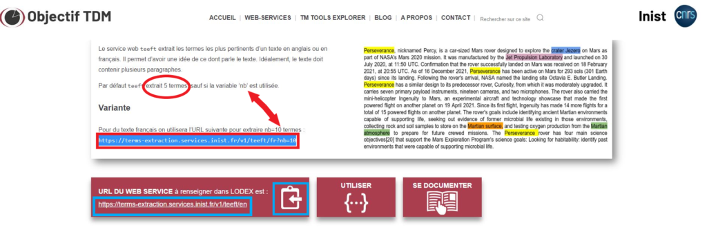
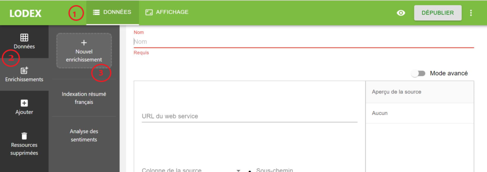
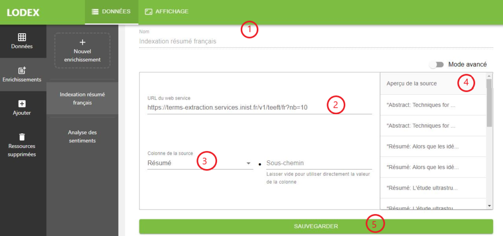
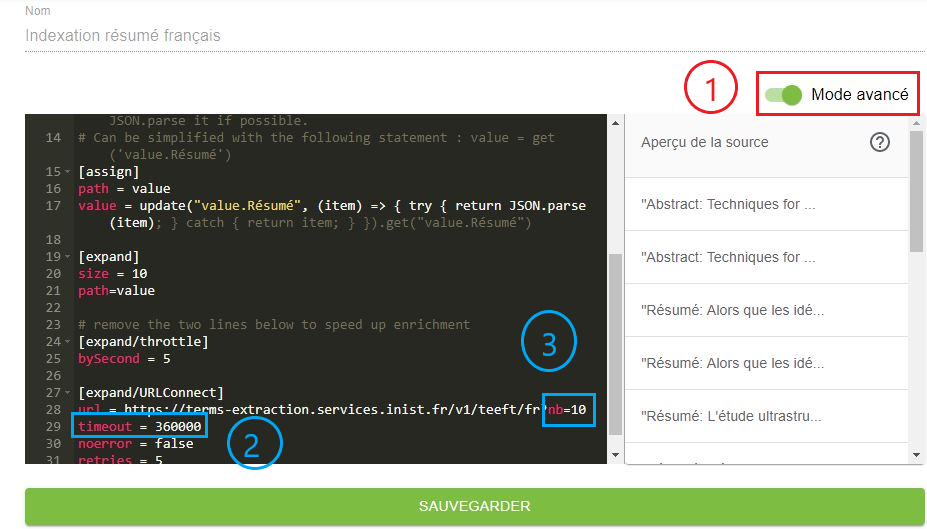
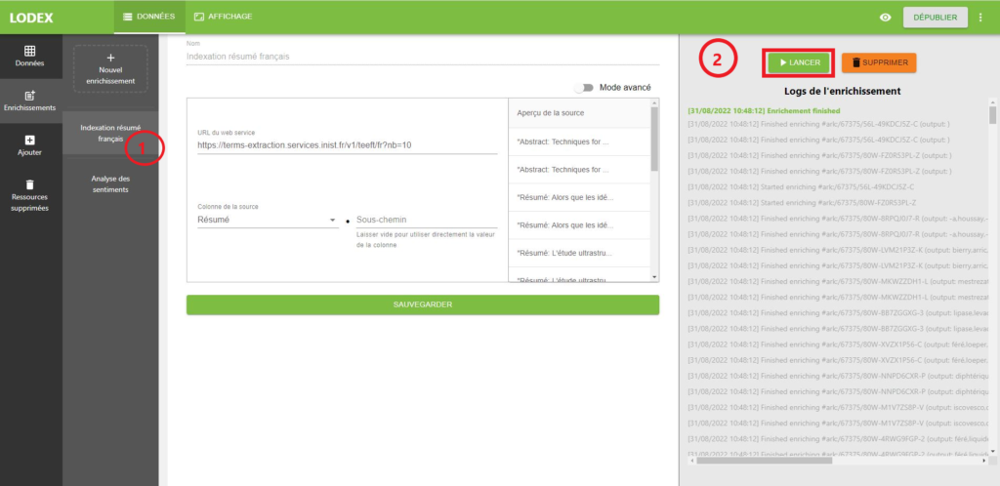
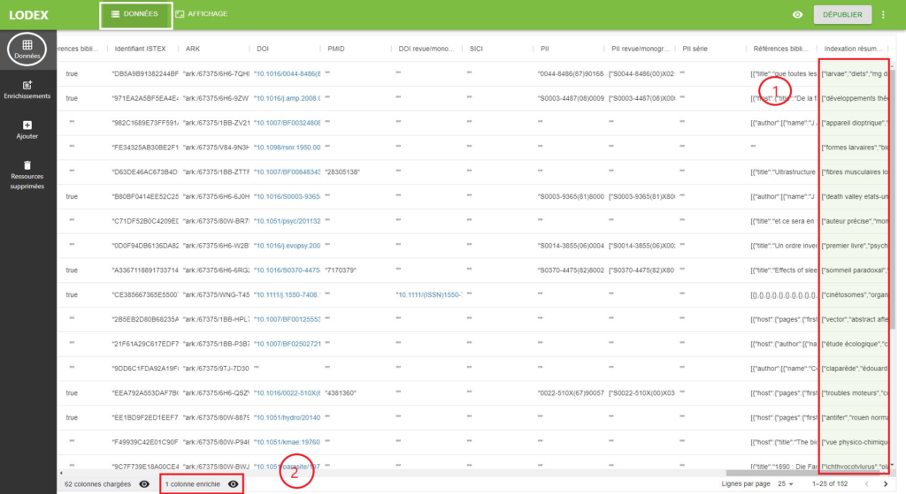
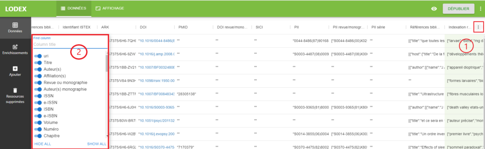
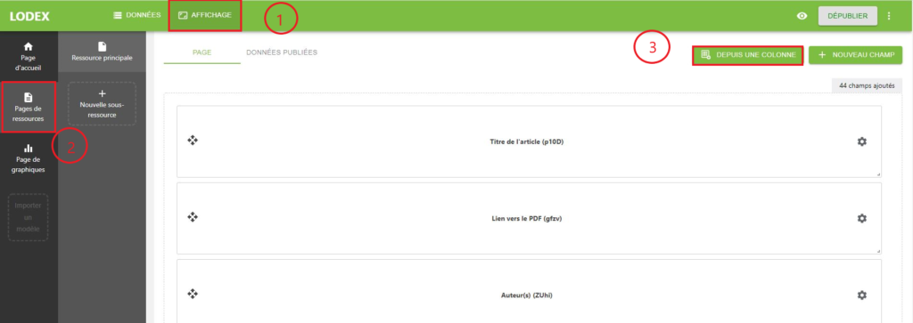

# Enrichissements avec les web services

## Objectif-TDM

Outils de TDM (Text and Data Mining) sous forme de web-services, faciles à mettre en œuvre, développés par Inist(CNRS
pour la fouille de textes.

Depuis la version 12… de Lodex, il est possible d’enrichir les données importées en utilisant les web services mis à
disposition dans le site [Objectif-TDM](https://objectif-tdm.inist.fr/category/services/)

- Rechercher en fonction des besoins par exemple : Indexation sur un champ en français

- Pour chaque web service à lancer dans Lodex, l’information à copier depuis le site Objectif-TDM est l’**URL du web
  service**

:::warning

- Lire attentivement les consignes, dans notre exemple l’indexation peut se faire sur un champ en anglais ou en
  français.
- Extraction 5 termes de base, modifier manuellement le nombre si besoin.

:::

- Si besoin pour tester le web service sur l’analyse des
  sentiments **[https://sentiment-analysis.tdmformation.inist.fr/](https://sentiment-analysis.tdmformation.inist.fr/)**
  (pas encore dans objectif TDM)

## Dans Lodex

### DONNEES

*Pour utiliser l’un de ces web services dans Lodex :*

- se positionner sur l’onglet “Données”(1)
- cliquer sur “Enrichissements”(2)
- nouvel enrichissement (3)

*Dans la fenêtre de paramétrage de l’enrichissement :*

- Donner un nom à la nouvelle colonne qui sera créée suite à l’enrichissement (1)
- coller l’URL du web-service d’enrichissement telle que trouvée sur le site Objectif-TDM (2)
- indiquer sur quel champ doit être réalisé l’enrichissement, en le sélectionnant dans le menu déroulant proposé (3). Un
  aperçu du champ s’affiche à droite de la fenêtre (4)
- cliquer sur “Sauvegarder” (5)

:::info

- Il existe un mode avancé (1) pour modifier certains paramètres pour les plus experts ou pour modifier le temps du time
  out (2) pour les gros corpus à traiter ou le nombre de données retournées (3).

:::

*Après la sauvegarde :*

- le nom de l’enrichissement s’affiche dans la colonne de gauche (1)
- et peut être lancé ou supprimé avec les boutons situés à droite (2)

*Une fois l’enrichissement terminé, la grille de données affiche :*

- le contenu de la nouvelle colonne sur fond vert (1)
- et la mention de la présence d’une colonne enrichie est indiquée dans le pied de page (2)

- Pour faciliter la vision des colonnes quand trop nombreuses en cliquant sur les … (1) une fenêtre s’ouvre permettant
  de masquer une ou plusieurs colonnes (2).

:::warning

Si la colonne n’apparait pas, c’est peut être simplement parce qu’il n’y aucun résultat au lancement du web service.

:::

### AFFICHAGE

Pour avoir un affichage de ces données sur notre instance Lodex, il faut créer, dans affichage (1) un nouveau champ sur
la page ressource (2) à partir d’une colonne (3)(celle des résultats du web service => verte)

