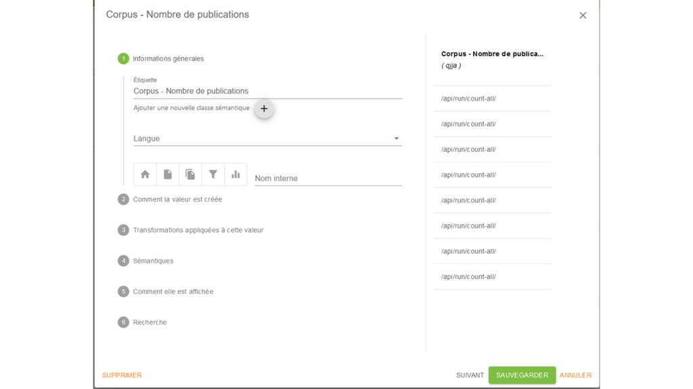
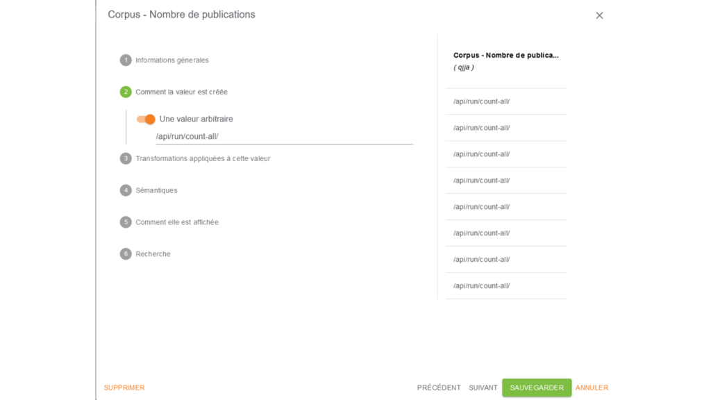
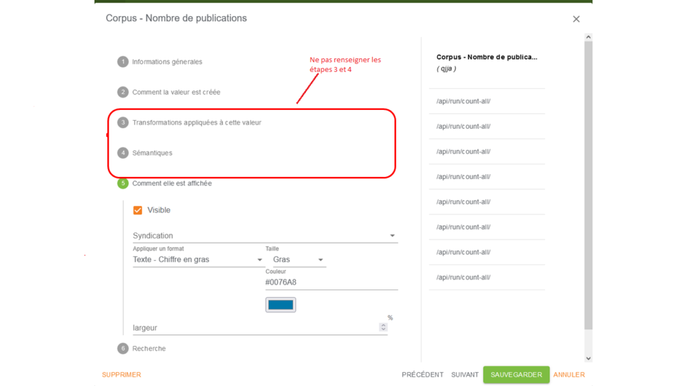
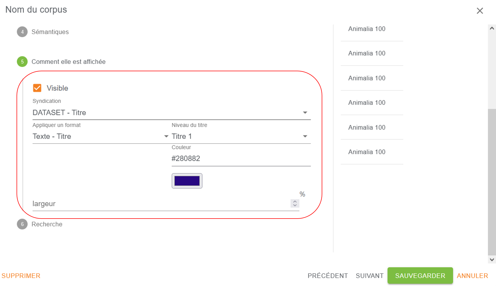

# Les routines

Les routines de Lodex sont des scripts, fournis par Lodex ou stockables n’importe où sur le web, qui peuvent effectuer
des agrégations, des calculs, des reformatages et renvoyer des données sous une forme utilisable (souvent un format de
type graphique).

Les routines sont appelées via l’API web de Lodex, et s’appliquent à un champ (ou plusieurs). Quand on connaît le nom de
la routine à utiliser (disons **routine exemple**), il suffit de l’ajouter derrière **/api/run/** pour obtenir la route
à
utiliser: **/api/run/routine exemple/** (voir la
partie [Création ou modification d’un modèle](../1-models/3-creating-and-modifying-model.md))

## Déclaration des routines dans le fichier de configuration

Pour qu’une routine soit utilisable dans LODEX via son API, il faut qu’elle soit déclarée dans le champ routine du
fichier de configuration.

Le nom de la routine doit être exactement le même que celui du fichier en ligne (avec l’extension .ini) (voir la partie
[Les paramètres d’une instance](../../getting-started/8-instance-setting.md) )

*Comment créer une routine non disponible dans Lodex (à compléter ?)*

Lors de la création et du paramétrage d’un modèle d’une instance Lodex, la routine doit être déclarée dans la partie
**“Comment la valeur est créée”** de la façon suivante :

/api/run/**routine**/**identifiant**/
où :

- **routine** est la routine utilisée
- **identifiant** est le code attribué par LODEX au champ représenté

(voir la partie [Création ou modification d’un modèle](../1-models/3-creating-and-modifying-model.md) )

Le résultat d’une routine peut être visualisé à partir d’une URL de la forme :
http://**url-instance**/api/run/**routine**/**identifiant**

- **url-instance** est l’URL de l’instance
- **routine** est la routine utilisée
- **identifiant** est le code attribué par LODEX au champ représenté

(voir la partie [Création ou modification d’un modèle](../1-models/3-creating-and-modifying-model.md) )

Le choix de la routine se fait en fonction du format d’affichage souhaité (type de graphique par exemple). Dans certains
cas, il est possible de pouvoir utiliser plusieurs routines pour un même format.

La description des routines et des graphiques déclinée dans les parties suivantes a pour but de préciser la ou les
routines utilisables pour afficher le type de graphique souhaité par exemple, ou d’autres formats.

## Routines disponibles dans Lodex (de la routine aux graphes)

### all-document

Donne, pour tout le corpus, le contenu de tous les documents en JSON.

### classif-by

Elle est destinée à un type de graphique permettant de visualiser les évolutions diachroniques du poids de thématiques
contenues dans les documents d’un corpus.

Cette routine doit alors être déclarée dans **“Comment la valeur est créée”** selon :
/api/run/classif-by/**identifiant**/ où **identifiant** est le code attribué par LODEX au champ représenté.

Cette routine est destinée à être utilisée avec le format graphique :

- Graphique de flux

### close-by

Cette routine est utilisée pour créer le “graphique” aster plot

### count-all

Cette routine compte le nombre de documents du corpus. Ce calcul est dynamique, le nombre de documents se met à jour
automatiquement si on ajoute un ou plusieurs fichiers supplémentaires au corpus

Elle peut être utilisée, par exemple, avec le format **Texte – Chiffre en gras** (faire lien vers ce format) pour
afficher
le nombre de documents sur la page d’accueil de l’instance.

Elle doit alors être déclarée dans **“Comment la valeur est créée”** selon : /api/run/count-all/

#### Exemple d’utilisation de cette routine :







### count-by-fields

Cette routine compte le nombre de documents du corpus pour chacun des champs déclarés dans le modèle.

### cross-by

Croise les éléments pour un champ ou plusieurs champs et compte le nombre d’occurrences de chaque croisement.

Crée les paires (source et cible) entre les éléments de 2 champs (champs identiques ou différents) déclarés selon :

- /api/run/cross-by/**identifiant1**/**identifiant1**/
- /api/run/cross-by/**identifiant1**/**identifiant2**/

et compte, pour chaque paire, le nombre de co-occurrences.

Cette routine se comporte comme la routine pairing-with , le petit +: elle sait interpréter les paramètres associés aux
graphiques:

- Nombre max de champs
- Valeur maximum à afficher
- Valeur minimum à afficher
- Trier par valeur/label

Elle peut, en particulier, être utilisée avec les formats Réseau et Carte de chaleur.

**Attention** : dans le cas où cette routine s’applique à un seul champ (/api/run/cross-by/identifiant1/identifiant1/),
elle
conserve les auto-paires (source et cible identiques). Cela peut être intéressant avec le format Carte de chaleur pour
visualiser la diagonale, mais peut être gênant avec d’autres formats.

### decompose-by

Croise les éléments pour un champ ou plusieurs champs et compte le nombre d’occurrences de chaque croisement.

Crée les paires (source et cible) entre les valeurs de 1 champ ou plusieurs champs (champs identiques ou différents)
selon :

/api/run/decompose-by/**identifiant1**/

/api/run/decompose-by/**identifiant1**/**identifiant2**/

et compte, pour chaque paire, le nombre de co-occurrences.

Cette routine se comporte comme la routine graph-by, le petit +: elle sait interpréter les paramètres associés aux
graphiques :

- Nombre max de champs
- Valeur maximum à afficher
- Valeur minimum à afficher
- Trier par valeur/label

Elle peut, en particulier, être utilisée avec les formats Réseau et Carte de chaleur

**Attention** : dans le cas où cette routine s’applique à plusieurs champs (
/api/run/decompose-by/identifiant1/identifiant2/), elle crée les paires identifiant1/identifiant2 mais aussi
identifiant1/identifiant1 et identifiant2/identifiant2, ce qui peut ne pas être adapté pour un réseau.

### distance-with

…

### distinct-alpha-2-alpha3-from

Transforme les **codes ISO 2** du champ pays en leurs **codes ISO 3** et compte le nombre de fois où ce pays apparaît (
identifiant), selon son :

- nombre d’occurrences si le champ n’est pas dédoublonné
- nombre de documents si le champ est dédoublonné

Elle est, en particulier, utilisée avec le format Cartographie pour représenter les pays du corpus sur une carte du
monde.

**Attention** : avant d’utiliser cette routine, il peut être utile de vérifier que les codes ISO 2 des pays du corpus
correspondent bien aux codes ISO 2 dans la table de correspondance (faire une lien vers une table des correspondances
des codes ISO 2 et ISO 3)

### distinct-alpha-3-alpha2-from

Transforme les **codes ISO 3** des pays du champ représenté en leurs **codes ISO 2** et compte le nombre de fois où ce
pays (identifiant) apparaît selon son :

- nombre d’occurrences si le champ n’est pas dédoublonné
- nombre de documents si le champ est dédoublonné

Elle est, en particulier, utilisée avec le format Cartographie pour représenter les pays d’un corpus sur une carte du
monde.

**Attention** : avant d’utiliser cette routine, il peut être utile de vérifier que les codes ISO 3 des pays du corpus
correspondent bien aux codes **ISO 3** dans
la [table de correspondance](https://raw.githubusercontent.com/Inist-CNRS/lodex-use-cases/master/country/data.json).

### distinct-alpha-3-ISO3166-1-from

Transforme les intitulés verbalisés (Anglais ou Français) des pays du champ représenté en leurs **codes ISO 3** et
compte le nombre de fois où ces pays apparaissent selon leur :

- nombre d’occurrences si le champ n’est pas dédoublonné
- nombre de documents si le champ est dédoublonné

Elle est, en particulier, utilisée avec le format Cartographie pour représenter les pays d’un corpus sur une carte du
monde.

**Attention** : avant d’utiliser cette routine, il peut être utile de vérifier que les verbalisations des pays du corpus
correspondent bien aux codes ISO 3 dans
la [table de correspondance](https://raw.githubusercontent.com/Inist-CNRS/lodex-use-cases/master/country/data.json).

### distinct-by

Compte, pour chaque élément du champ représenté (identifiant), le nombre de fois où cet élément apparaît selon son :

- nombre d’occurrences si le champ n’est pas dédoublonné
- nombre de documents si le champ est dédoublonné

Cette routine se comporte comme la routine distinct-by-field. Contrairement à celle-ci, elle n’interprète pas les
paramètres associés aux graphiques.

Cette routine peut être utilisée avec les formats graphiques :

- Graphe à bulles
- Diagramme en barres
- Diagramme circulaire
- Diagramme Radar
- Cartographie (si code ISO 3 ou code ISO 2 des pays)

Elle doit alors être déclarée dans **“Comment la valeur est créée”** selon :

/api/run/distinct-by/**identifiant**/ où **identifiant** est le code attribué par LODEX au champ représenté.

### distinct-by-field

Compte, pour chaque élément du champ représenté (identifiant), le nombre de fois où cet élément apparaît selon son :

- nombre d’occurrences si le champ n’est pas dédoublonné
- nombre de documents si le champ est dédoublonné

Cette routine se comporte comme la routine distinct-by, le petit +: elle sait interpréter les paramètres associés aux
graphiques :

- Nombre max de champs
- Valeur maximum à afficher
- Valeur minimum à afficher
- Trier par valeur/label

Cette routine peut être utilisée avec les formats graphiques :

- Graphe à bulles
- Diagramme en barres
- Diagramme circulaire
- Diagramme radar
- Cartographie (si code ISO 3 ou code ISO 2 des pays)

Elle doit alors être déclarée dans **“Comment la valeur est créée”** selon :

/api/run/distinct-by-field/**identifiant**/ où **identifiant** est le code attribué par LODEX au champ représenté.

### distinct-ISO3166-1-alpha2-from

Fournit le nombre de fois où un pays apparaît selon son :

- nombre d’occurrences si le champ n’est pas dédoublonné
- nombre de documents si le champ est dédoublonné

Elle est, en particulier, utilisée avec le format Cartographie pour représenter les pays d’un corpus sur une carte du
monde.

**Attention** : avant d’utiliser cette routine, il peut être utile de vérifier que les formes d’écriture des pays
verbalisés du corpus correspondent bien aux formes d’écriture des pays dans
la [table de correspondance](https://raw.githubusercontent.com/Inist-CNRS/lodex-use-cases/master/country/data.json).

### distinct-ISO3166-1-alpha3-from

Transforme les valeurs verbalisées du champ pays en leurs codes ISO 3 et compte le nombre de fois où ce pays apparaît (
code ISO 3), selon son :

- nombre d’occurrences si le champ n’est pas dédoublonné
- nombre de documents si le champ est dédoublonné

Elle est, en particulier, utilisée avec le format Cartographie pour représenter les pays du corpus sur une carte du
monde.

**Attention** : avant d’utiliser cette routine, il peut être utile de vérifier que les formes d’écriture des pays
verbalisés du corpus correspondent bien aux formes d’écriture des pays dans
la [table de correspondance](https://raw.githubusercontent.com/Inist-CNRS/lodex-use-cases/master/country/data.json).

### distinct-with-quote-rate

…

### distribute-by-date

Sert à créer des chronologies qui conservent les années sans document/de valeur nulle.

Cette routine est utilisée de manière optimale avec le format graphique :

- Diagramme en barres

Elle doit alors être déclarée dans **“Comment la valeur est créée”** selon :

/api/run/distribute-by-date/**identifiant**/ où **identifiant** est le code attribué par LODEX au champ représenté.

### distribute-by-decadal

Sert à créer des chronologies en regroupant les valeurs par décennie (utile pour des années dispersées sur plusieurs
siècles).

Cette routine est utilisée de manière optimale avec le format graphique :

- Diagramme en barres

Elle doit alors être déclarée dans **“Comment la valeur est créée”** selon :

/api/run/distribute-by-decadal/**identifiant**/ où **identifiant** est le code attribué par LODEX au champ représenté.

### distribute-by-interval

Routine destinée à des graphiques pour lesquels on souhaite regrouper des valeurs (nombres entiers ou décimaux) dans des
intervalles de pas “1”. ????

Cette routine peut être utilisée avec les formats graphiques :

- Diagramme en barres
- Diagramme circulaire
- Diagramme radar

Elle doit alors être déclarée dans **“Comment la valeur est créée”** selon :

/api/run/distribute-by-interval/**identifiant**/ où **identifiant** est le code attribué par LODEX au champ représenté.

### get-fields

pour utiliser des nombres affectés à des champs des ressources (pas de comptage, utilise la valeur numérique du champ),
il faut pouvoir générer des paires _id /valeur contenant les valeurs de deux champs (en général, un libellé et un
nombre, par exemple pour un camembert).

Pour sélectionner le libellé, on donne l’identifiant du champ contenant le libellé comme **identifiant1** puis on ajoute
l’identifiant du champ contenant la valeur numérique comme **identifiant2**.

/api/run/get-fields/**identifiant1**/**identifiant2**/

Exemples de ressources:

| nom de fichier    | Unitex-anglais | Unitex-français |
|-------------------|----------------|-----------------|
| wiley             | 4460007        | 12832           |
| elsevier          | 5879095        | 82652           |
| springer-journals | 1424762        | 20131           |

résultat de la routine:

```json
{
  "data": [
    {
      "_id": "wiley",
      "value": 4460007
    },
    {
      "_id": "elsevier",
      "value": 5879095
    },
    {
      "_id": "springer-journals",
      "value": 1424762
    }
  ]
}
```

### graph-by

Croise les éléments pour un champ ou plusieurs champs et compte le nombre d’occurrences de chaque croisement.

Crée les paires (**source** et **cible**) entre les valeurs de 1 champ ou plusieurs champs (champs identiques ou
différents) selon :

/api/run/graph-by/**identifiant1**/

/api/run/graph-by/**identifiant1**/**identifiant2**/

et compte, pour chaque paire, le nombre de co-occurrences.

Cette routine se comporte comme la routine decompose-by. Mais contrairement à celle-ci, elle n’interprète pas les
paramètres associés aux graphiques.

Elle peut, en particulier, être utilisée avec les formats Réseau et Carte de chaleur

**Attention** : dans le cas où cette routine s’applique à plusieurs champs (
/api/run/graph-by/identifiant1/identifiant2/), elle crée les paires identifiant1/identifiant2 mais aussi
identifiant1/identifiant1 et identifiant2/identifiant2, ce qui peut ne pas être adapté pour un graphique réseau.

### labeled-resources

Récupère les ressources, mais en enlevant les champs **_id**, **publicationDate**, **uri**, et **total**. Tous les
autres champs sont fournis.

De plus, les chaînes numériques (comme **“123”**) sont converties en nombres (comme **123**).

C’est utile pour des formats comme Vega Lite.

Comme elle retourne tous les champs, aucun champ n’est fourni en paramètre.

**Attention**: ce sont les identifiants des champs qui sont fournis, pas leurs libellés.

Exemple de résultat:

```json
[
  {
    "z5Yi": "May 14, 2019",
    "uNp0": "multicat",
    "cniQ": 11350203
  },
  {
    "z5Yi": "May 14, 2019",
    "uNp0": "unitex",
    "cniQ": 2743607
  },
  {
    "z5Yi": "May 14, 2019",
    "uNp0": "teeft",
    "cniQ": 2148348
  },
  {
    "z5Yi": "May 14, 2019",
    "uNp0": "nb",
    "cniQ": 3180498
  },
  {
    "z5Yi": "May 14, 2019",
    "uNp0": "refbibs",
    "cniQ": 5655020
  }
]
```

### pairing-with

Croise les éléments pour un champ ou plusieurs champs et compte le nombre d’occurrences de chaque croisement.

Crée les paires (**source** et **cible**) entre les éléments de 2 champs (champs identiques ou différents) déclarés
selon :

- /api/run/pairing-with/**identifiant1**/**identifiant1**/
- /api/run/pairing-with/**identifiant1**/**identifiant2**/

et compte, pour chaque paire, le nombre de co-occurrences.

Cette routine se comporte comme la routine cross-by. Contrairement à celle-ci elle n’interprète pas les paramètres
associés aux graphiques.

Elle peut, en particulier, être utilisée avec les formats graphiques Réseau et Carte de chaleur.

**Attention** : dans le cas où cette routine s’applique à un seul champ (
/api/run/pairing-with/identifiant1/identifiant1/), elle conserve les auto-paires (source et cible identiques). Cela peut
être intéressant avec le format Carte de chaleur pour visualiser la diagonale, mais peut être gênant avec d’autres
formats.

### sparql-query

Elle sert à faire des graphiques de distribution en prenant ses données dans un tripleStore et non dans Lodex.

Elle est adaptée pour réaliser les graphiques pouvant également utiliser la routine distinct-by.ini :

- Graphe à bulles
- Diagramme en barres
- Diagramme circulaire
- Diagramme radar

Ses résultats doivent ressembler à ceux de distinct-by.ini.

**Version minimale de lodex : 9.8.1**

Ce type de graphique nécessite la structure suivante : un champ `total` correspondant au nombre d’éléments un champ data
qui est la liste des éléments à afficher dans le graphique. Chaque élément possède 2 champs également. Un champ `_id`
qui correspond au nom de l’élément et un champ value qui correspond à la valeur numérique qui lui est associée.

**Attention** : créer directement sa requête dans le tripleStore de data.istex.fr via YASGUI

`Copier le lien de partage` –> ce lien sera la valeur à reporter dans un champ LODEX préalablement configuré.

Insérer ce lien dans un nouveau champ `DATASET` lodex et récupérer son identifiant (ici Kl67 )

Créer un autre champ type graphique au niveau du `DATASET` pour récupérer les informations de ce champ.

Cette routine doit être déclarée dans Value (Valeur) selon : /api/run/sparql-query/**identifiant**  où **identifiant**
représente le champ contenant la requête copiée depuis le yasgui de data.istex.fr

### syndication-from

Fait référence à une autre ressource **du même jeu de données** en liant les valeurs entre elles et non leurs arks. Il
affiche ainsi les informations que l’on souhaite via les identifiants de la ressource.

Cette routine est, en particulier, utilisée avec le format [Resources Grid](#) pour représenter sur la page d’accueil
les champs paramétrés dans [syndication-from](#).

Elle doit alors être déclarée dans “Comment la valeur est créée” selon : /api/run/syndication-from/Identifiant/

exemple : l’instance [revue de sommaire](https://revue-sommaire.istex.fr/ark:/67375/8Q1-WFCZK0TX-L)

Cette ressource récupère les informations d’une autre ressource via son identifiant ISSN déclaré dans une colonne bien
spécifique portant l’identifiant **nC6e**. On reporte donc la valeur à la fin :

`/api/run/syndication-from/**nC6e**/0300-4910`

### syndication

Récupère les champs paramétrés dans la zone `Syndication` de la configuration de l’affichage, à l’étape 5 “Comment
elle (
la valeur) est affichée”.



Elle est, en particulier, utilisée avec le format [Resources Grid](#) pour représenter sur la page d’accueil les champs
paramétrés dans Syndication.

Elle doit alors être déclarée dans `Value` (Valeur) selon :

`/api/run/syndication`

### tree-by

Permet de créer des graphiques en forme d’arbres représentant des données hiérarchisées (classification, taxonomies …)
et d’afficher le nombre de documents concernés.

Format d’entrée obligatoire : JSON

Les valeurs du champ représenté sont listées dans un ordre précis : du plus générique au plus spécifique :

```json
{
  "categories": {
    "wos": [
      "1 - science",
      "2 - marine & freshwater biology"
    ],
    "scienceMetrix": [
      "1 - natural sciences",
      "2 - biology",
      "3 - marine biology & hydrobiology"
    ],
    "scopus": [
      "1 - Life Sciences",
      "2 - Agricultural and Biological Sciences",
      "3 - Aquatic Science"
    ],
    "inist": [
      "1 - sciences appliquees, technologies et medecines",
      "2 - sciences biologiques et medicales",
      "3 - sciences biologiques fondamentales et appliquees. psychologie"
    ]
  }
}
```

Crée des paires 2 à 2 entre les concepts spécifiques et plus génériques, et comptabilise le nombre de documents
concernés par les concepts plus spécifiques de chaque segment.

Cette routine doit être déclarée dans Valeur selon : /api/run/tree-by/**identifiant**/ où **identifiant** représente les
noms des espèces ou les catégories scientifiques (termes les plus spécifiques d’une classification hiérarchique)

Cette routine est destinée à être utilisée avec le format graphique :

- Graphique hiérarchique


