# Les graphiques

Les graphiques font partie des formats d’affichage, et se construisent à l’aide des routines.

Le choix du graphique et son paramétrage s’effectuent pendant
la [création du modèle](../1-models/3-creating-and-modifying-model.md)

En fonction du graphique choisi, la routine utilisée n’est pas la même, et le paramétrage peut également varier.

Le paramétrage d’un graphique reste toutefois modifiable après la création du modèle.

Dans cette partie, nous avons répertorié les graphiques disponibles dans Lodex, et les routines utilisables pour chaque
graphique : des exemples de graphiques, ainsi que leur paramétrage possible, sont présentés avec la routine la plus
couramment utilisée.

La liste des différents graphiques disponibles dans Lodex se trouve dans le menu déroulant “Appliquer un format” de la
partie 5 “Comment elle (la valeur) est affichée” du paramétrage d’un modèle.

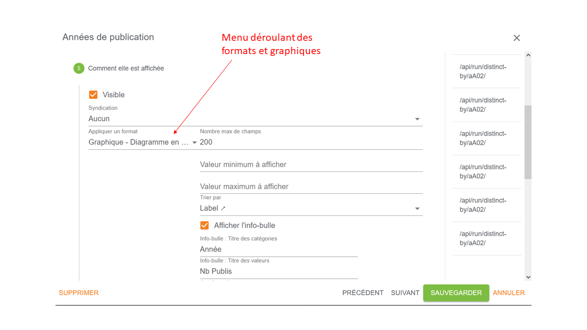

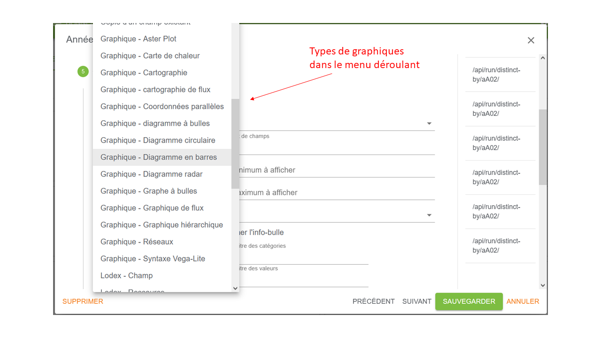

## Aster plot

C’est un “graphique” qui ne s’adapte pas à l’ensemble d’un jeu de données, mais permet de comparer des ressources au
sein d’un jeu de données

### Routines utilisables

- close-by
- sub-resources-asterplot

## Carte de chaleur

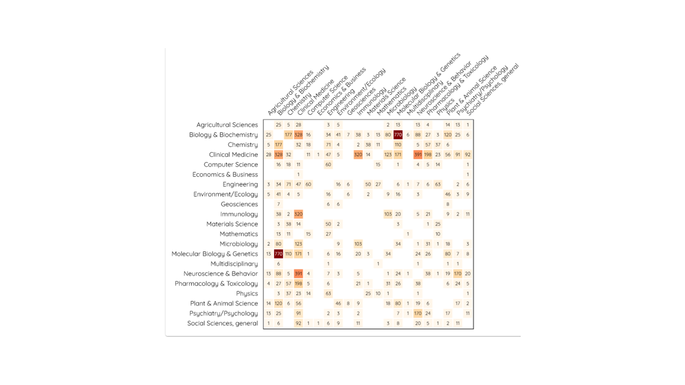

### Routines utilisables

- pairing-with
- graph-by
- cross-by
- decompose-by

### Paramétrages disponibles

- Nombre max de champs
  - Nombre de champs maximum retourné par la routine :   Le nombre maximum de champs indiqué par défaut est 200. Pour la
    carte de chaleur, il est souhaitable d’indiquer un nombre élevé de champs (20000000 par exemple), sinon toutes les
    données ne seront pas visibles sur le graphique.
- Valeur minimum à afficher & Valeur maximum à afficher
  - Encadrement des valeurs retournées par la routine, vide et équivalent à l’infini [-∞, +∞] (si la routine le permet)
- Trier par
  - Trie les données retournées par la routine sur leur intitulé ou leur valeur (si la routine le permet)
  - Note : le tri par valeur peut ne pas fonctionner car il s’agit d’association de valeurs
- Afficher l’info-bulle
  - permet de mettre une info-bulle sur les données du graphique avec un titre sur les intitulés et valeurs des données.
- Jeu de couleurs
  - Sélection d’une palette de couleur en dégradé
- Inverser les axes
  - Inverser les deux axes la source devient la destination et la destination devient la source : les éléments
    préalablement affichés à l’horizontale sont affichés à la verticale, et inversement.

### Exemple

de carte de chaleur où les valeurs des deux axes (source et cible) sont identiques (identifiant 1) –> écriture de
“Comment la valeur est créée” sous la forme de /api/run/pairing-with/identifiant1/identifiant1

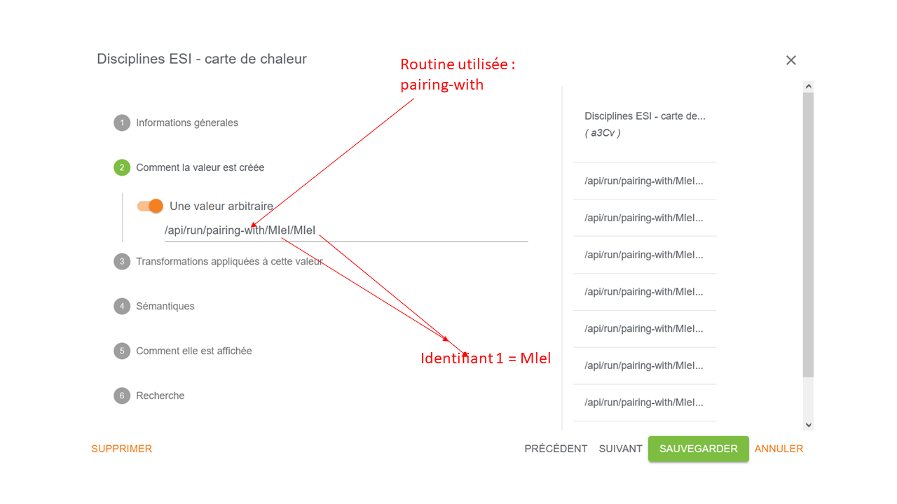

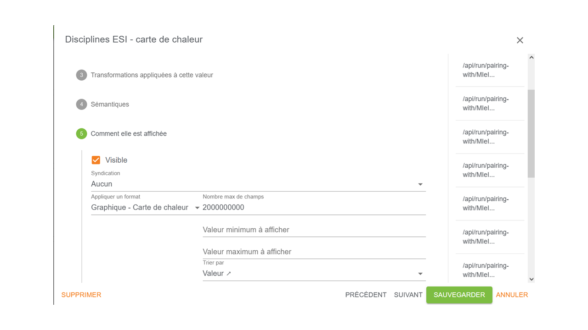

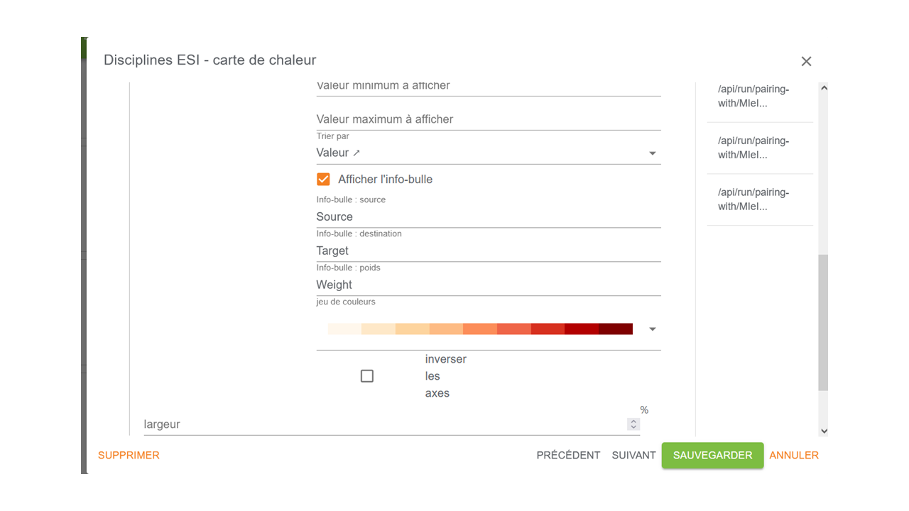

## Cartographie

Le format Graphique – Cartographie projette des données numériques sur une carte géographique du Monde, de l’Europe ou
de la France

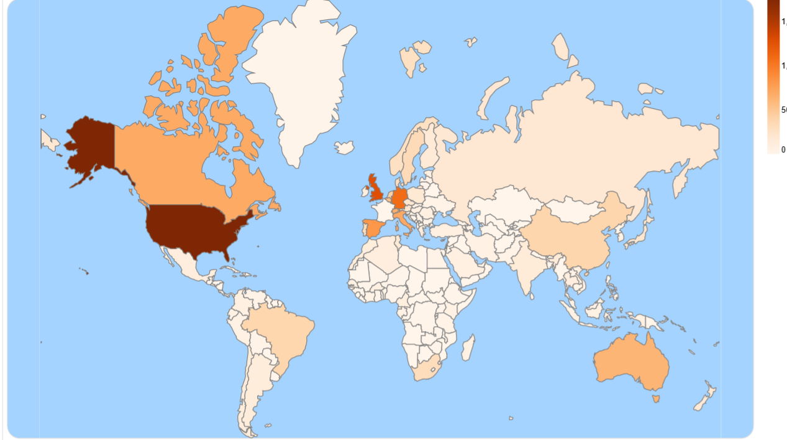

### Routines utilisables

- distinct-by
- distinct-ISO3166-1-alpha3-from
- distinct-alpha-2-alpha3-from

### Paramétrages disponibles

Les paramètres Nombre max de champs, Valeur minimum à afficher et Valeur maximum à afficher permettent de définir, pour
le champ représenté, les éléments à afficher.

Seuls sont affichés les éléments dont le nombre d’apparitions est :

- supérieur à la valeur définie dans le paramètre Valeur minimum à afficher
- inférieur à la valeur définie dans le paramètre Valeur maximum à afficher

- Nombre max de champs
  - Détermine le nombre maximum d’éléments à afficher
- Valeur minimum à afficher & Valeur maximum à afficher
  - Définit le nombre minimum ou maximum d’apparitions d’un élément dans le corpus pour qu’il soit affiché

- Projection du Monde
  - Ce paramètre correspond au zoom effectué sur la carte, 3 zooms sont disponibles
    - Projection mondiale : Affiche le Monde
    - Projection européenne : Affiche l’Europe géographique
    - Projection française : Afficher la France avec ses départements
- Trier par :
  - Valeur ascendante (dans ce cas, plus l’entité géographique aura un poids important, plus le dégradé de couleur
    foncera) ou valeur descendante (dégradé de couleur du plus foncé au moins foncé)
- Dégradé de couleur qui est appliqué au poids d’un pays (projection européenne ou mondiale) ou d’un département (dans
  le cas de la projection française)
- Afficher l’info-bulle
  - permet de mettre une info-bulle sur les données du graphique lorsqu’on passe le curseur sur le graphique, avec un
    titre sur les intitulés et valeurs des données.

Si le corpus de données comporte un champ avec les codes ISO 3 des pays, ce format nécessite l’utilisation de la routine
**distinct-by**, appliquée à l’identifiant du champ représenté, qui doit être déclarée dans valeur selon :

/api/run/distinct-by/**identifiant**/

où identifiant est le code attribué par LODEX au champ contenant les codes ISO 3 des pays.

Si le corpus de données ne comporte pas les codes ISO 3 des pays, ce format nécessite l’utilisation de la routine
**distinct-ISO3166-1-alpha3-from**, appliquée à l’identifiant du champ contenant les pays verbalisés, (ou la routine
**distinct-alpha-2-alpha3-from**, appliquée à l’identifiant du champ contenant les codes ISO 2 des pays) qui doit être
déclarée dans valeur selon :

/api/run/distinct-ISO3166-1-alpha3-from/**identifiant**/ (ou /api/run/distinct-alpha-2-alpha3-from/**identifiant**/)

où **identifiant** est le code attribué par LODEX au champ contenant les **pays verbalisés**.

### Exemple

de paramétrage d’une carte mondiale (nombre de publications par pays – hors France ; utilisation de la routine
distinct-by)

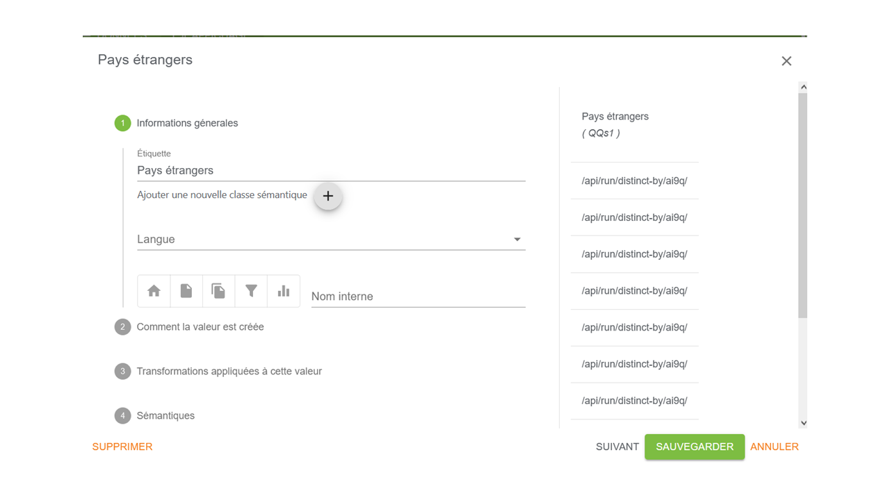

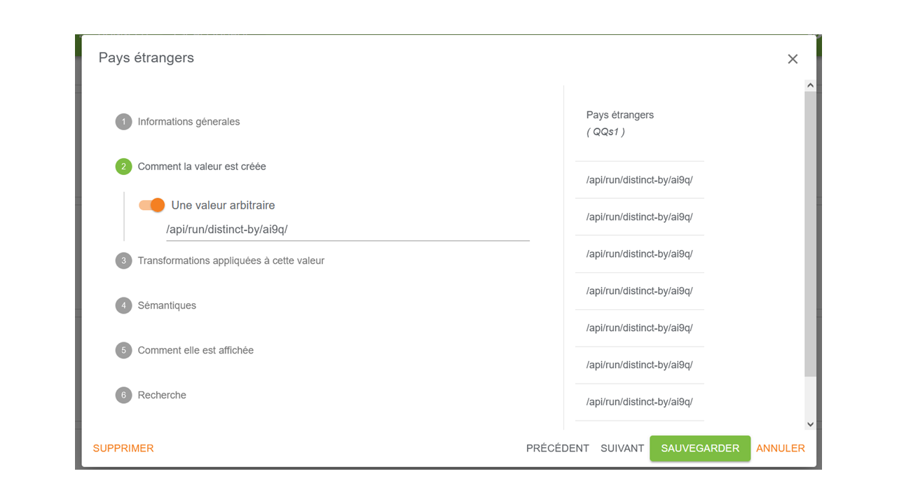

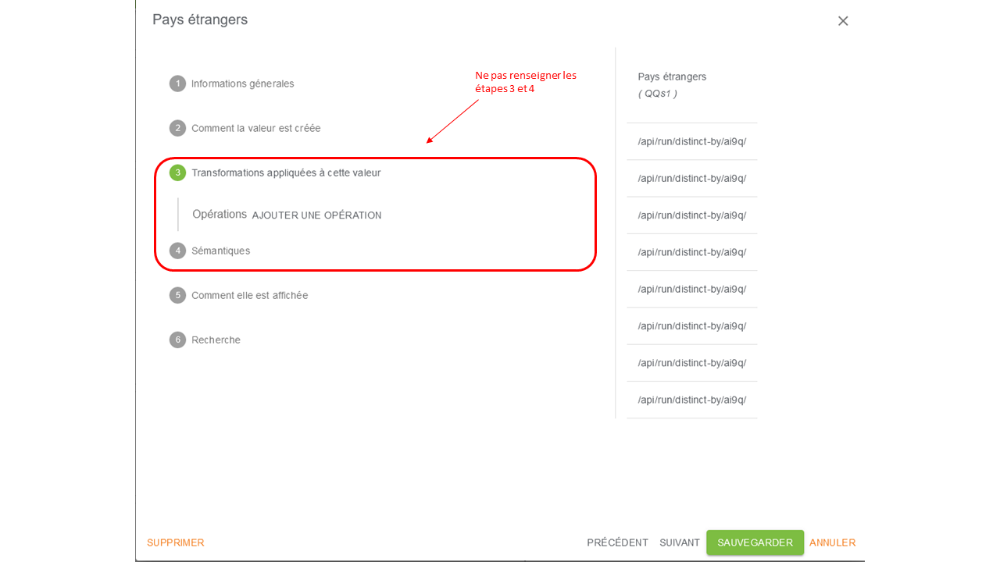

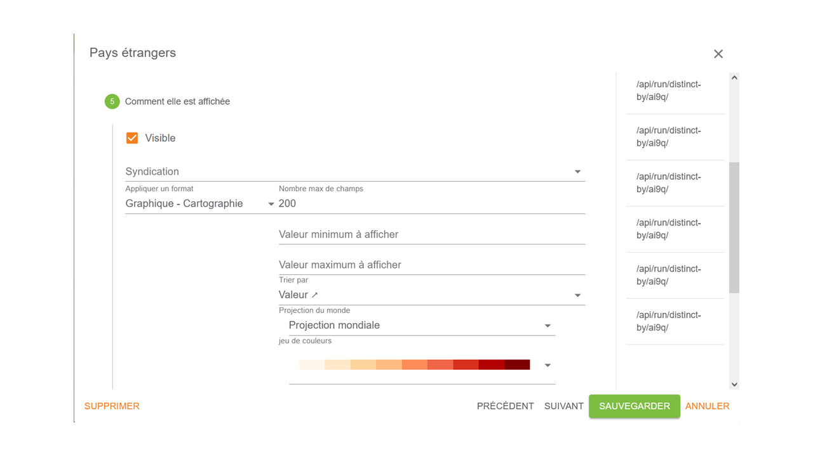

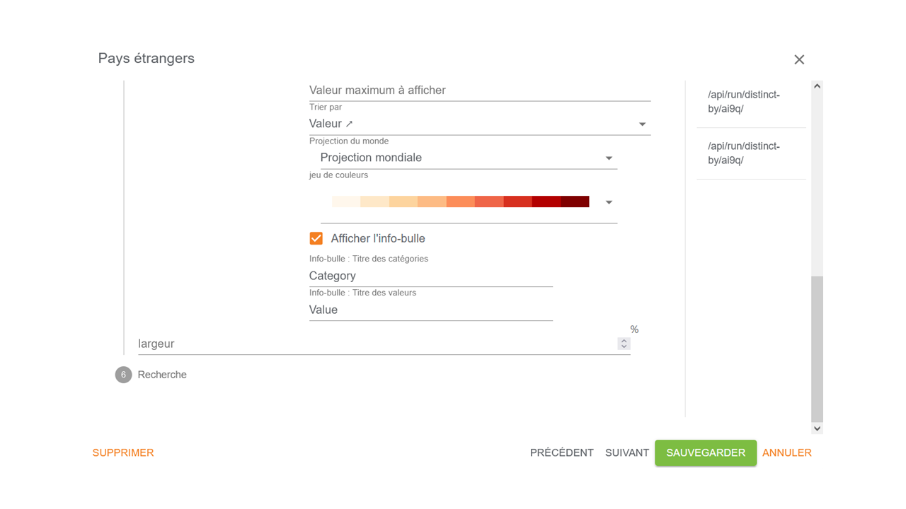

## Cartographie de flux

Le graphique Cartographie de flux permet la géo-visualisation de données sur une carte. C’est une cartographie web
dynamique : le passage de la souris sur les pays met en évidence les liens entre les pays (flèches simples incurvées,
dont la largeur est proportionnelle à l’importance des collaborations entre pays) et affiche également le “poids” de
chaque pays par un point dont le dégradé de couleur est plus ou moins prononcé.

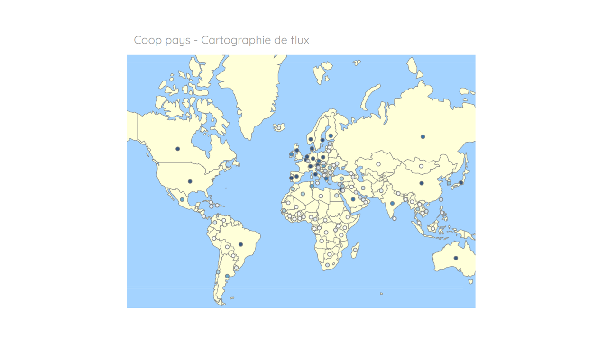

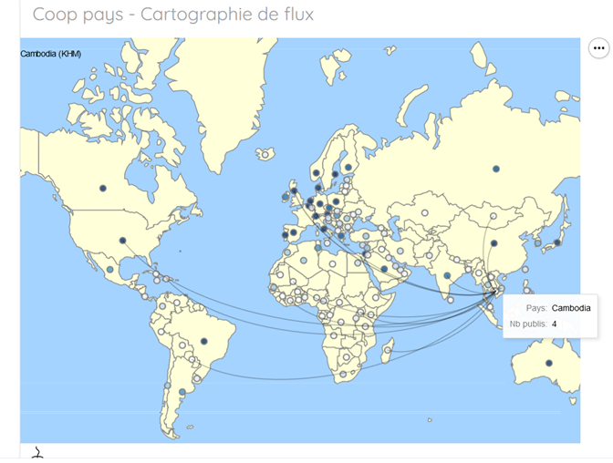

### Routines utilisables

- pairing-with
- graph-by
- cross-by
- decompose-by

### Paramétrages disponibles

Les paramètres Nombre max de champs, Valeur minimum à afficher et Valeur maximum à afficher permettent de définir, pour
le champ représenté, les éléments à afficher.

Seuls sont affichés les éléments dont le nombre d’apparitions est :

- supérieur à la valeur définie dans le paramètre Valeur minimum à afficher
- inférieur à la valeur définie dans le paramètre Valeur maximum à afficher

- Nombre max de champs
  - Détermine le nombre maximum d’éléments à afficher
- Valeur minimum à afficher & Valeur maximum à afficher
  - Définit le nombre minimum ou maximum d’apparitions d’un élément dans le corpus pour qu’il soit affiché
- Trier par
  - Trie les données retournées par la routine sur leur intitulé ou leur valeur (si la routine le permet)
  - Note : le tri par valeur peut ne pas fonctionner car il s’agit d’association de valeur
- Afficher l’info-bulle
  - permet de mettre une info-bulle sur les données du graphique avec un titre sur les intitulés et valeurs des données

- Jeu de couleurs
  - Dégradé de couleur sur les points (les points sont plus ou moins foncés, en fonction de la valeur)
- Couleur
  - Couleur des liens entre les lieux géographiques (flèches simples incurvées), donnée en code hexadécimal

### Exemple

de paramétrage d’une cartographie de flux (géo-visualisation des relations entre pays co-publiants ; utilisation de la
routine pairing-with)

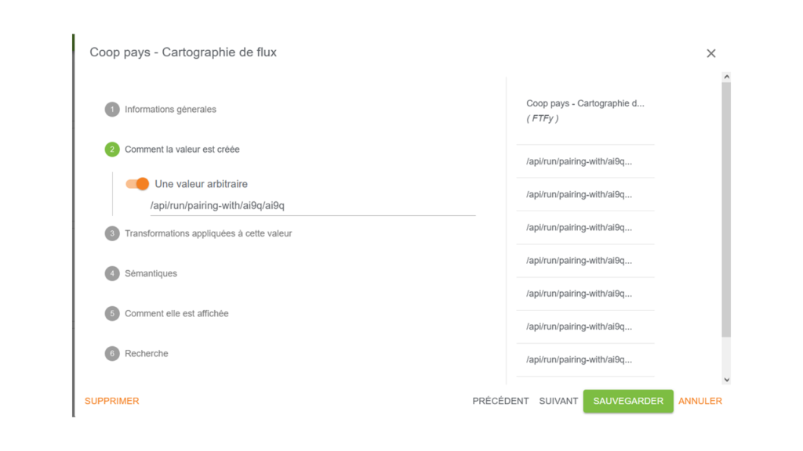

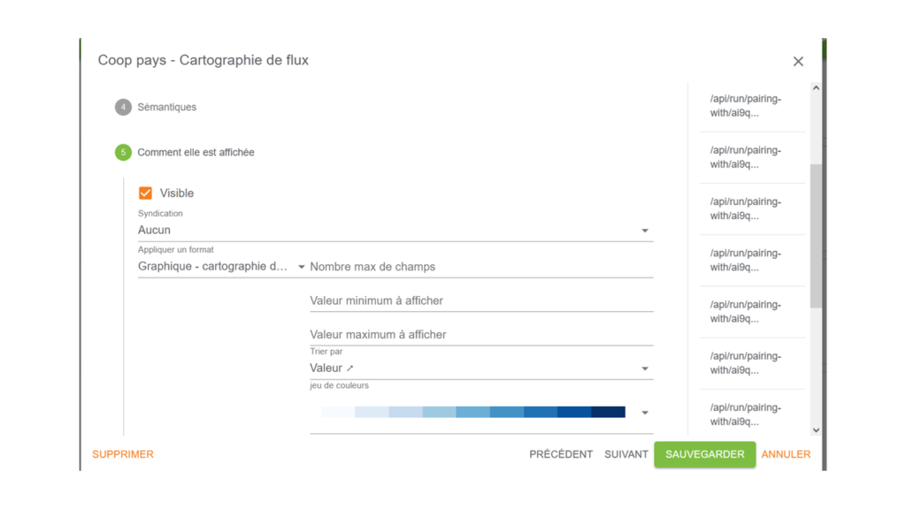

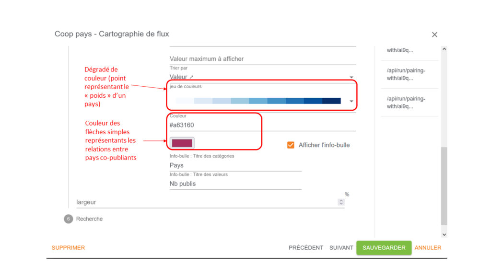

La couleur des flèches simples de relations entre les pays est par défaut le noir. Pour modifier cette couleur, il
suffit de cliquer sur la partie appropriée (voir ci-dessous)

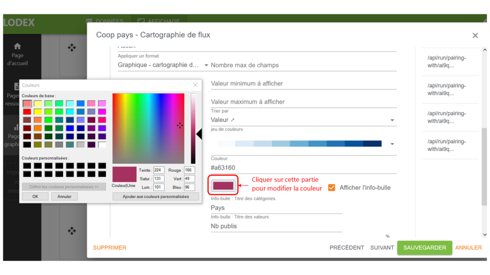

## Coordonnées parallèles

…

## Diagramme à bulles (bubble plot)

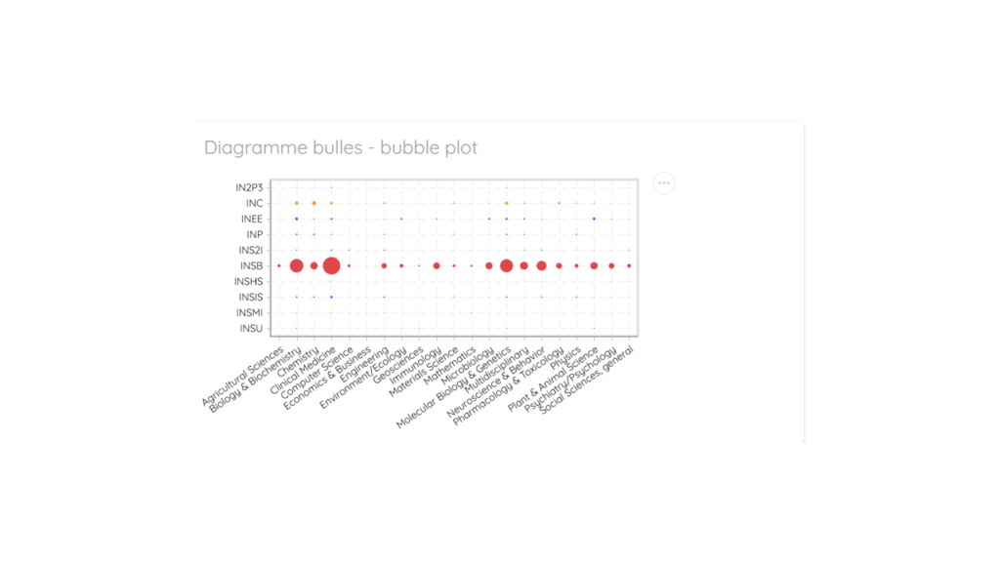

### Routines utilisables

- pairing-with
- cross-by
- graph-by
- decompose-by

### Paramétrages disponibles

- Nombre max de champs
  - Nombre de champs maximum retournés par la routine, vide et équivalent à l’infini (si la routine le permet)
- Valeur minimum à afficher & Valeur maximum à afficher
  - Encadrement des valeurs retournées par la routine, vide et équivalent à l’infini [-∞, +∞] (si la routine le permet)
- Trier par
  - Trie les données retournées par la routine sur leur intitulé ou leur valeur (si la routine le permet)
  - Note : le tri par valeur peut ne pas fonctionner car il s’agit d’association de valeurs
- Afficher l’info-bulle
  - permet de mettre une info-bulle sur les données du graphique avec un titre sur les intitulés et valeurs des données.
- Jeu de couleurs
  - Couleur du graphique donnée en code hexadécimal
- Inverser les axes
  - Inverser les deux axes la source devient la destination et la destination devient la source

### Exemple

de paramétrage d’un diagramme à bulles (utilisation de la routine pairing-with)

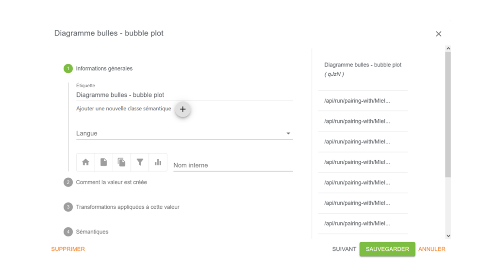

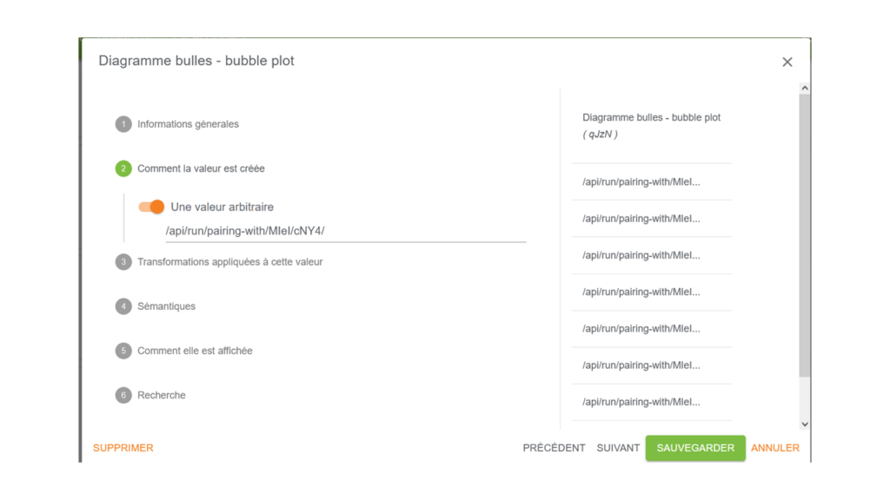

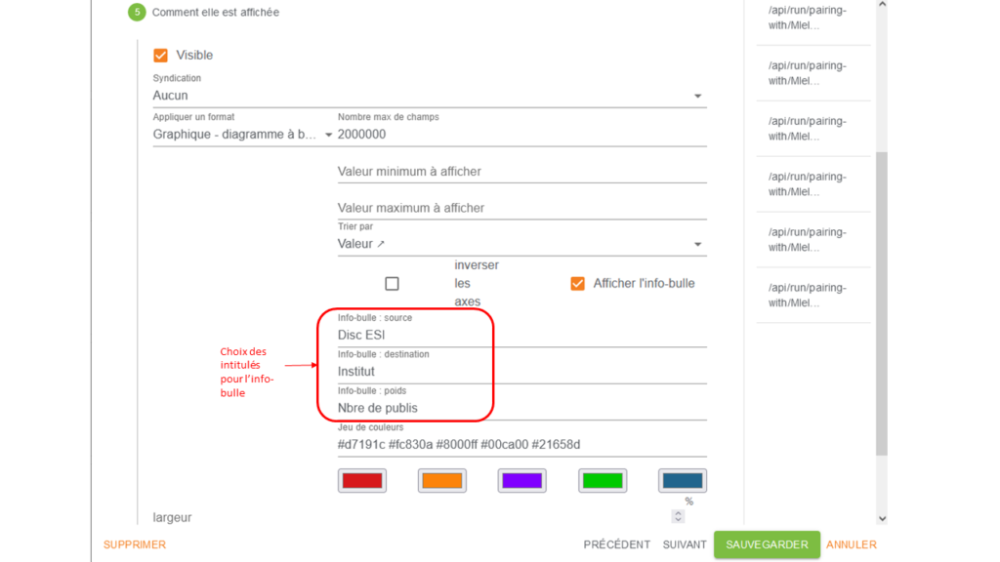

## Diagramme circulaire

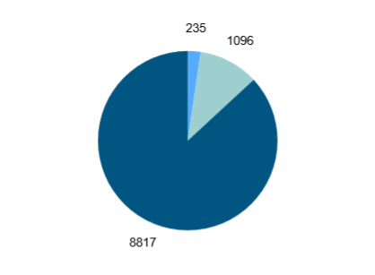

### Routines utilisables

- distinct-by
- distinct-by-field
- distribute-by-interval

### Paramétrages disponibles

Les paramètres Nombre max de champs, Valeur minimum à afficher et Valeur maximum à afficher permettent de définir, pour
le champ représenté, les éléments à afficher.

Seuls sont affichés les éléments dont le nombre d’apparitions est :

- supérieur à la valeur définie dans le paramètre Valeur minimum à afficher
- inférieur à la valeur définie dans le paramètre Valeur maximum à affiche

- Nombre max de champs
  - Détermine le nombre maximum d’éléments à afficher

- Valeur minimum à afficher & Valeur maximum à afficher
  - Définit le nombre minimum ou maximum d’apparitions d’un élément dans le corpus pour qu’il soit affiché

- Trier par :
  - Trie les données retournées par la routine sur leur intitulé (ordre alphabétique) ou leurs valeurs (valeur
    croissante ou décroissante)

- Afficher les valeurs
  - Affiche les valeurs des données sur le graphique

- Afficher l’info-bulle
  - Permet de mettre une info-bulle sur les données du graphique, avec un titre pour les catégories du diagramme et un
    titre des valeurs des données.

- Jeu de couleurs
  - Couleur du graphique donnée en code hexadécimal

- Largeur
  - La largeur est exprimée en pourcentage et correspond à la largeur du graphique par rapport à la largeur de la page
    entière. Par défaut la largeur est de 100 %. Si on souhaite que le graphique n’occupe que la moitié de la largeur de
    la page par exemple, on réduit la largeur à 50 %.

### Exemple

de paramétrage d’un diagramme circulaire (utilisation de la routine distinct-by)

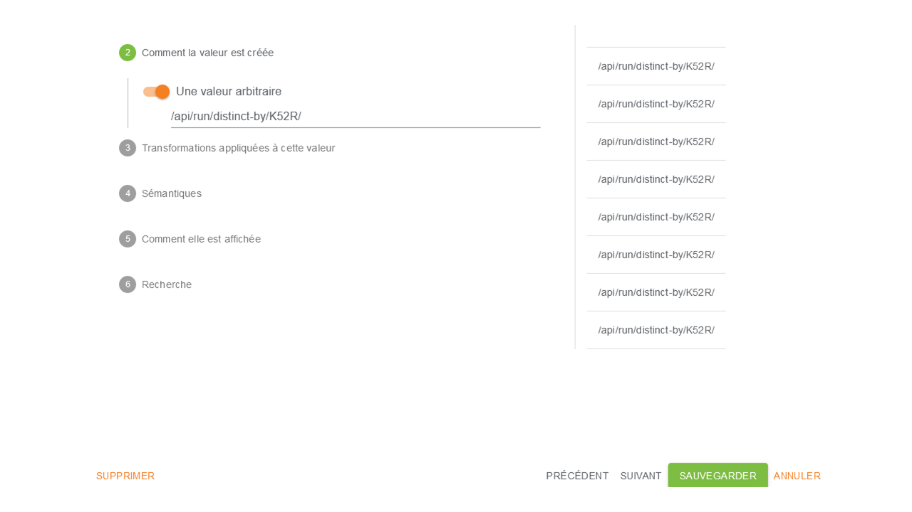

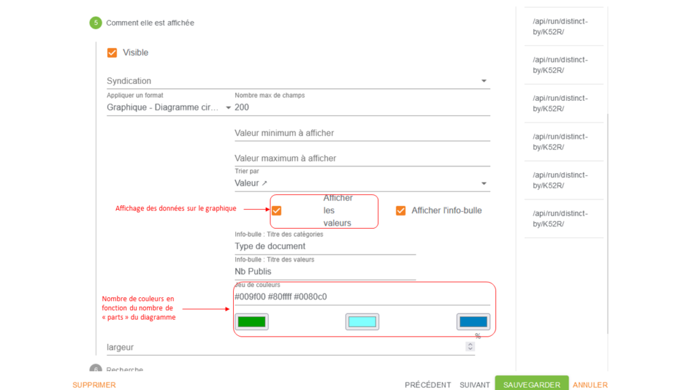

## Diagramme en barres

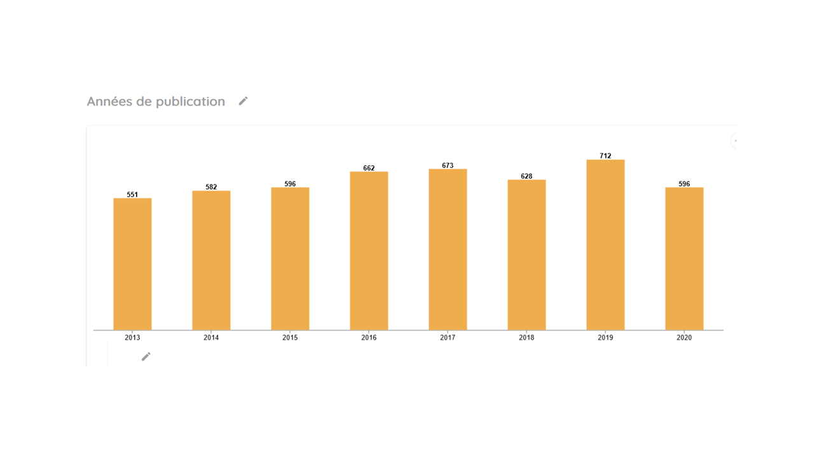

### Routines utilisables

- distinct-by
- distinct-by-field
- distribute-by-date
- distribute-by-decadal
- distribute-by-interval

### Paramétrages disponibles

Les paramètres Nombre max de champs, Valeur minimum à afficher et Valeur maximum à afficher permettent de définir, pour
le champ représenté, les éléments à afficher.

Seuls sont affichés les éléments dont le nombre d’apparitions est :

- supérieur à la valeur définie dans le paramètre Valeur minimum à afficher
- inférieur à la valeur définie dans le paramètre Valeur maximum à afficher

- Nombre max de champs
  - Détermine le nombre maximum d’éléments à afficher
- Valeur minimum à afficher & Valeur maximum à afficher
  - Définit le nombre minimum ou maximum d’apparitions d’un élément dans le corpus pour qu’il soit affiché

- Trier par
  - Trie les données retournées par la routine sur leur intitulé (Label) ou leur valeur : un tri par Label ascendant
    permet un affichage par ordre alphabétique ou numérique croissant (année de publication, …) ; un tri par valeur met
    en évidence les valeurs des données
- Afficher l’info-bulle
  - Permet de mettre une info-bulle sur les données du graphique avec un titre sur les intitulés et valeurs des données.
    L’affichage de l’info-bulle sera visible en passant la souris sur le graphique
- Jeu de couleurs
  - Couleur du graphique donnée en code hexadécimal
- Direction
  - Direction des barres du graphique (barres horizontales ou verticales)
- Afficher l’axe des catégories en diagonale / afficher l’axe des valeurs en diagonale
  - Passe l’angle des intitulés des axes de 0° à 45°
- Arrondir les valeurs sur l’axe
  - Arrondit les valeurs de l’axe (sans virgule)
- Afficher les valeurs
  - Supprime l’axe des valeurs pour le remplacer par un affichage des valeurs sur les barres
- Éviter le chevauchement des étiquettes
- Échelle
  - Type de représentation du graphique (linéaire ou logarithmique)
- Largeur des barres
  - Taille maximum des barres
- Largeur
  - La largeur est exprimée en pourcentage et correspond à la largeur du graphique par rapport à la largeur de sa
    représentation sur la page entière. Par défaut la largeur est de 100 %. Si on souhaite que le graphique n’occupe que
    la moitié de la largeur de la page par exemple, on réduit la largeur à 50 %.

### Exemple

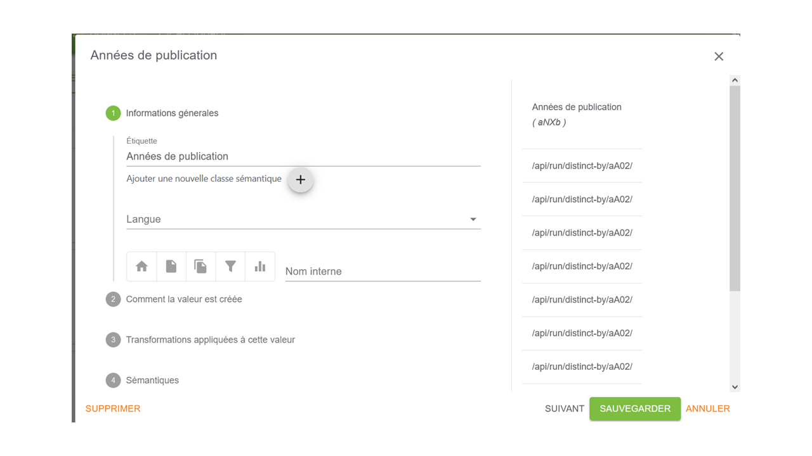

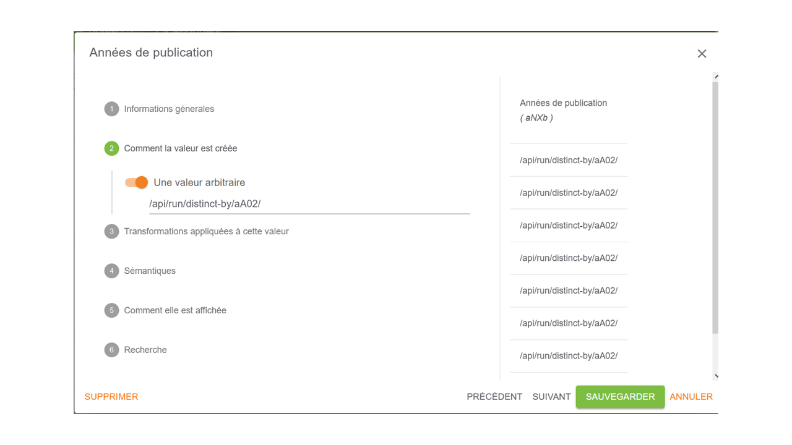

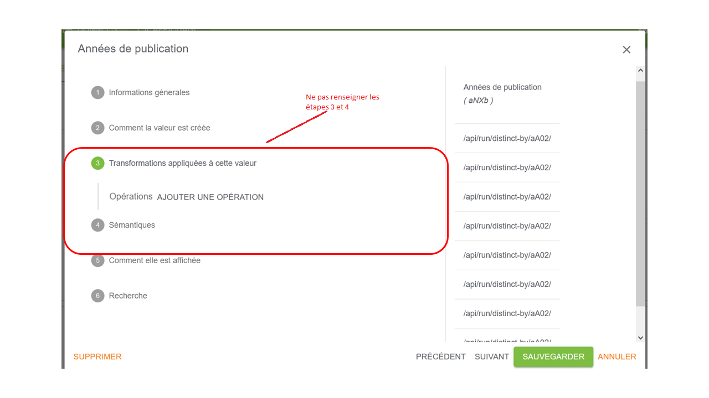

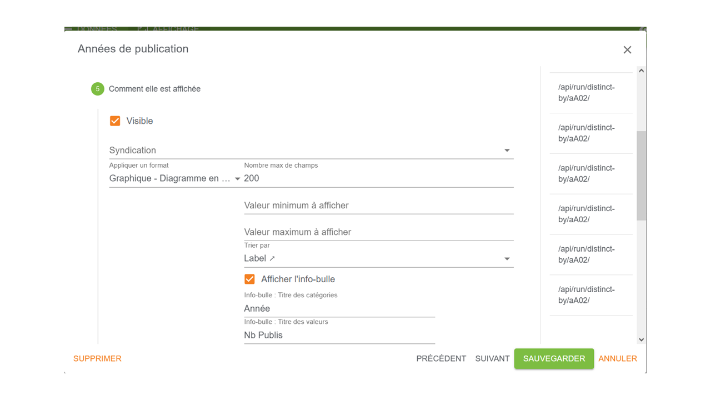

Dans cet exemple, on a choisi de trier par Label ascendant : le label correspond ici aux années de publication qui
s’afficheront de façon chronologique ascendante dans le graphique

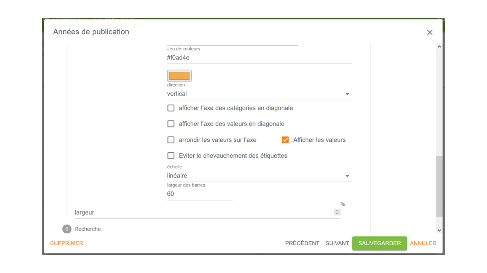

## Diagramme radar

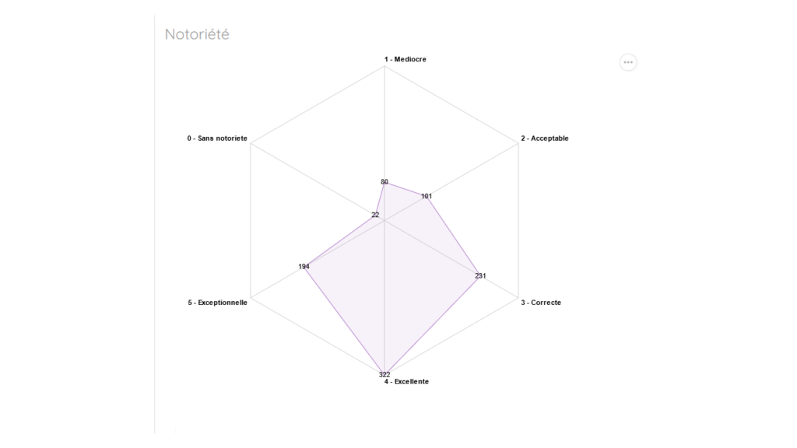

### Routines utilisables

- distinct-by
- distinct-by-field

### Paramétrages disponibles

- Nombre max de champs
  - Nombre de champs maximum retourné par la routine, vide et équivalent à l’infini (si la routine le permet)
- Valeur minimum à afficher & Valeur maximum à afficher
  - Encadrement des valeurs retournées par la routine, vide et équivalent à l’infini [-∞, +∞] (si la routine le permet)
- Trier par
  - Trie les données retournées par la routine sur leur intitulé ou leur valeur (si la routine le permet)
- Afficher l’info-bulle
  - Permet de mettre une info-bulle sur les données du graphique avec un titre sur les intitulés et valeurs des données.
- Couleur
  - Couleur du graphique donnée en code hexadécimal
- Arrondir les valeurs sur l’axe
  - Arrondit les valeurs de l’axe
- Échelle
  - Type de représentation du graphique (linéaire ou logarithmique)

### Exemple d’un diagramme radar

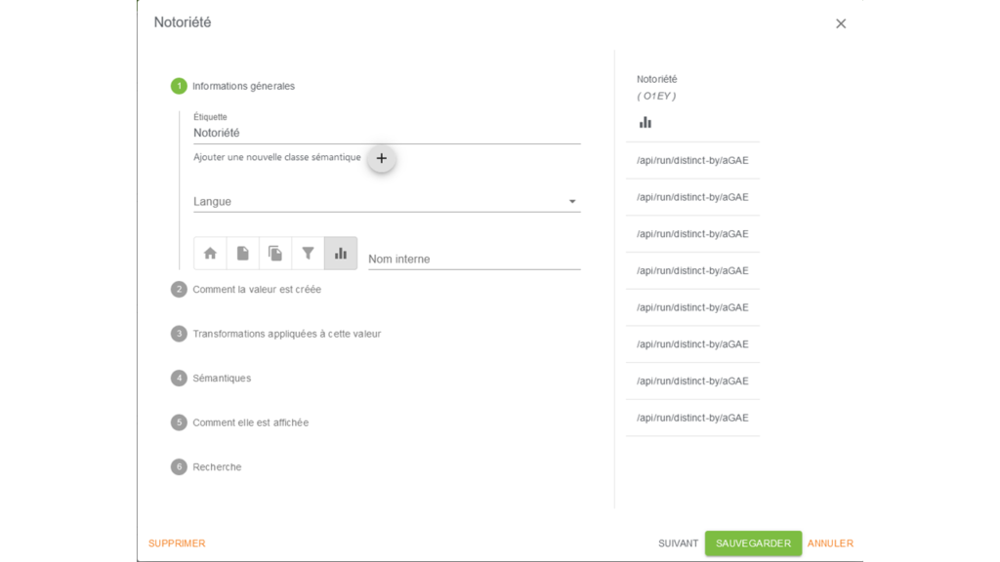

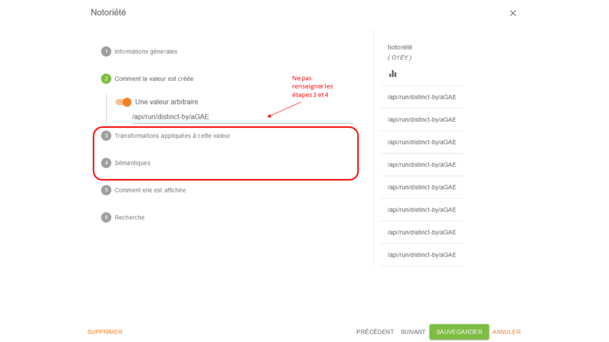

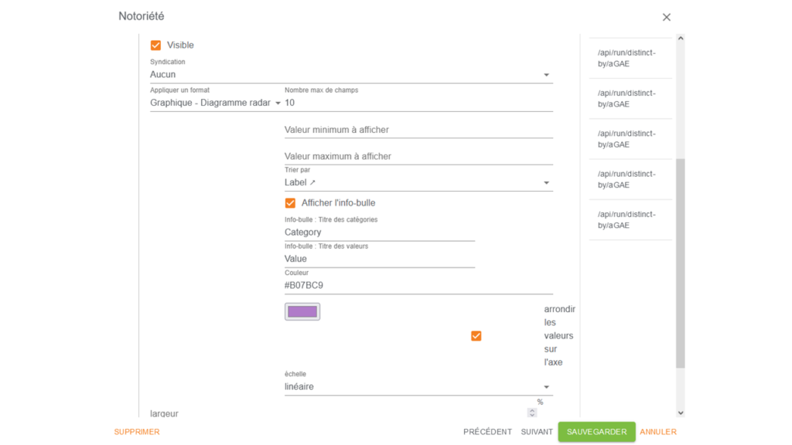

## Graphe à bulles

Le format Graphique – Graphe à bulles (*Graph – Bubble*) montre les corrélations (regroupement de bulles) et les poids (
taille des bulles) des différents éléments du champ représenté, montrant ainsi les proportions des différentes valeurs.

### Routines utilisables

- distinct-by
- distinct-by-field
- sparql-query

### Paramétrages disponibles

Les paramètres Nombre max de champs, Valeur minimum à afficher et Valeur maximum à afficher permettent de définir, pour
le champ représenté, les éléments à afficher.

Seuls sont affichés les éléments dont le nombre d’apparitions est :

- supérieur à la valeur définie dans le paramètre Valeur minimum à afficher
- inférieur à la valeur définie dans le paramètre Valeur maximum à afficher

- Nombre max de champs
  - Détermine le nombre maximum d’éléments à afficher
- Valeur minimum à afficher & Valeur maximum à afficher
  - Définit le nombre minimum ou maximum d’apparitions d’un élément dans le corpus pour qu’il soit affiché
- Trier par
  - Trie les données retournées par la routine sur leur intitulé ou leur valeur (si la routine le permet)
- Couleur
  - Couleur du graphique donnée en code hexadécimal
- Diamètre des bulles : nombre en pixels

### Exemple de paramétrage d’un graphe à bulles

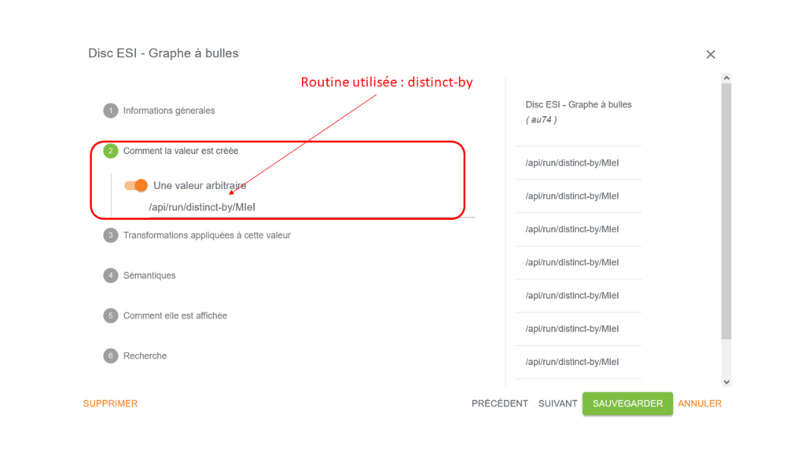

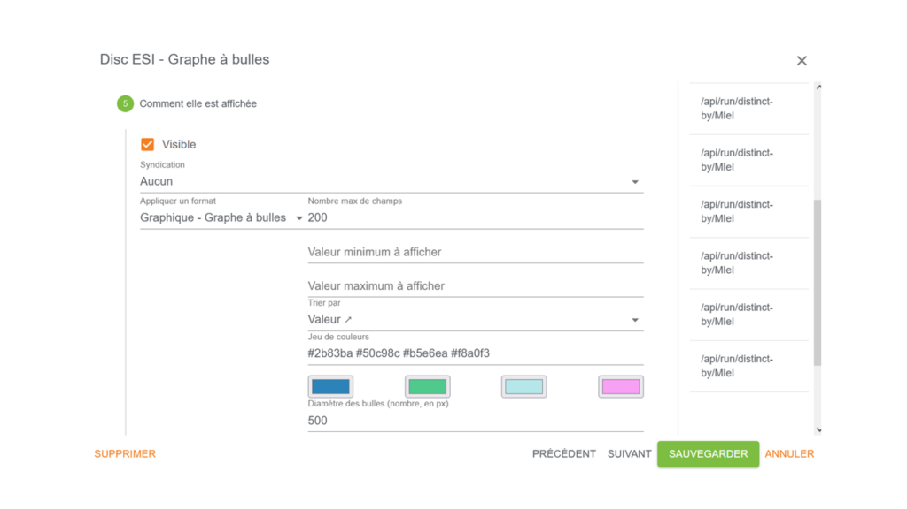

## Graphique de flux

### Routines utilisables

- classif-by

### Paramétrages disponibles

…

## Graphique hiérarchique

### Routines utilisables

- tree-by

### Paramétrages disponibles

…

## Réseaux

Pour le format Réseaux, la largeur des liens est calculée automatiquement en fonction du poids de ces liens : à préciser

La taille d’un nœud est fonction de son degré, c’est-à-dire du nombre de liens le reliant à d’autres nœuds.

On peut cliquer sur un nœud pour griser tous les nœuds qui ne lui sont pas liés (et leurs liens).

La position des nœuds est calculée automatiquement, et est dynamique (cela peut mettre un peu de temps pour se
stabiliser).

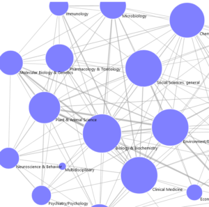

### Routines utilisables

- cross-by
- decompose-by
- graph-by
- pairing-with

Si le réseau est unimodal (un seul champ représenté), ce format nécessite l’utilisation de la routine graph-by ou
decompose-by, appliquée à l’identifiant du champ représenté, qui doit être déclarée dans valeur (value) selon :

/api/run/graph-by/**identifiant**/ ou /api/run/decompose-by/**identifiant**/

où **identifiant** est le code attribué par LODEX au champ représenté.

Si le réseau est multimodal (plusieurs champs représentés), ce format nécessite l’utilisation de la routine
pairing-with, appliquée aux identifiants des champs représentés, qui doit être déclarée dans valeur (value) selon :

/api/run/pairing-with/**identifiant1**/**identifiant2**/

où **identifiant1** et **identifiant2** sont les codes attribués par LODEX aux champs représentés.

### Exemple de paramétrage d’un graphique en format réseaux  (réseau unimodal)

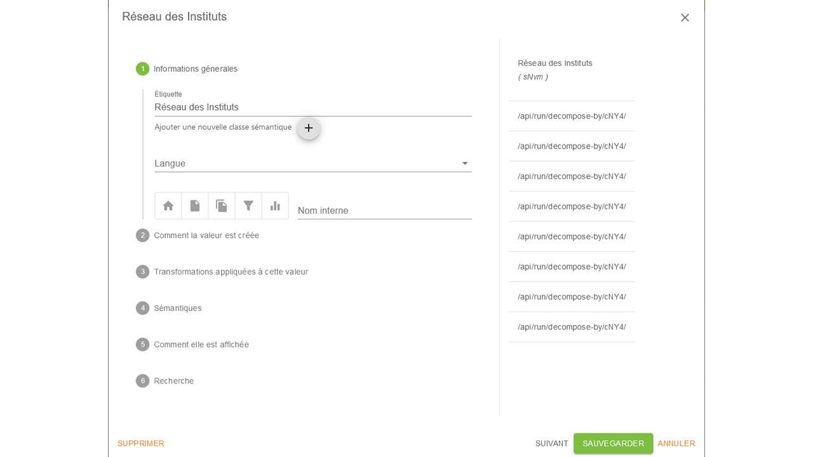

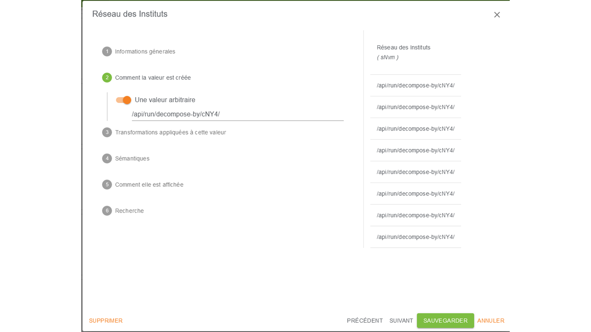

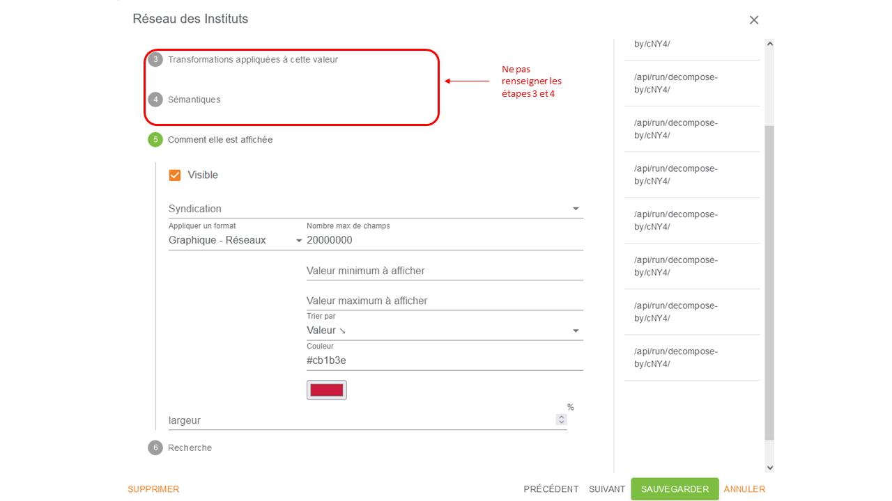

## Syntaxe Vega-Lite

La syntaxe Vega-Lite peut être utile si on souhaite réaliser des graphiques un peu plus élaborés que ceux précédemment
décrits.

Elle permet la réalisation de tout type de graphiques (graphique à barres, carte de chaleur, etc…). Comme expliqué
précédemment, la routine utilisée est fonction du graphique.

Pour aller se familiariser avec la syntaxe Vega-lite : https://vega.github.io/vega-lite/docs/
