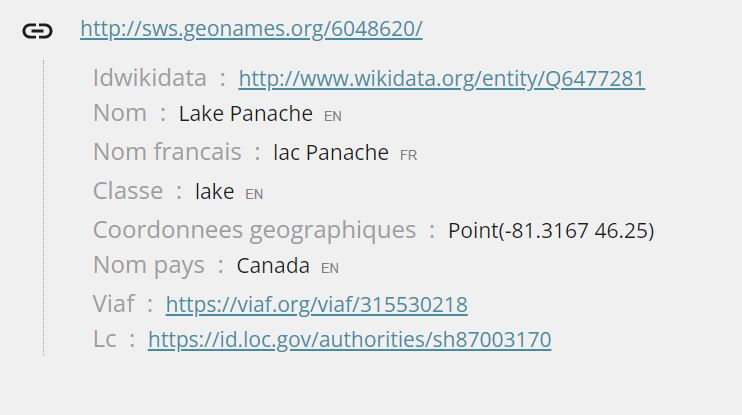
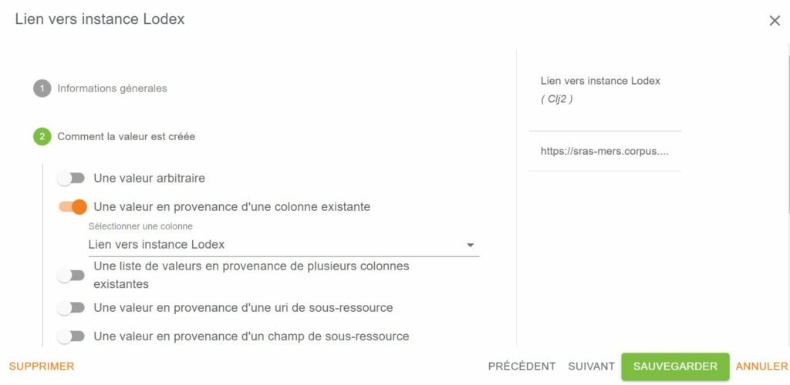

# Les "formats"

Le format c’est ce qui va conditionner la manière dont le champ, sur lequel on l’applique, sera affiché. Le paramétrage
réalisé sur tous les champs donne le modèle d’affichage du jeu de données.

Sans choix de format, “none” la valeur du champ s’affichera comme une chaîne de caractères.

## NONE

La valeur du champ s’affiche comme une chaine de caractère.

## AUTRE-Article citant

Format utilisé dans la “revue de sommaire” qui affiche la liste paginée des documents des 10 premières revues (1) par
ordre d’importance, citant cette revue lorsqu’ils sont présents dans l’api-Istex.

- L’affichage se fait par titres d’ouvrage ou de revue dans des dossiers contenant la liste des articles en corrélation
  avec le titre de la revue ou ouvrage retournée.
- Ce format permet de dupliquer cette requête dans Istex-dl. Dans ce cas, tous les résultats au-delà des 10 premiers
  sont présents. (2)
- Il est possible de dupliquer cette requête dans Istex-dl au niveau de chaque dossier retourné. (3)


En appliquant le format Autre -Article citant les autres paramètres se mettent automatiquement :


## AUTRE-Article cité

Format utilisé dans la [“revue de sommaire”](https://revue-sommaire.istex.fr/) qui affiche le top 10 des articles les
plus cités de la revue. Ils sont paginés par ordre de pertinence.

## AUTRE-Grille de ressources

La grille de ressource permet d’afficher une liste de ressources sur la **page d’accueil** avec des liens vers ces
ressources. Les caractéristiques affichées de chaque ressource sont : le Titre et la “Description”, c’est à dire le
champ qui a reçu le marquage “DESCRIPTION” dans la case “Syndication” de la configuration du format d’affichage.

- Autoriser à charger plus de ressources  :  Cette option, si elle est cochée, permet d’afficher de proche en proche
  toutes les ressources (le pas étant défini par le paramètre “Nombre de ressources par page”). Le bouton *“Plus de
  résultats”* disparaît, dès que le nombre de ressources à afficher est complet. Si cette option est décochée, tous les
  résultats sont affichés d’emblée. Ne pas oublier d’adapter la valeur du paramètre “Nombre de ressources par page” au
  nombre de maximum de résultats à afficher.

- Ouvrir la ressource dans un nouvel onglet : Cette option, si elle est cochée, permet de choisir l’ouverture de chaque
  ressource dans un nouvel onglet (NB : nécessite à l’heure actuelle à chaque ouverture une déclaration des login/mot de
  passe dans les instances configurées avec des paramètres de connexion => paramétrer la connexion “user” sans login/mot
  de passe pour éviter ce problème)

- Titre limité à (nombre de caractères) :  Ce paramètre permet de tronquer un *Title* trop long en le limitant par un
  nombre maximum de caractères. Le découpage du texte se fait mot par mot pour conserver la totalité du dernier mot. Si
  la valeur est égale à zéro (ou un nombre négatif ] -∞ ; 0]) ou si elle n’est pas précisée, le texte du Title
  s’affichera en entier.

- Description limitée à (nombre de caractères) : Ce paramètre permet de tronquer une Description trop longue en la
  limitant par un nombre maximum de caractères. Le découpage du texte se fait mot par mot pour conserver la totalité du
  dernier mot. Si la valeur est égale à zéro (ou un nombre négatif ] -∞ ; 0]) ou si elle n’est pas précisée, le texte de
  la *Description* s’affichera en entier.


## AUTRE-Lien image

Format qui permet d’afficher une image dans votre instance en ajoutant son lien stocké à un autre endroit. Choisir sa
taille en pixel.

Dans les paramètres, on peut donner le lien vers l’image :

- Une Url custom (identiques pour toutes les ressources”)
- Un autre contenu de colonne

**=> Exemple avec une icône Pdf**


**=> Affichage**


## AUTRE-Requête Istex

Format qui affiche la liste paginée des documents correspondant à une requête dans l’api Istex.

Les documents sont cliquables et affichent le Pdf dès lors que l’utilisateur en a le droit.

Donner un nom au champ
La valeur correspondant à la requête à l’api Istex ((“severe acute respiratory syndrome virus”) OR (“sars related
coronavirus”))
Sélectionner le format

## AUTRE-Sommaire Istex

Format qui permet d’afficher les ressources présentes dans Istex, par titre de revue et sous une forme d’arborescence (
tous les articles d’une même Numéro) Utilisé pour l’instance “revue de sommaire”.

Lorsque le format est sélectionné les autres champs d’affichage sont préremplis.

## AUTRE-Tableau Non Paginé

### Routine utilisable

- Toutes à l’exception des routines nécessitant une URI

Ce format est destiné à publier, sous forme d’un tableau d’une seule page, les données retournées par n’importe quelle
routine (à l’exception des routines nécessitant une URI) et de choisir pour chaque colonne de ce tableau un format
d’affichage particulier.

*Par défaut, le tableau s’affiche avec la 1ère colonne triée par ordre croissant (même si un autre choix de tri en mode
admin via le paramètre orderBy a été appliqué).*

*Un tri, par ordre croissant ou décroissant, peut être demandé sur chaque colonne du tableau.*

:::note

Ce format est à privilégier dans le cas d’un faible nombre de données que l’on peut afficher en une seule fois sur la
page de son site web

:::

Les paramètres Maximum fields number *(Nombre max de champs)*, min value *(valeur minimum)* et max value *(valeur max)*
permettent de définir, pour le champ représenté, les éléments à afficher.

Seuls sont affichés les éléments dont le nombre d’apparitions est :

=> supérieur à la valeur définie dans le paramètre min value

=> inférieur à la valeur définie dans le paramètre max value

Paramétrages

- Nombre maximum de champ : Détermine le nombre maximum d’éléments à afficher (par défaut 5).
- Valeur minimum à afficher : Définit le seuil, nombre minimum d’apparitions d’un élément dans le corpus pour qu’il soit
  affiché.
- Valeur maximum à afficher : Définit le nombre maximum d’apparitions d’un élément dans le corpus pour qu’il soit
  affiché.
- Trier par :
  - L’ordre de tri peut prendre quatre valeurs :
    - libellé ascendant
    - libellé descendant
    - valeur croissante (par défaut)
    - valeur décroissante
- Nombre de colonnes : Paramètre de choix du nombre de colonnes à afficher
- Liste des paramètres de chaque colonne :
  - Champ de la routine (nom)
    - Propose une liste de champs les plus fréquents renvoyés par la majorité des routines ; dans le cas où le champ
      n’est pas disponible, un élément “Champ personnalisé” permet d’indiquer manuellement le nom du champ (celui-ci
      peut être le nom technique d’un champ paramétré dans l’affichage)
  - Titre de la colonne : Permet de donner le titre souhaité à chaque colonne
  - Appliquer un format
    - Permet d’appliquer un format d’affichage aux données de la colonne, les format proposés sont un sous-ensemble des
      formats déjà disponibles dans Lodex.
    - Après avoir choisi un format dans cette liste, des paramètres supplémentaires spécifiques du format sélectionné
      peuvent s’afficher en complément (se référer à la documentation Lodex de chacun d’entre eux).

**=> Exemple**


**=> Affichage**


## AUTRE-Tableau Paginé

### Routine utilisable

- Toutes à l’exception des routines nécessitant une URI

Ce format permet de publier, sous forme d’un tableau de plusieurs pages, les données retournées par n’importe quelle
routine utilisant le module EZS LodexRunQuery (à l’exception des routines nécessitant une URI) et de choisir pour chaque
colonne de ce tableau un format d’affichage particulier.

*Le tableau s’affiche avec la 1ère colonne triée par ordre croissant.*

*Un tri, par ordre croissant ou décroissant, peut ensuite être appliqué sur chaque colonne du tableau.*

:::note

Ce format est à privilégier dans le cas d’un grand nombre de données (intérêt de la pagination)

:::

Paramétrage

- Nombre max de champs : définit le nombre total de résultats à afficher
- Nombre de ressources par page
  - Permet de choisir le nombre de résultats à afficher dans une page, et donc de mettre en forme la pagination. Le
    tableau publié proposera une subdivision de la pagination dans un menu déroulant à 4 niveaux (depuis la valeur
    initiale choisie lors du paramétrage dans l’interface d’administration jusqu’à “Tous les documents”)
- Nombre de colonnes : Paramètre de choix du nombre de colonnes à afficher
- Liste des paramètres de chaque colonne :
  - Champ de la routine (nom)
    - Propose une liste de champs les plus fréquents renvoyés par la majorité des routines ; dans le cas où le champ
      souhaité n’est pas proposé dans le menu déroulant, utiliser le choix “Champ personnalisé” (sélectionné par défaut)
      pour indiquer manuellement le nom du champ requis (celui-ci peut être le libellé technique d’un champ paramétré
      dans l’affichage)
  - Titre de la colonne : Permet de donner le titre souhaité à chaque colonne
  - Appliquer un format
    - Permet d’appliquer un format d’affichage aux données d’une même colonne (les formats proposés sont un
      sous-ensemble des formats déjà disponibles dans Lodex).
    - Après avoir choisi un format dans cette liste, des paramètres supplémentaires spécifiques du format sélectionné
      peuvent s’afficher en complément (se référer à la documentation Lodex pour chacun d’entre eux).

**=>Exemple**


**=> Affichage**


## AUTRE-Trello Timeline

Le format Trello Timeline permet, à partir d’un tableau [Trello](https://www.trello.com/), d’afficher une timeline

**=> Exemple : tableau Trello**


**=> Affichage**


## AUTRE-URL d’un PDF

Ce format affiche la vue du pdf dont l’URL est la valeur arbitraire dans “comment la valeur est créée”.
Il permet aussi de garder tous les outils disponibles sur le Pdf :  navigation, téléchargement, impression..
Son seul paramétrage est la largeur de l’image (en pourcentage de la largeur de l’application).

## AUTRE-URL d’une image

Ce format affiche l’image dont l’URL est la valeur arbitraire dans “comment la valeur est créée”.
Il permet aussi de zoomer sur l’image pour remplir la page, et revenir à la taille d’origine.
Son seul paramétrage est la largeur de l’image (en pourcentage de la largeur de l’application).

## COPIE d’un champ existant

Ce format permet d’afficher un graphe en page d’accueil qui est déjà présent dans la page de graphes.
Le graphe étant préalablement paramétré dans la page de graphe, il suffit alors de faire une copie, en page d’accueil,
du champ qui a servi à faire le graphe et de préciser son nom. Ne pas oublier de sauvegarder les modifications.

## GRAPHIQUE-Aster Plot

### Routine utilisable

- close-by
- sub-resources-asterplot

Ce format permet de faire un graphique sur le champ multivalué textuel “mots-clés”, dans la ressource, et non au niveau
du jeu de données, pour visualiser les ressources qui ont le plus de similarité entre elles .

- **créer un champ ressource X** (exemple : mots-clés auteur, indexation Teeft, entités nommées Unitex)
  - transformers : PARSE / CAPITALIZE, éventuellement homogénéiser avec des REPLACE Biomimetisme, Bio-mimétisme….=>
    Biomimétisme
  - format : liste de valeurs désordonnée

- **créer un champ graphique** (dans page Ressource )
  - valeur : /api/run/close-by/id-du-champ-ressource X

- **choisir des transformateurs**  : PARSE/JOIN/TRUNCATE et REPLACE_REGEX => api/run/close-by/id-du-champ-ressource X


- Choisir le format “graphique-Aster Plot”


- Résultat : en cliquant sur les quartiers on accède à la ressource


Cas particulier du **“graphique-Aster Plot de sous ressource”**

- Dans sous ressource créer un champ “Y”

- Dans sous ressource créer un champ graphique : comment la valeur est créée une valuer arbitraire
  /api/run/sub-resources-asterplot/X/Y

X= étant l’intitulé du champ lié à la sous ressource dans les ressources et Y l’intitulé du champ sous ressource.(ex:
oeSQ..)

- Choisir ensuite le format “Graphique- Aster Plot”

## GRAPHIQUE-Carte de chaleur

### Routine utilisable

- pairing-with
- graph-by
- cross-by
- decompose-by

### Paramétrage disponible

- Nombre max de champs
  - Nombre de champs maximum retourné par la routine, vide et équivalent à l’infini (si la routine le permet)

- Valeur minimum à afficher & Valeur maximum à afficher
  - Encadrement des valeurs retournés par la routine, vide et équivalent à l’infini [-∞, +∞] (si la routine le permet)

- Trier par
  - Trie les données retournées par la routine sur leur intitulé ou leurs valeur (si la routine le permet)
    Note : le tri par valeur peut ne pas fonctionner car il s’agit d’association de valeurs

- Afficher l’info-bulle
  - permet de mettre une info-bulle sur les données du graphique avec un titre sur les intitulés et valeurs des données.

- Jeu de couleurs
  - Sélection d’une palette de couleur en dégradé

- Inverser les axes
  - Inverser les deux axes la source devient la destination et la destination devient la source


=> Exemple /api/run/pairing-with/FFnf/cb8a


:::warning

Comme pour tous les graphiques en fonction des valeurs dans le paramétrage le graphique peut ne pas s’afficher. Dans
l’exemple ci-dessous Nombre max de champs = 100, pas d’affichage

:::

## GRAPHIQUE-Cartographie

### Routine utilisable

- **distinct-by**
- **distinct-ISO3166-1-alpha3-from**
- **distinct-alpha-2-alpha3-from**

### Paramétrage disponible

*\-Projection du monde*  
Ce paramètre correspond au zoom effectué sur la carte, 3 zoom sont disponibles  
Projection mondiale : Affiche le monde  
Projection européenne : Affiche l’europe géographique  
Projection français : Afficher la france avec ces départements

*\-Jeu de couleurs*  
Dégradé de couleur qui est appliqué au poids d’un pays/département

*\-Afficher l’info-bulle*  
permet de mettre une info-bulle sur les données du graphique avec un titre sur les intitulés et valeurs des données.


## GRAPHIQUE-cartographie de flux

### Routine utilisable

- **pairing-with**
- **graph-by**
- **cross-by**
- **decompose-by**

### Paramétrage disponible

*\-Nombre max de champs*  
Nombre de champs maximum retourné par la routine, vide et équivalent à l’infini (si la routine le permet)

–*Valeur minimum à afficher & Valeur maximum à afficher*  
Encadrement des valeur retourné par la routine, vide et équivalent à l’infini \[-∞, +∞\] (si la routine le permet)

*\-Trier par*  
Trie les données retournées par la routine sur leur intitulé ou leurs valeur (si la routine le permet)  
Note : le tri par valeur peut ne pas fonctionner car il s’agit d’association de valeur

*\-Afficher l’info-bulle*  
permet de mettre une info-bulle sur les données du graphique avec un titre sur les intitulés et valeurs des données.

*\-Jeu de couleurs*  
Dégradé de couleur sur les point

*\-Couleur*  
Couleur des lien données en code hexadécimal


Carte des flux sans survol des nœuds


Carte des flux avec survol des nœuds


## GRAPHIQUE-Coordonnées parallèles

Format de graphique sur plusieurs champs monovalués ou multivalués, textuels ou numériques et comme pour l’asterplot
c’est un graphique qui s’affiche dans une ressource et non sur un jeu de données.

Calcule pour chaque champ une similarité, puis il fait une moyenne : calcule la distance entre le doc courant et les
autres docs  
\-> calcule le pourcentage de similarité entre les documents  
\-> le problème est qu’il risque de calculer 1 doc avec tout le reste  
On peut mixer les champs mono ou multivalués, on aura toujours des résultats  
Pour les champs numériques, il faut absolument les coupler avec un transformer NUMBER  
Pour les champs textuels, calcule une distance de Levenstein  
(=comparaison de chaînes de caractère => nombre d’opérations qu’il faut pour se retrouver d’un mot à l’autre)

### Routine utilisable

- **distance with**

### Paramétrage disponible

*\-Comment la valeur est créée*

**\=> Exemple** /api/run/distance-with/zoQ1/aljG/NzLI/LzSz/


*\-Comment elle est affichée*

Faire varier le nombre des champ pour voir l’affichage du graphe le plus lisible.


## GRAPHIQUE-diagrammes à bulles

### Routine utilisable

- **pairing-with**
- **graph-by**
- **cross-by**
- **decompose-by**

### Paramétrage disponible

–*Nombre max de champs*  
Nombre de champs maximum retournés par la routine, vide et équivalent à l’infini (si la routine le permet)

*\-Valeur minimum à afficher & Valeur maximum à afficher*  
Encadrement des valeurs retournées par la routine, vide et équivalent à l’infini \[-∞, +∞\] (si la routine le permet)

*\-Trier par*  
Trie les données retournées par la routine sur leur intitulé ou leurs valeurs(si la routine le permet)  
Note : le tri par valeur peut ne pas fonctionner car il s’agit d’association de valeurs

*\-Afficher l’info-bulle*  
permet de mettre une info-bulle sur les données du graphique avec un titre sur les intitulés et valeurs des données.

*\-Jeu de couleurs*  
Couleur du graphique donnée en code hexadécimal

*\-Inverser les axes*  
Inverser les deux axes la source devient la destination et la destination devient la source


**\=>Exemple**/api/run/pairing-with/l2zl/cb8a


## GRAPHIQUE-Diagramme circulaire

### Routine utilisable

- **distinct-by**
- **distinct-by-field**

### Paramétrage disponible

*\-Nombre max de champs*  
Nombre de champs maximum retourné par la routine, vide et équivalent à l’infini (si la routine le permet)

*\-Valeur minimum à afficher & Valeur maximum à afficher*  
Encadrement des valeur retourné par la routine, vide et équivalent à l’infini \[-∞, +∞\] (si la routine le permet)

*\-Trier par*  
Trie les données retournées par la routine sur leur intitulé ou leurs valeurs (si la routine le permet)

*\-Afficher l’info-bulle*  
permet de mettre une info-bulle sur les données du graphique avec un titre sur les intitulés et valeurs des données.

*\-Jeu de couleurs*  
Couleur du graphique donné en code hexadécimal

**\=> Exemple** /api/run/distinct-by/YWUH


## GRAPHIQUE-Diagramme en barres

### Routine utilisable

- **distinct-by**
- **distinct-by-field**

### Paramétrage disponible

*\-Nombre max de champs*  
Nombre de champs maximum retourné par la routine, vide et équivalent à l’infini (si la routine le permet)

*\-Valeur minimum à afficher & Valeur maximum à afficher*  
Encadrement des valeurs retournées par la routine, vide et équivalent à l’infini \[-∞, +∞\] (si la routine le permet)

*\-Trier par*  
Trie les données retournées par la routine sur leur intitulé ou leurs valeur (si la routine le permet)

*\-Afficher l’info-bulle*  
Permet de mettre une info-bulle sur les données du graphique avec un titre sur les intitulés et valeurs des données.

*\-Jeu de couleurs*  
Couleur du graphique donné en code hexadécimal

*\-Direction*  
Direction des barres du graphique (barres horizontal ou vertical)

–*Afficher l’axe des catégories* en diagonale & Afficher l’axe des valeurs en diagonale  
Passe l’angle des intitulé des axe de 0° à 45°

*\-Arrondir les valeurs sur l’axe*  
Arrondi les valeur de l’axe (sans virgule)

*\-Afficher les valeurs*  
Supprime l’axe des valeurs pour le remplacer par un affichage sur les barres

*\-Échelle*  
Type de représentation du graphique (linéaire ou logarithmique)

*\-Largeur des barres*  
Taille maximum des barres


**\=> Exemple** /api/run/distribute-by-date/cb8a


## GRAPHIQUE-Diagramme radar

### Routine utilisable

- **distinct-by**
- **distinct-by-field**

### Paramétrage disponible

*\-Nombre max de champs*  
Nombre de champs maximum retourné par la routine, vide et équivalent à l’infini (si la routine le permet)

–*Valeur minimum à affiche*r & Valeur maximum à afficher  
Encadrement des valeurs retournées par la routine, vide et équivalent à l’infini \[-∞, +∞\] (si la routine le permet)

*\-Trier par*  
Trie les données retournées par la routine sur leur intitulé ou leurs valeur (si la routine le permet)

*\-Afficher l’info-bulle*  
Permet de mettre une info-bulle sur les données du graphique avec un titre sur les intitulés et valeurs des données.

*\-Couleur*  
Couleur du graphique donné en code hexadécimal

*\-Arrondir les valeurs sur l’axe*  
Arrondi les valeurs de l’axe

*\-Échelle*  
Type de représentation du graphique (linéaire ou logarithmique)


**\=> Exemple** /api/run/distinct-by/cb8a


## GRAPHIQUE-Graphe à bulles

### Routine utilisable

- **distinct-by**
- **distinct-by-field**

### Paramétrage disponible

*\-Nombre max de champs*  
Nombre de champs maximum retourné par la routine, vide et équivalent à l’infini (si la routine le permet)

*\-Valeur minimum à afficher & Valeur maximum à afficher*  
Encadrement des valeur retourné par la routine, vide et équivalent à l’infini \[-∞, +∞\] (si la routine le permet)

*\-Trier par*  
Trie les données retournées par la routine sur leur intitulé ou leurs valeurs (si la routine le permet)

*\-Jeu de couleurs*  
Couleur du graphique donné en code hexadécimal

–*Diamètre des bulles(nombre en px)*


**\=> Exemple** /api/run/distinct-by/sCRT


## GRAPHIQUE-Graphique de flux

Travaille sur plusieurs champs monovalués ou multivalués, textuels ou numériques.

**\=> Exemple : Disciplines scientifiques des articles du jeu de donnée par année**


### Routine utilisable

- **pairing-with**

### Paramétrage disponible

*\-Comment la valeur est créée*

/api/run/pairing-with/zoQ1/mk4M/(dans notre exemple zoQ1=Year et mk4M=Disciplines)

*\-Comment elle est affichée*

Prévoir autant de couleur qu’il existe de disciplines pour que le graphe soit lisible


## GRAPHIQUE-Graphique hiérarchique

Ce format permet de créer des graphiques en forme d’arbres représentant des données hiérarchisées (classification,
taxonomies …) et d’afficher le nombre de documents concernés.

Les valeurs du champ représenté sont listées dans un ordre précis : du plus générique au plus spécifique et concerne des
noms des espèces ou des catégories scientifiques (termes les plus spécifiques d’une classification hiérarchique).


### Routine utilisable

- **tree-by**

### Paramétrage disponible

*\-Comment la valeur est créée*

/api/run/tree-by/aRmn (dans notre exemple le champ aRmn est le champ de catégories scientifiques)

*\-Comment elle est affichée*

Faire varier les champ pour rendre le graphe lisible.


## GRAPHIQUE-Réseaux

Permet de visualiser des réseaux comme par exemple les pays qui publient entre eux (dans affiliation)….


### Routine utilisable

- **decompose-by**

### Paramétrage disponible

*\-Comment la valeur est créée*

/api/run/decompose-by/aljG/(dans notre exemple aljG=Pays de publication)

*\-Comment elle est affichée*

Faire varier les données pour avoir un graphe qui reste lisible.


## GRAPHIQUE-Syntaxe Vega-Lite

Ce format permet de créer de nouveau graphique selon les besoins

### Routine utilisable

- **Cela dépend du graphique souhaité**

### Paramétrage disponible

*\-Nombre max de champs*  
Nombre de champs maximum retourné par la routine, vide et équivalent à l’infini (si la routine le permet)

*\-Valeur minimum à afficher & Valeur maximum à afficher*  
Encadrement des valeur retournées par la routine, vide et équivalent à l’infini \[-∞, +∞\] (si la routine le permet)

*\-Trier par*  
Trie les données retournées par la routine sur leur intitulé ou leurs valeurs (si la routine le permet)  
Note : le tri par valeur peut ne pas fonctionner car il s’agit d’association de valeurs

*\-Spécification Vega-Lite*  
spécification qui peut être créé via le validateur vega

*\-Largeur responsive (optionnelle) \[10~200\]*  
Largeur du graphique correspondant à un pourcentage de la largeur de la fenêtre allant de 10 à 200 %  
Si laissé vide alors les paramètres utilisé seront ceux donnés dans la spécification Vega-Lite

–*Hauteur responsive (optionnelle) \[10~800\]*  
Hauteur du graphique correspondent à un pourcentage de 300px allant de 10 à 800%  
Si laissé vide alors les paramètre utilisé seront ceux donnés dans la spécification Vega-Lite

### Exemple d’un graphe créé avec le format Vega-Lite : Nombre total d’enrichissements par corpus et sur plusieurs années

### Routine utilisable

- ****select-by****

pour un graphique construit avec des données chiffrées.Cette routine permet de lire les chiffres comme tels et les
positionne dans un graphique sans en faire la somme.Le graphique peut avoir 2 ou 3 dimensions.

Pour obtenir le graphique à barres ci-dessous:

x = dates

y = nombre de documents

z = enrichissements


**\*Page de ressource**

Créer un champ pour chaque donnée requise pour le graphique à l’aide de “**+DEPUIS UNE COLONNE”**

*Exemple :* *Date ; Editeurs ; Nombre de documents ayant 1 enrichissement*

Pour chaque champ.

*1-Informations générales .Etiquette: écrire le nom du graphique*

*5-Décocher “visible”*

Lodex attribue à chaque champ un identifiant à 4 caractères:

*Exemple : Date = XuPz ; Editeurs = v4dJ ; Nombre de documents ayant 1 enrichissement = fI2J*

**\*Page de graphiques**

**“+ NOUVEAU CHAMP”**

*1- Informations générales .Etiquette: écrire le nom du graphique*

*2-Comment la valeur est créée => une valeur arbitraire =>/api/run/select-by/XuPz/v4dj/fl2J*

Après avoir sélectionné la routine, ajouter les identifiants des 3 champs créés dans la Page de ressources (Attention à
ne pas laisser d’espace avant ou après les identifiants)

L’identifiant positionné en 1ère position sera sur l’axe x, le second sur l’axe z et le 3ème sur l’axe y.

On peut ne sélectionner que 2 identifiants pour obtenir un graphique avec deux axes.

*5-Comment elle est affichée*

Dans “Appliquer un format” choisir “Graphique – Syntaxe Vega-Lite”

Le validateur vega est pré-rempli avec:

```json
{“width”: 600, “autosize”: {“type”: “fit”, “contains”: “padding” }, “mark”: “bar”, “encoding”: { “x”: {“field”: “\_id”,
“type”: “ordinal”}, “y”: {“field”: “value”, “type”: “quantitative”} }, “data”: {“name”: “values”} }
```

Où l’intitulé de x est “\_id” et l’intitulé de y est “value”.

Certaines modifications sont apportées pour obtenir le graphique ci-desus:

```json
{ “autosize”: {“type”: “fit”, “contains”: “padding”}, “spacing”: 8, “mark”: {“type”:”bar”, “cornerRadiusEnd”: 4},
“encoding”: { “column”: {“field”: “value”, “type”: “ordinal”, “title”: “enrichissements”}, “y”: { “field”: “weight”,
“type”: “quantitative”, “axis”: {“title”: “Nombre de documents”, “grid”: false} }, “x”: { “field”: “\_id”, “type”:
“nominal”, “scale”: {“rangeStep”: 15}, “axis”: {“title”: “”} }, “color”: { “field”: “\_id”, “type”: “nominal”,
“scale”: { “range”: \[“#FF0000” , “#FF00FF” , “#FFC300” , “#00FF00” , “#00CED1” , “#228B22”\] }, “axis”: {“title”:
“dates”} }, “config”: { “view”: {“stroke”: “transparent”}, “axis”: {“domainWidth”: 3}, “style”: {“cell”: {“stroke”:
“transparent”}} } }
```

- L’intitulé de x est “\_id”, l’intitulé de y est “weight” et l’intitulé de z est “value”.
- “color” permet d’ajouter des couleurs aux différentes barres du graphique, elles sont ici ajoutées aux données de “x”
  puisque c’est sur ce champ que sont configurées les dates).
- L’ajout de “title” permet de donner un titre aux différents champs : “axis”: `{“title”: “dates”}` ajoute un titre au
  code couleurs (“color”) qui concerne les données de “x” ; on laisse vide le “axis”: `{“title”: “”}` de “x”, sinon le
  titre “dates” apparaîtrait en dessous de chaque groupe de dates.
- “cornerRadiusEnd” arrondit les angles des barres ; pour supprimer cette fonctionnalité, supprimer **`{“type”:”bar”,
  “cornerRadiusEnd”: 4}`**, et le remplacer par **“bar”**,

Pour obtenir une infobulle qui indique le nombre d’enrichissements sur chaque barre du graphique, il faut ajouter :

```json
{ “autosize”: {“type”: “fit”, “contains”: “padding”}, “spacing”: 8, “mark”: {“type”:”bar”, “cornerRadiusEnd”: 4},
“encoding”: { “column”: {“field”: “value”, “type”: “ordinal”, “title”: “enrichissements”}, “y”: {“field”: “weight”,
“type”: “quantitative”, “axis”: {“title”: “Nombre de documents”, “grid”: false} }, “x”: { “field”: “\_id”, “type”:
“nominal”, “scale”: {“rangeStep”: 15}, “axis”: {“title”: “”} }, “color”: { “field”: “\_id”, “type”: “nominal”,
“scale”: { “range”: \[“#FFAC33”, “#00ff7b”, “#33D4FF”, “#E633FF”, “#FF3342”, “#0000FF”\] }, “axis”: {“title”:
“dates”} },**“tooltip”: \[ {“field”: “\_id”, “type”: “nominal”, “title”: “”}, {“field”: “weight”, “type”:
“quantitative”, “title”: “values”} \]},**“config”: { “view”: {“stroke”: “transparent”}, “axis”: {“domainWidth”: 3},
“style”: {“cell”: {“stroke”: “transparent”}} } }
```


**Après publication** on peut tester en cliquant sur les ” petite points du graphe, puis en choisissant “Open in Vega
Editor” d’autres modifications que l’on souhaiterait apporter.


Cliquer sur “Run” pour voir le graphique

On a la configuration que l’on a mise dans le validateur Vega à gauche et le graphique à droite.

Cette configuration est ici indentée, ce qui facilite sa lecture.


On peut voir s’opérer en direct sur le graphique les modifications que l’on apporte dans la configuration.


Il s’agit seulement d’une visualisation. Pour que les transformations soient effectives dans le graphique de l’instance,
il faut copier la nouvelle configuration et la coller dans le validateur Vega du graphique.

### Variation : Pour obtenir un graphique présentant les résultats chiffrés sur des lignes


La procédure est la même. Le changement s’opère dans la configuration Vega :

```json
{ “autosize”: {“type”: “fit”, “contains”: “padding”}, “spacing”: 8, “layer”: \[ { “mark”: “line”, “encoding”: { “line”:
{“field”: “value”, “type”: “ordinal”}, “y”: { “field”: “weight”, “type”: “quantitative”, “axis”: {“title”: “Nombre de
documents”, “grid”: false} }, “x”: { “field”: “\_id”, “type”: “nominal”, “axis”: {“title”: “”} }, “color”: { “field”:
“value”, “type”: “nominal”, “scale”: {“range”: \[“#FF0000” , “#FF00FF” , “#FFC300” , “#00FF00” , “#0000FF”, “#00CED1” ,
“#228B22”\]}, “axis”: {“title”: “Editeurs”} } }, “layer”: \[ {“mark”: {“type”: “line”}}, {“mark”: {“type”: “text”, “dy”:
“15”}, “encoding”: {“text”: {“field”: “weight”, “type”: “nominal”}} } \]}\], “config”: { “view”: {“stroke”:
“transparent”}, “axis”: {“domainWidth”: 3}, “style”: {“cell”: {“stroke”: “transparent”}} } }
```

- Le “type”: “line” est encodé dans un “layer”.
- “dy”: “15” permet d’ajuster la distance entre les chiffres et la ligne ; le nombre peut être augmenté ou diminué pour
  éloigner ou rapprocher les chiffres de la ligne.

## LODEX-Champ

Format qui permet d’afficher dans une page ressource une ou plusieurs informations déjà renseignée(s) dans une autre
instance Lodex.

**\=> Exemple :** Une revue ( Revue-sommaire) provenant d’un corpus éditeur dont le titre développé et les
renseignements sur l’éditeur de ce corpus proviennent d’une autre instance (Référentiel des corpus chargés)

- Le champ c’est information sur le corpus la valeur le lien vers cette ressource dans l’instance “Référentiel des
  corpus chargés” https://loaded-corpus.data.istex.fr/ark:/67375/XBH-G60FFGKH-Q
- Le format Lodex-Champ avec la liste des identifiants des champs des renseignements souhaités de l’instance
  “Référentiel des corpus chargés” (FOmf pour nom long du corpus; 614D pour la description)


## LODEX-Ressource

Format qui permet de lier un titre de ressource à sa page grâce à son identifiant.

**\=> Exemple** : Affichage de titre de périodique grâce à son ark ( voir: **TEXTE-Liste de valeurs )**

## SPARQL-Texte

En choisissant ce format la page à renseigner permet d’écrire des requêtes SPARQL et d’aligner nos données avec par
exemple : Wikidata, IDRef, dataBNF, Mirabel…

**Le format SPARQL texte** dispose de plusieurs paramètres a renseigner **: SPARQL endpoint, SPARQL request et max value
** permettent de définir, pour la ressource dédiée, les éléments à afficher et la quantité.


**Sparql endpoint**

\-Le paramètre SPARQL endpoint permet de sélectionner la base de données SPARQL par
exemple “https://query.wikidata.org/sparql” (https://data.istex.fr/sparql/ est renseigné par défaut)  
\-Le SPARQL endpoint doit être une URL valide.

**Sparql request**

\-Le paramètre SPARQL request contient la requête qui va être exécutée sur le endpoint.  
\-Pour indiquer la ressource qui va être incluse dans la requête, elle devra être signalée par “??”.

La requête est valable pour tous les cas les ?? correspondent à une variable qui va chercher les valeurs du champ
concerné (crayon en admin).

**\=>Exemple :**Pour la revue de sommaire et son alignement des titres avec wikidata les ?? correspondent aux titres :
physiology, nature , lancet…etc

\-Si la valeur de la ressource ou le corps de la requête est incorrect, la requête retournera une erreur et affichera “
*We are not able to display data”*.  
\-Les valeurs ne seront prises en compte que lors du chargement de la page.

\-Les variables présentes dans la requête seront affichées en séparant les mots : la majuscule faisant office de
séparateur

**\=> Exemple :**SELECT ?IDwikidata ?nom ?**nomFrancais** ?image ?Classe ?**coordonneesGeographiques** ?**nomPays**
?departement ?NbHabitants ?capitale ?fuseauHoraire ?localisationSurLaCarte ?VIAF ?LC ?ISNI ?SUDOC ?BabelNet



\-Un lien vers un validateur SPARQL est disponible à la fin de la requête.

**Le site ne fonctionne plus …mettre un autre site pour tester le SPARQL? ou on supprime cette possibilité**

**Max value**

\-Le paramètre max value ignore la clause LIMIT pour la remplacer par la valeur fixée.  
\-Augmenter le nombre de requêtes influe sur le temps de réponse du enpoint interrogé.  
\-Autrement dit, c’est le nombre de lignes (ou de résultats) affichées.

**Hide resource field & separator**

\-Il est possible de masquer le champ indiquant la ressource ainsi que le SPARQL endpoint.


\-En utilisant dans la requête une concaténation, il est possible d’afficher la valeur en forme de liste en indiquant le
séparateur utilisé : ;; ou &&

## TEXTE-Badge pour identifiant

Ce format permet d’afficher un identifiant pérenne (soit un DOI, soit un PMID), et d’y ajouter un lien vers la
ressource.

**\=> Exemple**


**\=> Affichage**


## TEXTE-Balises HTML

Le format HTML permet d’afficher dans l’application un bloc de HTML.

## TEXTE-Chiffre en gras

### Routine utilisable

- **count-all**

Ce format texte permet de mettre les chiffres du champ en gras et de choisir également une couleur.  
Par exemple dans le cas où est affiché le nombre de documents présent dans le jeu de donnée avec comme “valeur
arbitraire” dans “comment la valeur est créée” la routine “/api/run/count-all”

## TEXTE-Code

Colore syntaxiquement la valeur du champ en suivant la syntaxe du langage donné en paramètre (parmi XML, JSON, INI,
Shell, SQL, Javascript).

**\=> Exemple**


**\=> Affichage INI**


## TEXTE-LaTeX

je n’arrive pas à tester, qu’est ce qu’on doit avoir ?? ?  
Si veut récupérer des données en Latex dans un champ d’un article, sélectionner le séparateur.

## TEXTE-Liste de valeurs

Le format List est un format de présentation des données en tableau ou sous forme de liste (à puces, ordonnée,
désordonnée, liste à plat).  


Il est possible de préciser le format des valeurs du tableau, en mettant une deuxième information.  
**\=> Exemple** : appliquer un format “Lodex-ressource”, permettra d’afficher les ressources en renseignant les arks,
dans “Comment la valeur est créée” et d’aller directement sur cette ressource en la sélectionnant.


## TEXTE-Paragraphe

Le format paragraphe affiche un texte sur plusieurs lignes.  
Sa particularité est qu’il soit éditable en paragraphe contrairement au format par défaut, qui met tout le texte sur une
seule ligne.

## TEXTE-Phrase

Ce format permet de mettre une phrase dans le champ.

## TEXTE-Syntaxe Markdown

Ce format texte permet de renseigner les données d’un champ en Markdown, qui est une syntaxe permettant d’écrire d’une
manière simplifiée un texte qui sera transformé en
HTML. ([voir syntaxe](https://daringfireball.net/projects/markdown/basics))  
Avec ce format il est possible d’insérer dans un même champ LODEX des paragraphes, des sections, du gras, de l’italique,
des liens, …

## TEXTE-Titre

Ce format permet de styler le texte, aux choix Tire 1, Titre 2, Titre 3 et Titre 4 et de choisir une couleur de police.

## URL-Lien courriel

Ce format permet de joindre par courriel en cliquant sur l’adresse.

## URL-Lien interne

Ce format permet de mettre des liens pour naviguer si besoin entre des données d’une même instance. Il faudra préciser
l’intitulé du champ.


## URL-Redirection automatique

Ce format permet de rediriger automatiquement une ressource d’une instance Lodex vers une autre instance Lodex,
contrairement au fil d’Ariane qui permet de lier plusieurs instances entre elles.

Créer un champ Lien vers l’instance Lodex dont l’url est renseignée dans les données
importées.



et sélectionner le format souhaité.


**\=> Exemple**: collections corpus spécialisés ou d’actualité avec redirection vers l’instance des corpus thématique

## URL externe

Ce format a utiliser lorsqu’on veut un lien vers un site extérieur.

\=> Exemple : lien vers le site internet des établissements dans l’instance des “Ayants droit Istex”.


