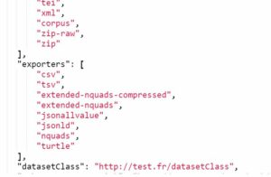

# Les "exporters"

Il est possible d’exporter les données que vous avez renseigné dans votre jeu de données de votre instance de travail,
sur Lodex, afin de les modifier, les enrichir, les partager avec des collègues.

Pour activer la fonctionnalité d’export, il est nécessaire qu’au moins un des champs ait l’option « Une recherche texte
globale peut être effectuée sur ce champ » cochée.

Mais vous pouvez aussi souhaiter profiter de jeux de données présents sur le site [data.istex](https://data.istex.fr/),
comme un corpus scientifique d’actualité (voir
ex : “[L’enseignement et l’apprentissage à distance”](https://shs-educadistance.corpus.istex.fr/)) ou les ressources
présentes sur Istex (voir ex : [“Revue de sommaire Istex”](https://revue-sommaire.istex.fr/)).

**Plusieurs format d’export sont possibles avec Lodex, on les appelle les “exporters”**

Pour être disponibles dans une instance, [les exporters](https://www.lodex.fr/docs/glossaire/e/exporter/) doivent d’une
part être enregistrés dans
lodex-extended [(https://github.com/Inist-CNRS/lodex-extended/tree/master/public/exporters)](https://github.com/Inist-CNRS/lodex-extended/tree/master/public/exporters)
et d’autre part être renseignés
dans [le fichier de configuration](https://www.lodex.fr/docs/partie-2-2/parametrages-dune-instance/) de l’instance.

*Exemple de liste d’exporters enregistrés dans le fichier de configuration d’une instance :*

Tous les formats d’export ne sont pas forcément judicieux pour l’utilisateur, il revient donc à l’administrateur de
l’instance de ne signaler dans le fichier de configuration que les plus pertinents, compatibles avec le jeu de données
présenté.

Par exemple, il est judicieux de proposer un export au format Kbart pour
la [“Revue de sommaire”](https://revue-sommaire.istex.fr/) mais cela n’est pas judicieux pour le jeu de données
des [“Ayants droit à l’usage d’ ISTEX”](https://authorized-user.data.istex.fr/)

**Exporters disponibles dans “lodex-extended”**

## CSV-détection automatique du séparateur

Fichier au format CSV qui contient une liste de ressources et se caractérise par une représentation de données
tabulaires sous forme de texte, les valeurs de chaque cellule étant séparées par des virgules ou des points-virgules

## TSV-avec des tabulations

Fichier au format TSV qui contient une liste de ressources et se caractérise par une représentation de données
tabulaires sous forme de texte, les valeurs de chaque cellule étant séparées par des tabulations.

Fichier au format Kbart, qui contient des métadonnées d’une ou d’un ensemble de ressources décrivant le ou leurs états
de collection (voir exemple sur[https://revue-sommaire.istex.fr/](https://revue-sommaire.istex.fr/))

## JSON

Fichier au format JSON avec un objet contenant un champ data. Chaque objet est interprété comme une ressource. Exemple :
`{data:\[{…}, …, {…}\]}`

## JSON-LD

Fichier au format JSON-LD avec un champ désigné par une URI. C’est un format compatible avec le web sémantique.

## TURTLE *Un service actuellement en construction*

Fichier au format turtle (Terse RDF Triple Language)

C’est un format compatible avec le web sémantique car il exporte les données en triplets.
