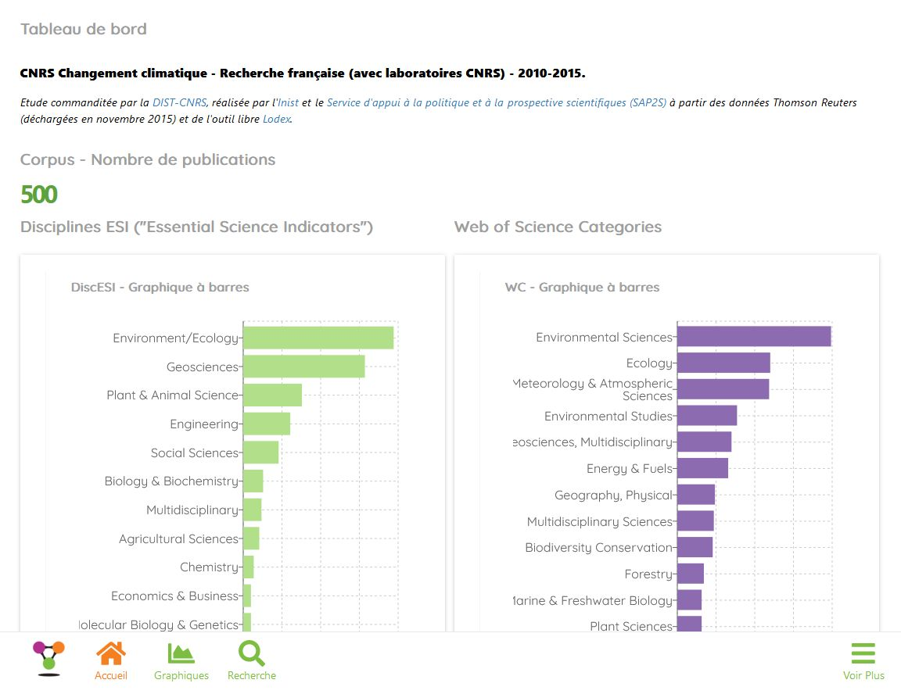
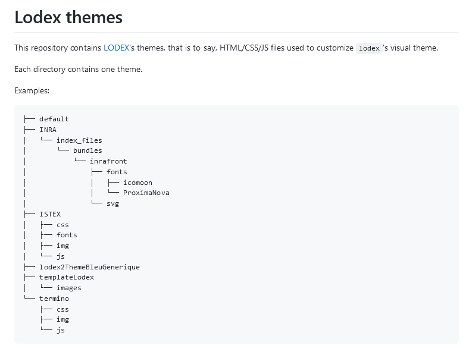
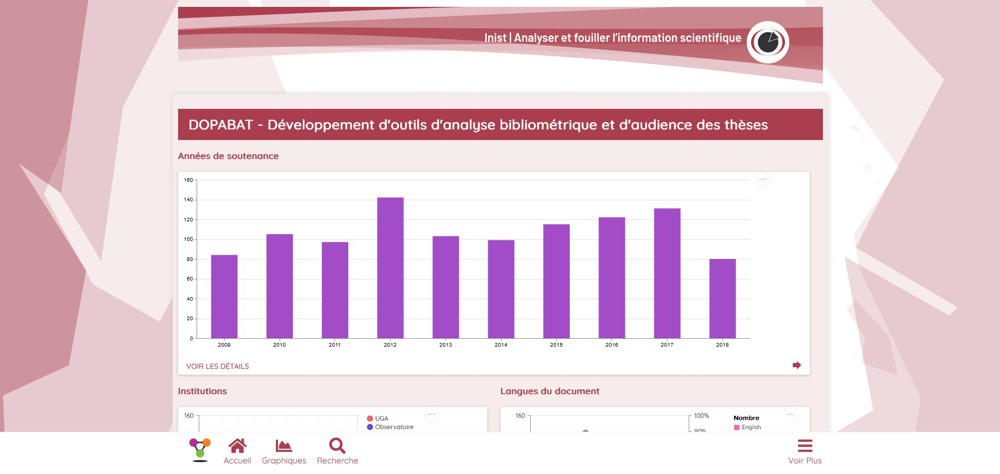
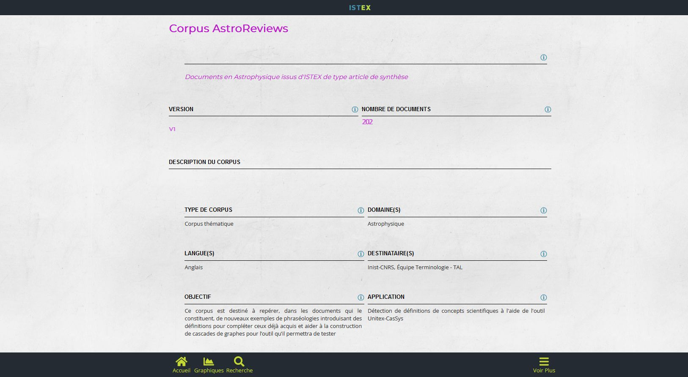
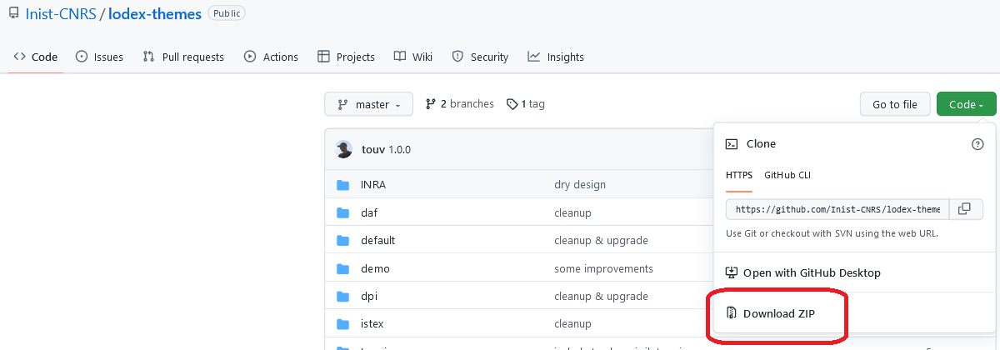
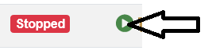

# Le thème

Dans Lodex, le thème définit la charte graphique des pages : couleurs, polices de caractères, icônes…

Chaque thème comporte au moins un fichier **index.html** contenant une balise dont l’identifiant est **root**. C’est
dans cet
élément HTML que s’instancie l’application.

Un thème par défaut est intégré à chaque instance créée, aucune action spécifique n’est nécessaire pour l’utiliser.

L’administrateur d’une instance Lodex peut donc choisir de conserver cet affichage graphique proposé par défaut ou
décider d’adopter un thème personnalisé. Il a alors le choix d’utiliser un thème préexistant ou d’en créer un nouveau.

## Utilisation d’un thème existant

Des exemples de thèmes prédéfinis sont disponibles sur Github, dans une bibliothèque
dédiée : https://github.com/Inist-CNRS/lodex-themes

### Exemples de thèmes présents dans la bibliothèque

- Thème du département DAFIS de l’Inist

- Thème Data ISTEX

## Création d’un thème

Chaque thème comporte au moins un fichier index.html contenant une balise dont l’identifiant est root. C’est dans cet
élément HTML que s’instancie l’application.

Le contenu du fichier index.html est donc: `

`

Le fichier index.html doit contenir des balises `</head>` et `</body>`.

Une instance de Lodex est un site web statique, sauf pour l’élément div contenant l’application Lodex.
Vous pouvez donc utiliser :

- du CSS
- du JavaScript
- des images
- des sous-répertoires

Vous pouvez inclure d’autres pages html, liées à partir du fichier index.html, qui seront statiques et vous permettront
de réaliser un thème complet.

Attention à ne pas utiliser des liens incluant des noms de domaines (utilisez `/other_page.html`, et non
pas `http://mydomain.com/other_page.html`).

C’est à la conception du thème que certaines options sont ajoutées, comme le fait de différencier un mode administrateur
d’un mode utilisateur, d’accéder à l’instance par un mot de passe etc…

- administration: /admin
- connexion: /login
- liste des ressources: /graph

:::warning

Dans le cas où des documents comme “Documentation”, “Mentions légales”, “Méthodologie” sont inclus dans le thème, il
faut modifier le fichier de configuration de l’instance pour afficher un lien vers ces documents dans l’instance.

Voir : [Les paramètres d’une instance](../../getting-started/8-instance-setting.md)

:::

## Chargement d’un thème

### Si Lodex est installé sous ezMaster

Télécharger les fichiers nécessaires au thème et les décompresser

Par exemple à l’adresse suivante pour les thèmes Inist : https://github.com/Inist-CNRS/lodex-themes

- Se connecter au lecteur réseau contenant les répertoires de l’instance (Voir
  le [paragraphe dédié](../../getting-started/3-login-instance-repository.md))

- Copier/coller le contenu du répertoire de thème décompressé à la racine du lecteur réseau ouvert

A la question “Remplacer les fichiers existants dans la destination ?” , répondre `oui`

- Pour que la nouvelle configuration soit prise en compte
  - arrêter l’instance dans ezMaster 
  - puis la redémarrer 

### Si Lodex est installé sans ezMaster

Les fichiers et répertoires composant le thème doivent être ajoutés dans le répertoire `src/app/custom` de
l’arborescence Lodex, avant de relancer le programme.

