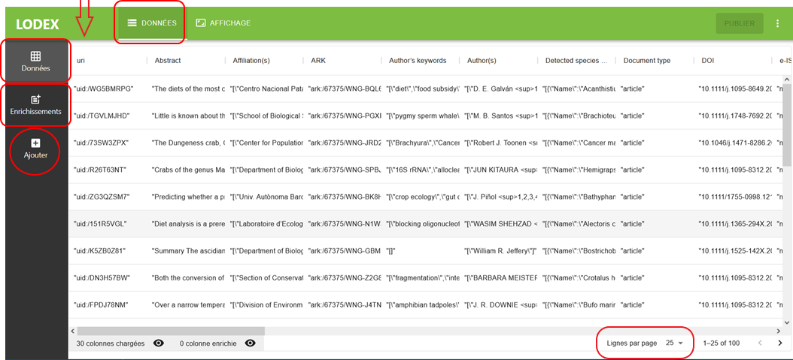

# Préparation des données

À l’import d’un jeu de données, Lodex créé automatiquement un identifiant pour chaque donnée
(colonne “uri” : voir copie d’écran ci-dessous).

Pour définir un identifiant personnalisé :

- le mettre dans le fichier d’import et l’intituler “uri”,
  (même si Lodex créé un uri pour chaque donnée c’est celui de votre colonne “uri” qui sera pris en compte).
- ou le faire générer par le Loader
  C’est le cas par exemple d’un fichier provenant de Istex-dl puis importé dans Lodex avec le “Loader Istex”
  qui choisit les “Ark Istex” comme identifiant “uri”
  (en savoir plus: https://github.com/Inist-CNRS/lodex-extended/blob/master/public/loaders/zip.ini#L193-L194 )

*Fichier tabulaire importé:*

- Chaque ligne correspond à une ressource.
- Chaque colonne correspond à un champ.
- Il est possible d’ajouter des colonnes au jeu de données initial,
  pour ajouter une information qui caractérise le jeu de données,
  ou pour créer un graphe ou en faisant tourner un webservice.
- Pour chaque colonne, il est possible de modifier les caractéristiques :
  - en transformant les valeurs, via les transformers
  - en ajoutant des propriétés sémantiques
  - en modifiant des formats d’affichage
- Il est possible de paramétrer le nombre de lignes à afficher par page (en bas à droite).
