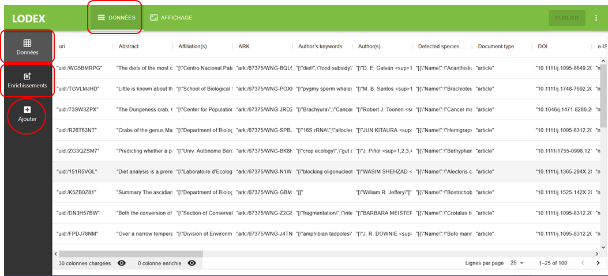
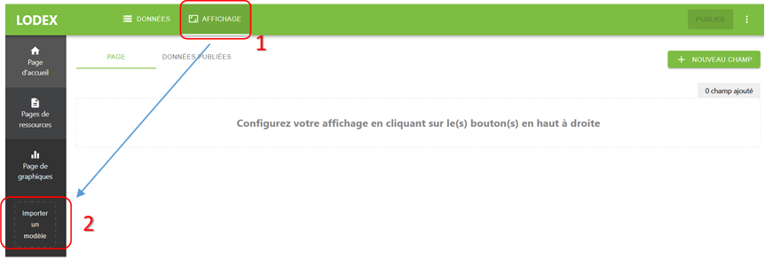
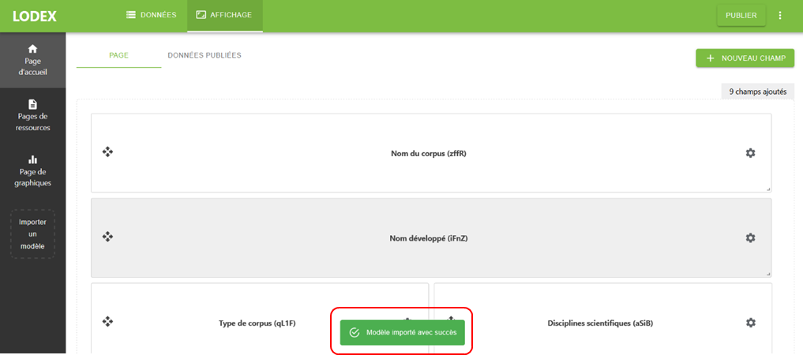

# Import d’un modèle

Un modèle créé antérieurement pour une instance peut être réutilisé en l’important dans une autre.

Pour importer un modèle, s’authentifier à l’instance en tant qu’administrateur (
voir “[Paramètres d’une instance](../../getting-started/8-instance-setting.md)“) et se
rendre dans l’administration.

- Après avoir importé un fichier de données :

- Sélectionner “Affichage”, car c’est bien le modèle qui conditionne l’affichage (1)
- Puis “Importer un modèle” (2)

- Une fenêtre de dialogue va s’ouvrir vous permettant d’aller sélectionner le modèle à importer

Après confirmation du succès de l’import, le modèle va s’appliquer automatiquement au jeu de données.

:::warning

Le chargement d’un nouveau modèle écrase le précédent.

:::
